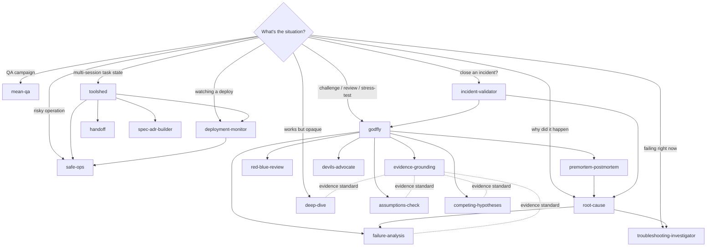

# godfly-skills

**18 skills for Claude Code and Codex CLI that form one system: an adversarial
reviewer, the evidence-grounded toolkit it draws on, and the production-ops
discipline it feeds into.**

Not a grab-bag. Every skill here has a deliberately carved territory and knows
exactly which sibling to hand off to when the question isn't its job — and the
whole analysis spine links to one shared evidence standard instead of restating it.

## Why yet another skills repo? 🙃

Fair question. There are collections out there advertising hundreds of skills,
toolkits with more of everything, and several published "adversarial reviewer"
personas. Here is the honest pitch:

**Most published skills are personas. These are protocols.**
A persona tells the model to "act like a tough reviewer." A protocol tells it what
evidence it must gather *before it is allowed to have an opinion*, in what order,
when it must yield, and what a finished verdict looks like. godfly's Steelman
Guarantee is non-skippable: before challenging anything it restates your actual
ask, your position at its strongest, and tests your *broadest* invariant before
chasing narrower theories. A challenge against a position you don't hold is just
noise with confidence.

**No two skills fight over the same trigger.**
The most common failure of skill collections is five review skills that all
activate on "review this." Territories here are deliberately carved:

| Situation | Skill |
|---|---|
| "Challenge this / poke holes / call my bullshit" | **godfly** |
| Something is failing **right now** | **troubleshooting-investigator** |
| Why did that failure *really* happen (post-hoc) | **root-cause** |
| It works, but nobody understands it | **deep-dive** |
| How could this fail in the future | **failure-analysis** |
| Argue the strongest case for the *other* side | **devils-advocate** |
| What are we taking for granted | **assumptions-check** |
| Choose between competing approaches | **competing-hypotheses** |
| Attack paths + launch readiness | **red-blue-review** |
| Imagine the failure before starting / write it up after | **premortem-postmortem** |

**Evidence is a shared standard, not a vibe.**
`evidence-grounding` is the canonical evidence-standards reference; the whole
analysis spine links to it instead of restating it. Challenges carry evidence
tiers, and the house rule is blunt: *agreement without evidence is a bug*.

**The ops suite was forged in production, not written for a repo.**
These rules exist because their absence hurt:

- **mean-qa**'s Environment Boundary: an environment you cannot classify **is
  production**. A flow passes only when UI, network, and backend layers all
  confirm — UI-green alone is *unproven*, not pass.
- **incident-validator** distinguishes "PR merged" from "verified running in
  production" and asks which one you actually proved. It grades *restraint* —
  probes you deliberately did NOT run against partner systems — as a quality gate.
- **safe-ops** classifies every operation L1–L4 with dry-run previews,
  named confirmation gates, and audit trails.
- **toolshed** keeps durable working state for one task and then **deletes it at
  close** — git history is the archive, and decisions promote to ADRs the moment
  they're made, not when someone remembers.

**One library, two runtimes.**
The same skill files run in Claude Code (`~/.claude/skills/`) and OpenAI Codex
CLI (`~/.codex/skills/`). Cross-references are relative, so the system stays
intact wherever you drop it.

## The system



## The skills

### Flagship

| Skill | What it does |
|---|---|
| [godfly](skills/godfly/SKILL.md) | Adversarial collaborator with a non-skippable Steelman Guarantee, evidence-tiered challenges, a live-state PR/incident review gate, and a hold/yield rule where evidence decides — not authority. |

### The adversarial & analysis spine

| Skill | What it does |
|---|---|
| [evidence-grounding](skills/evidence-grounding/SKILL.md) | The canonical evidence standard: tiers, precedent search, claim validation. Everything else links here. |
| [assumptions-check](skills/assumptions-check/SKILL.md) | CIA Key Assumptions Check — surface and rate what's being taken for granted. |
| [competing-hypotheses](skills/competing-hypotheses/SKILL.md) | Analysis of Competing Hypotheses — map the solution space, let evidence eliminate. |
| [failure-analysis](skills/failure-analysis/SKILL.md) | FMEA, dependency chains, and real-world failure pattern matching. |
| [devils-advocate](skills/devils-advocate/SKILL.md) | The strongest possible case for the side nobody is arguing. |
| [red-blue-review](skills/red-blue-review/SKILL.md) | Attack paths vs. defense controls with a ship/block/spike gate. |
| [premortem-postmortem](skills/premortem-postmortem/SKILL.md) | Kill the project on paper before it starts; write the honest document after it dies for real. |
| [root-cause](skills/root-cause/SKILL.md) | Evidence-backed Five Whys from symptom to systemic cause. |
| [troubleshooting-investigator](skills/troubleshooting-investigator/SKILL.md) | Structured investigation for things failing *now*, with a ranked hypothesis table. |
| [deep-dive](skills/deep-dive/SKILL.md) | Map a system that works but isn't understood; produce an evidence-backed brief. |

### The production-ops suite

| Skill | What it does |
|---|---|
| [mean-qa](skills/mean-qa/SKILL.md) | Adversarial QA campaigns that find what a happy-path pass misses — oracle discipline, a hard prod-safety boundary, and a run directory of embedded screen evidence and replayable cases. |
| [incident-validator](skills/incident-validator/SKILL.md) | Gate matrix for incident handovers, fix PRs, and postmortems — with live evidence verification and a closure verdict. |
| [safe-ops](skills/safe-ops/SKILL.md) | L1–L4 risk classification, dry-run previews, named confirmation gates, audit trails. |
| [deployment-monitor](skills/deployment-monitor/SKILL.md) | Read-only post-deploy evidence gathering, anomaly detection, and cadence summaries. |
| [toolshed](skills/toolshed/SKILL.md) | Mortal working state for one task under `docs/work/<slug>/` — deleted at close, survivors become ADRs/specs. |
| [handoff](skills/handoff/SKILL.md) | Compact continuation notes so the next session/agent doesn't reconstruct the thread. |
| [spec-adr-builder](skills/spec-adr-builder/SKILL.md) | Specs, ADRs, and RFCs with non-goals, alternatives, rollout, and rollback. |

## Install

**Claude Code:**

```bash
git clone https://github.com/CassioRoos/godfly-skills.git
mkdir -p ~/.claude/skills
cp -R godfly-skills/skills/* ~/.claude/skills/
```

**Codex CLI:**

```bash
mkdir -p ~/.codex/skills
cp -R godfly-skills/skills/* ~/.codex/skills/
```

Or symlink individual skills if you only want part of the system — but note the
cross-references: godfly leans on the spine, toolshed leans on the ops suite.

## Design principles

1. **Verdict first.** Blocker, impact, evidence, action — never buried under preamble.
2. **Evidence decides, not authority.** Hold when the evidence holds; yield cleanly when it doesn't.
3. **Steelman before challenge.** Prove you understood the position before attacking it.
4. **Unclassifiable environment = production.** Ceremony scales with blast radius.
5. **State is mortal, decisions are not.** Working notes die at task close; decisions promote to ADRs immediately.
6. **Aim at the code, never the person.** Heat scales with stakes, and it's always pointed at the work.

## License

[MIT](LICENSE)
