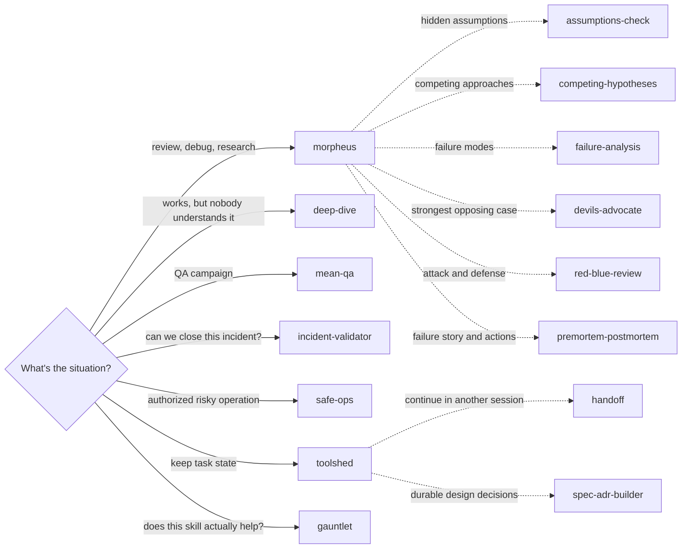

# godfly-skills

**15 skills for Claude Code and Codex CLI: reviewers that demand evidence,
analysis tools for the hard questions, and an ops toolkit that keeps the receipts.**

Read the code. Challenge the assumption. Run the test. Reach a verdict.
The point is to leave with a better decision and something you can verify.

## Why yet another skills repo? 🙃

Fair question. Another folder of prompts promising to turn your agent into a
principal engineer deserves a raised eyebrow. Here is the actual pitch.

**A strong opinion has to earn its place.**
Morpheus asks for code, tests, logs, or documented evidence before
judging. It steelmans your actual position, names what would change the verdict,
and yields when the evidence goes the other way. A challenge against an argument
you never made is just noise with confidence.

**Questions should move the work forward.**
Morpheus reads what it can discover itself, asks about consequential unknowns,
and follows the answers that matter. Its stopping rules target the familiar
failure mode where a two-line bug becomes an expedition into the nature of
software. The intended destination is a supported answer, a verified fix, or a
precise blocker. An endless interview is not a deliverable.

**Proof has receipts.**
MeanQA keeps cases and evidence under `.proof/`. Incident-validator separates
"the PR merged" from "the fix is running and the affected flow works."
Safe-ops checks authorization and reads back what changed. Toolshed preserves
working state so the next session can pick up the task without archaeological
fieldwork. Gauntlet tests whether a skill actually helps; a confident prompt
still has to survive a comparison.

**Pick the tool that earns its keep.**
Morpheus is the focused second opinion. Reach for the other skills when the task
needs their specific procedure. Fifteen skills is a toolbox, not a fifteen-step
entrance exam.

## The system

Start with the situation. Solid arrows show entry points; dotted arrows show
optional supporting work. These are choices, not an automatic chain of calls.



Morpheus also supports a deployment watch when explicitly requested, with a
baseline, end time, read-only evidence, and an honest account of coverage gaps.
The analysis skills can be invoked directly or used alongside Morpheus;
the map shows a starting route, not exclusive ownership.

## Choose a skill

| Situation | Skill |
|---|---|
| Focused review, decisions, troubleshooting, research, or a requested deploy watch | [morpheus](skills/morpheus/SKILL.md) |
| Surface and test hidden assumptions | [assumptions-check](skills/assumptions-check/SKILL.md) |
| Compare architecture, technology, or strategy options | [competing-hypotheses](skills/competing-hypotheses/SKILL.md) |
| It works, but nobody can explain how | [deep-dive](skills/deep-dive/SKILL.md) |
| Prioritize component and dependency failure modes | [failure-analysis](skills/failure-analysis/SKILL.md) |
| Make the strongest case for the side nobody is arguing | [devils-advocate](skills/devils-advocate/SKILL.md) |
| Examine attack paths and prevention, detection, containment, and recovery | [red-blue-review](skills/red-blue-review/SKILL.md) |
| Kill the project on paper; learn from the real failure | [premortem-postmortem](skills/premortem-postmortem/SKILL.md) |
| Run a QA campaign with persistent, re-runnable proof | [mean-qa](skills/mean-qa/SKILL.md) |
| Validate incident handovers, fix PRs, and closure claims | [incident-validator](skills/incident-validator/SKILL.md) |
| Execute an authorized remote, destructive, or security-relevant operation | [safe-ops](skills/safe-ops/SKILL.md) |
| Keep durable working state for one task | [toolshed](skills/toolshed/SKILL.md) |
| Hand work to another session without reconstructing the thread | [handoff](skills/handoff/SKILL.md) |
| Write a technical spec, ADR, or RFC | [spec-adr-builder](skills/spec-adr-builder/SKILL.md) |
| Make a skill prove it beats the model without it | [gauntlet](skills/gauntlet/SKILL.md) |

Godfly is [archived](archive/README.md) for now. Its protocol, commands, and verdict
graph remain available for reference, outside the active installation set.

## How Morpheus keeps its focus

Morpheus asks when an answer could materially change the result, groups independent
questions, and follows up as needed. Exhaustive interviewing is explicit-only.
Its instructions keep each probe tied to an unresolved question, stop investigation
once the answer is supported and required checks pass, and report blockers when
further probes add no evidence. They do not impose a fixed question or hypothesis
quota or automatically chain other skills.

For active failures, its [troubleshooting reference](skills/morpheus/references/troubleshooting.md)
covers containment, reproduction, discriminating tests, and evidence-backed fixes.
Its [research reference](skills/morpheus/references/research.md) preserves the requested
question and recommends an option when a choice was requested.

Deployment watching runs only when requested: pin the deployed version, baseline,
success signal, and end time; compare read-only signals on cadence; corroborate
delivery with durable outcomes; report anomalies and coverage gaps. Use the project's
runbook for operational procedures. Incident-validator separately assesses incident
artifacts against its resolved production-issue standard; it includes a dated
fallback snapshot when the live standard cannot be reached.

## Working principles

- **Investigate before judging.** Read the real code, configuration, tests, or
  runtime evidence. Separate observations from inferences and guesses.
- **Steelman before challenging.** Preserve the user's actual position and
  constraints. Evidence-backed approval is a valid result.
- **Try to break your own verdict.** Name what would overturn it and run the
  cheapest useful check. Say what you could not test.
- **Keep authorization explicit.** Safe-ops previews material effects, executes
  the authorized scope, and reads back the result. A review does not authorize
  publication; a PR does not authorize a merge or deployment.
- **State is mortal; useful evidence survives.** MeanQA keeps `.proof/` artifacts.
  Toolshed keeps `docs/work/<slug>/` until close, when surviving decisions and
  evidence move to permanent homes. The folder can die; the reasoning should not.
- **Aim at the code, never the person.** Heat follows the stakes. During incidents,
  drop the wit: blocker, impact, containment, next action.

## Install

The commands below are for a fresh installation. For an existing installation,
review the upgrade notes below before copying over skill folders.

Clone the repository:

```bash
git clone https://github.com/CassioRoos/godfly-skills.git
```

For Claude Code:

```bash
mkdir -p ~/.claude/skills
cp -R godfly-skills/skills/* ~/.claude/skills/
```

For Codex CLI:

```bash
mkdir -p ~/.codex/skills
cp -R godfly-skills/skills/* ~/.codex/skills/
```

Both copy commands install the same 15 skill folders. Individual skills can also
be symlinked. Install the sibling skills referenced by the workflows you use;
optional skills named in references are not necessarily bundled here. Host-specific
paths and tool instructions may need adaptation. Tool access and permissions come
from the host runtime, not from a skill file.

### Updating an existing installation

Review and back up the installed folders you intend to replace. Copying over an
older installation does not remove obsolete files inside retained skills.
Replace the selected folders with the corresponding repository folders.

The standalone `root-cause`, `evidence-grounding`, `deployment-monitor`, and
`troubleshooting-investigator` skills are no longer included. Remove their installed
folders deliberately if you want the repository's current selection. Useful evidence,
troubleshooting, causal-analysis, and watch guidance now lives in retained skills;
this is a consolidation, not a feature-for-feature replacement of every old workflow.
Godfly is now archived; move any installed `godfly` folder outside your host's
skill discovery directories if you want to retire that local copy too. Updating
this clone alone does not change copied installations.

## Validation and evals

Run these helper checks from the cloned `godfly-skills` directory, with Git,
Python 3, and a POSIX shell available. They use temporary fixtures:

```bash
sh skills/toolshed/scripts/acceptance.sh
python3 skills/toolshed/scripts/close-regressions.py
sh skills/mean-qa/scripts/acceptance.sh
python3 skills/safe-ops/scripts/acceptance.py
```

These checks validate helper behavior, not model review quality. Behavioral eval
fixtures, judge rubrics, and historical example runs live in [evals/](evals/README.md),
outside the installable skill directories. Keep judge answer keys out of the arm
being evaluated. Paths in `evals/morpheus/evals.json` are relative to this repository
root. Existing published runs describe the versions exercised at the time; they
do not validate later instruction changes. Morpheus's clarification and investigation
revision has structural validation but no behavioral A/B result yet. Smaller
instructions alone do not establish better task completion.

## License

[MIT](LICENSE)
