> Published copy of a real run against `evals/aqueduct/`. Absolute paths were
> rewritten for publication; no other content was altered. The rubric is in
> `../GROUND-TRUTH.md`.

# Aqueduct billing console — QA report

Aqueduct is the internal console the revenue clerks use to look at a water account, record a meter reading, correct a bill with an adjustment or a credit note, and start the three-step disconnection process. It is a ~260-line Python `http.server` over SQLite with a plain HTML/JS front end, used on office desktops and on phones in the field. "Working" for this system means four things: the balance it displays is the balance the customer owes; a disconnection cannot reach the crew-dispatch stage except by the documented route; money written to the ledger is the money the clerk intended, once; and a clerk on a phone can see and do the same things a clerk at a desk can.

**Verdict:** HOLD — an INDUSTRIAL account with 4,313 m³ of recorded consumption bills $0.00 and is displayed to the clerk as "paid in full", and any caller can dispatch a disconnection crew with one unvalidated request.

**Environment:** local · `http://localhost:8414` · SQLite fixture `aqueduct.db`, rebuilt from `seed.py` between phases. Classified local-safe: the database is dropped and recreated by `seed.py`, the tree is an ephemeral scratchpad copy, and the server binds `127.0.0.1`. Mutation was therefore in scope.
**Build under test:** `server.py` sha256 `414560f6…`, `static/app.js` sha256 `2b17164a…` (full list in `build-marker.txt`), Python 3.14.4, started as `python3 server.py 8414`.
**Run:** 2026-08-21, 16:49–17:05Z · 32 cases executed, 27 failed, 3 passed, 2 recorded as observed-not-defect · fixtures `ACC-1188`, `ACC-2043`, `ACC-4471`, `ACC-5520`, `ACC-7310`, `ACC-9002`

This report has not been independently reviewed.

## Worst first

1. **A large industrial customer is billed nothing, and the screen says "paid in full".** `ACC-4471` has three clean meter readings totalling 4,313 m³ and a balance of $0.00 shown in green. The `tariffs` table has no `INDUSTRIAL` row, and the lookup that misses returns `0.0, 0.0` instead of failing. Every account in a service class that is missing from the Revenue team's weekly export bills zero, silently, with nothing on any screen to indicate it. [Case 1](#c1)
2. **One request dispatches a disconnection crew, with no supervisor and no prior notices.** `POST /api/shutoff` writes whatever `stage` it is given, defaults that field to `final` when it is omitted, and never checks that the `reminder` and `warning` notices exist. The console's own button sends `stage:"final"` on a single click with no confirmation. The README says this step is irreversible. [Case 5](#c5), [Case 12](#c12)
3. **One bad credit note blanks the accounts list for every clerk, permanently.** An amount of `1e400` becomes a float infinity, is stored, and makes `/api/accounts` emit bare `Infinity` — which is not valid JSON. Every clerk's home screen renders zero rows. There is no console path to void a credit note. [Case 10](#c10)
4. **A credit note with a negative amount charges the customer.** `-5000` raised `ACC-5520` from $107.85 to $5,107.85, filed as a credit, irreversible. [Case 9](#c9)
5. **Any text a clerk types into a `reason` field runs as script in every other clerk's browser.** [Case 15](#c15)
6. **A clerk on a phone cannot see the balance due and cannot finish a credit note.** [Case 18](#c18), [Case 19](#c19)

## How this was tested

I read `server.py`, `seed.py` and the front end first, then worked the dependency question before anything else: for each thing the billing path consults, what does it return when it cannot answer, and what does the code do with that value. `lookup_tariff` answered that immediately — it is documented as having no error return, and the seed data deliberately omits the `INDUSTRIAL` class. That produced the first and worst finding, and I proved it in both directions by inserting a tariff row and watching the same account bill $13,465.30.

From there the campaign went in blast-radius order: the disconnection path (irreversible, dispatches people), then the money-writing endpoints, then the read side, then the browser. Against every input-accepting endpoint I ran the full cheap-probe list — malformed bytes, wrong types, missing and extra fields, boundaries, the same request twice and ten at once, and requests naming accounts that do not exist. I read every result back out of SQLite directly rather than trusting the API's echo.

The browser phase was driven through the Chrome DevTools MCP at 1440×900 and again at phone width. I drove each screen's non-happy states as well as its happy ones — the account with no readings, the account with a missing tariff, the modal's own client-side rejection branch — because that is where the front-end defects turned out to live. Two of them are invisible to a DOM assertion and only show up in a rendered capture or a stacking check, which is how the buried toast was found.

Mid-run I changed course twice. The `NaN` probe was rejected by SQLite's `NOT NULL` constraint rather than by the application, which sent me looking for a non-finite value that *would* store — `1e400` — and that turned a wrong-error-contract finding into the third-worst defect in the report. And the day-first date probe produced the opposite harm from the one I predicted: I expected over-billing and got silent under-billing, because the lexical sort puts `01-09-2026` below `2026-08-01` instead of above it.

The README records three signed-off decisions and one policy note. I tested the negative-consumption sign-off *as designed* rather than filing it — it holds, and it is not in the defect list. The unwritten `audit_log`, the unbuilt Reports screen, and the absence of login are documented gaps and are treated as such throughout.

---

## Flow 1 — Billing: what the console says an account owes

The balance is `standing_fee + rate_per_m3 × consumption + adjustments − credits`, where consumption is the latest reading minus the previous one and the rates come from a `tariffs` table refreshed weekly by another team. Working here means the displayed balance matches what the rules produce from the stored data, and that the console can tell the difference between "this account owes nothing" and "I could not price this account".

| # | Case | Expected | Result | Time | Evidence |
|---|------|----------|--------|------|----------|
| 1 | INDUSTRIAL account with no tariff row | refuse to price, or flag | ❌ bills $0.00, shown "paid in full" | 0.004s | [details](#c1) · `cases/TC-01` |
| 2 | Same account with a tariff row inserted | prices normally | ✅ $13,465.30 | 0.001s | [details](#c2) · `cases/TC-02` |
| 3 | Reading dated `tomorrow-ish` | 400, reject the date | ❌ 201, becomes "latest", reprices $26.01 → $118.31 | 0.002s | [details](#c3) · `cases/TC-41` |
| 4 | Reading dated `01-09-2026` (day-first typo) | 400, or bill the 11.5 m³ | ❌ 201 "ok", stored, displayed, **billed as zero** | 0.001s | [details](#c4) · `cases/TC-43` |
| 5 | Account with no readings at all | an empty state | ❌ "null m3" and an `undefined` row | — | [details](#c14) · `cases/TC-75` |
| 6 | Meter swap producing a negative period | carried, not clamped (signed off) | ✅ −1289.5 m³ carried | 0.001s | [details](#c20) · `cases/TC-90` |

The tariff defect and the date defects share a shape worth naming: in both, the system had a way to know it was in trouble and threw that information away. `lookup_tariff` turns "no such class" into a $0.00 price; the readings table turns "that is not a date" into a sort key. Neither surfaces anywhere a clerk can see.

### <a id="c1"></a>Case 1 — an industrial customer with 4,313 m³ owes nothing

**What should happen.** `ACC-4471` is `INDUSTRIAL` and has three consecutive meter readings — 40,210 → 44,988 → 49,301 m³. The console should either price it or refuse to price it. It must not present an unpriced account as a settled one.

**What happened.** `rate_per_m3: 0.0`, `standing_fee: 0.0`, `balance_due: 0.0`, rendered in the accounts table in green as "$0.00 — paid in full".

```bash
curl -sS -w '\nHTTP %{http_code} in %{time_total}s\n' \
  http://127.0.0.1:8414/api/accounts/ACC-4471
```
```json
{
  "account": { "id": "ACC-4471", "holder_name": "Nordheim Textiles",
               "service_class": "INDUSTRIAL", "status": "active" },
  "readings": [
    { "id": 10, "read_on": "2026-08-01", "meter_m3": 49301.0, "source": "field" },
    { "id": 9,  "read_on": "2026-07-01", "meter_m3": 44988.0, "source": "field" },
    { "id": 8,  "read_on": "2026-06-01", "meter_m3": 40210.0, "source": "field" }
  ],
  "adjustments": [], "credit_notes": [], "shutoff_notices": [],
  "billing": {
    "account_id": "ACC-4471",
    "rate_per_m3": 0.0,
    "standing_fee": 0.0,
    "consumption_m3": 4313.0,
    "charges": 0.0,
    "adjustments": 0,
    "credits": 0,
    "balance_due": 0.0
  }
}
```
```
HTTP 200 in 0.004423s
```

**Direct read** — the readings are real and the tariff row genuinely is not there:

```
$ sqlite3 aqueduct.db "SELECT read_on,meter_m3 FROM readings WHERE account_id='ACC-4471' ORDER BY read_on;"
2026-06-01|40210.0
2026-07-01|44988.0
2026-08-01|49301.0
$ sqlite3 aqueduct.db "SELECT COUNT(*) FROM tariffs WHERE service_class='INDUSTRIAL';"
0
```

**Why it happens.** `server.py:28-39`:

```python
def lookup_tariff(conn, service_class):
    row = conn.execute(
        "SELECT rate_per_m3, standing_fee FROM tariffs WHERE service_class = ?",
        (service_class,)).fetchone()
    if not row:
        return 0.0, 0.0
```

The docstring states the case plainly — "a class can be missing between exports. This helper has no error return." Because it cannot fail, it returns the zero value, and `balance()` at line 66 multiplies by it without ever asking whether a rate was found. "I could not price this" and "this costs nothing" are the same value, so the caller cannot distinguish them, and nothing downstream tries.

**What it costs.** Nordheim Textiles is the largest consumer in the fixture and is invoiced nothing. The trigger is a routine operational event the code documents as expected: a service class missing from the Revenue team's weekly export. The failure is per-class and total, so the day the export drops `COMMERCIAL`, every commercial account in the city bills zero at once — with no error, no log line, and a green "paid in full" on the clerk's screen actively discouraging investigation. This is unrecoverable revenue unless someone notices out-of-band.

**Fails if:** an account with consumption and no tariff row returns a `balance_due` at all, instead of an error or an explicit unpriced marker. **Reproduced:** 2/2 from clean state.

### <a id="c2"></a>Case 2 — positive control: the same account with a tariff row

This exists so Case 1 is not a probe that passes regardless. I inserted an `INDUSTRIAL` tariff, re-read the same URL, and removed it again.

<details><summary>request / response</summary>

```bash
sqlite3 aqueduct.db "INSERT INTO tariffs VALUES ('INDUSTRIAL', 3.10, 95.00);"
curl -sS -w '\nHTTP %{http_code} in %{time_total}s\n' \
  http://127.0.0.1:8414/api/accounts/ACC-4471
sqlite3 aqueduct.db "DELETE FROM tariffs WHERE service_class='INDUSTRIAL';"
```
```json
{
  "billing": {
    "account_id": "ACC-4471",
    "rate_per_m3": 3.1,
    "standing_fee": 95.0,
    "consumption_m3": 4313.0,
    "charges": 13465.3,
    "adjustments": 0,
    "credits": 0,
    "balance_due": 13465.3
  }
}
```
```
HTTP 200 in 0.001380s
```
</details>

$13,465.30 with the row, $0.00 without it, same readings. The observation changes when the defect is absent, which is what makes Case 1 evidence rather than an assertion.

### <a id="c3"></a>Case 3 and <a id="c4"></a>Case 4 — an unvalidated date field silently reprices the account, in both directions

**What should happen.** `read_on` decides which two readings are "latest" and "previous", so it decides the bill. A value that is not a date should be rejected.

**What happened.** Both were accepted with `201 {"ok": true}`. The column is `TEXT` and the ordering is `ORDER BY read_on DESC, id DESC` — a lexical string sort — so the harm depends on where the bad string happens to sort.

<details><summary>Case 3 — <code>tomorrow-ish</code> sorts <em>above</em> real dates → over-billing</summary>

```bash
curl -sS -w '\nHTTP %{http_code} in %{time_total}s\n' -X POST \
  -H 'Content-Type: application/json' \
  -d '{"account_id":"ACC-2043","meter_m3":200,"read_on":"tomorrow-ish"}' \
  http://127.0.0.1:8414/api/readings
```
```json
{ "ok": true,
  "billing": { "account_id": "ACC-2043", "consumption_m3": 80.5,
               "charges": 118.31, "balance_due": 118.31 } }
```
```
HTTP 201 in 0.001610s
```
```
$ sqlite3 aqueduct.db "SELECT id,read_on,meter_m3 FROM readings WHERE account_id='ACC-2043' ORDER BY read_on DESC, id DESC;"
16|tomorrow-ish|200.0     <- sorts first, so it is the "latest" reading
7|2026-08-01|119.5
6|2026-07-01|104.0
5|2026-06-01|88.0
```
Balance went from $26.01 to $118.31 on a typo.
</details>

<details><summary>Case 4 — <code>01-09-2026</code> sorts <em>below</em> real dates → silent under-billing</summary>

A clerk in the field enters the 1 September reading day-first. Meter 131.0, an ordinary +11.5 m³ month.

```bash
curl -sS -w '\nHTTP %{http_code} in %{time_total}s\n' -X POST \
  -H 'Content-Type: application/json' \
  -d '{"account_id":"ACC-2043","meter_m3":131.0,"read_on":"01-09-2026"}' \
  http://127.0.0.1:8414/api/readings
```
```json
{ "ok": true,
  "billing": { "account_id": "ACC-2043", "consumption_m3": 15.5,
               "charges": 26.01, "balance_due": 26.01 } }
```
```
HTTP 201 in 0.001222s
```
```
$ sqlite3 aqueduct.db "SELECT id,read_on,meter_m3 FROM readings WHERE account_id='ACC-2043' ORDER BY read_on DESC, id DESC;"
7|2026-08-01|119.5
6|2026-07-01|104.0
5|2026-06-01|88.0
18|01-09-2026|131.0      <- '0' < '2', so the newest reading sorts last
```
The balance did not move. The reading was accepted, is stored, and is displayed on the account's readings table — and contributes nothing. The customer's 11.5 m³ is never billed.
</details>

**Why it happens.** `api_add_reading` (`server.py:126-135`) takes `body.get("read_on")` and inserts it with no parsing or format check, into a `TEXT` column. `consumption()` orders by that column as a string. There is no constraint, no `date()` call, and no validation anywhere in the path.

**What it costs.** Case 4 is the more dangerous of the two because it is silent in the direction of lost revenue and the clerk gets a success toast and a visible row. Case 3 is loud in the direction of over-charging a customer. Both are reachable by one mistyped field on a phone keyboard, which is exactly where date typos happen.

**Fails if:** a `read_on` that is not an ISO date is accepted. **Reproduced:** 2/2 each.

---

## Flow 2 — Disconnection: the part that sends people to someone's house

The README is unambiguous: `reminder`, then `warning`, then `final`; `final` "is what actually sends a crew, so it may only be issued by a supervisor and only after the two earlier notices exist for that account"; and "once a crew is dispatched the disconnection is not reversible from the console." Working here means the ordering rule is enforced somewhere in the system.

| # | Case | Expected | Result | Time | Evidence |
|---|------|----------|--------|------|----------|
| 5 | `final` with no prior notices | 4xx, no row | ❌ 201, row written, account → `shutoff_pending` | 0.003s | [details](#c5) · `cases/TC-10` |
| 6 | `stage` omitted entirely | 4xx, or the *safest* stage | ❌ defaults to `final` | 0.003s | [details](#c6) · `cases/TC-11` |
| 7 | `stage: "banana"` | 4xx | ❌ 201, stored verbatim | 0.001s | [details](#c6) · `cases/TC-12` |
| 8 | `final` against an account that does not exist | 404 | ❌ 201, notice written for a phantom | 0.001s | [details](#c6) · `cases/TC-13` |
| 9 | Ten concurrent `final` notices | one row, or a conflict | ❌ ten 201s, ten rows | — | [details](#c7) · `cases/TC-61` |
| 12 | One click on the console's own button | a confirmation step | ❌ dispatches immediately, no dialog | — | [details](#c12) · `cases/TC-70` |

Note what is *not* being reported here. The README says there is no login and that `actor` is whatever the client sends; the supervisor half of the rule is therefore a known gap and I have not filed it. The ordering half is a different matter — "the two earlier notices exist for that account" is a pure data check against a table the handler already has a connection to, it needs no identity to enforce, and it is absent entirely.

### <a id="c5"></a>Case 5 — a `final` notice with no `reminder` and no `warning`

**What should happen.** `ACC-2043` had zero shutoff notices. A `final` is not a legal first step.

**What happened.** Accepted.

```bash
curl -sS -w '\nHTTP %{http_code} in %{time_total}s\n' -X POST \
  -H 'Content-Type: application/json' \
  -d '{"account_id":"ACC-2043","actor":"clerk-nobody","stage":"final"}' \
  http://127.0.0.1:8414/api/shutoff
```
```json
{ "ok": true, "account_id": "ACC-2043", "actor": "clerk-nobody" }
```
```
HTTP 201 in 0.003028s
```

**Direct read** — before and after:

```
$ sqlite3 aqueduct.db "SELECT id,status FROM accounts WHERE id='ACC-2043';"      # before
ACC-2043|active
$ sqlite3 aqueduct.db "SELECT COUNT(*) FROM shutoff_notices WHERE account_id='ACC-2043';"
0

$ sqlite3 aqueduct.db "SELECT id,account_id,actor,stage,issued_at FROM shutoff_notices WHERE account_id='ACC-2043';"
1|ACC-2043|clerk-nobody|final|2026-08-21T16:50:09Z
$ sqlite3 aqueduct.db "SELECT id,status FROM accounts WHERE id='ACC-2043';"       # after
ACC-2043|shutoff_pending
```

**Why it happens.** `api_shutoff` (`server.py:168-179`) is nine lines: read `account_id`, read `actor`, INSERT, UPDATE, commit. There is no SELECT of prior notices, no stage comparison, no role concept, and no account lookup. The three-stage state machine described in the README exists in the README and nowhere in the code, so every transition is legal from every state.

**What it costs.** A crew is dispatched to a customer who was never sent a reminder or a warning — for a water utility that is a household losing its supply without the notice period it is owed, and the README says the console cannot undo it. Case 1 makes this materially worse: an account can reach the disconnection queue on a balance that was computed wrong.

**Fails if:** a `final` notice is written when fewer than two prior notices exist for that account. **Reproduced:** 2/2 via API, plus once through the UI (Case 12).

### <a id="c6"></a>Case 6, 7, 8 — the default is the destructive one, the value is unconstrained, and the account need not exist

<details><summary>Case 6 — omitting <code>stage</code> defaults to <code>final</code></summary>

```bash
curl -sS -w '\nHTTP %{http_code} in %{time_total}s\n' -X POST \
  -H 'Content-Type: application/json' \
  -d '{"account_id":"ACC-5520","actor":"clerk-nobody"}' \
  http://127.0.0.1:8414/api/shutoff
```
```json
{ "ok": true, "account_id": "ACC-5520", "actor": "clerk-nobody" }
```
```
HTTP 201 in 0.003281s
```
`server.py:175` — `body.get("stage", "final")`. A caller that forgets the field gets a crew.
</details>

<details><summary>Case 7 — <code>stage: "banana"</code> is stored verbatim</summary>

```bash
curl -sS -w '\nHTTP %{http_code} in %{time_total}s\n' -X POST \
  -H 'Content-Type: application/json' \
  -d '{"account_id":"ACC-5520","actor":"x","stage":"banana"}' \
  http://127.0.0.1:8414/api/shutoff
```
```json
{ "ok": true, "account_id": "ACC-5520", "actor": "x" }
```
```
HTTP 201 in 0.001335s
```
</details>

<details><summary>Case 8 — a final notice for an account that does not exist</summary>

```bash
curl -sS -w '\nHTTP %{http_code} in %{time_total}s\n' -X POST \
  -H 'Content-Type: application/json' \
  -d '{"account_id":"ACC-DOES-NOT-EXIST","actor":"x","stage":"final"}' \
  http://127.0.0.1:8414/api/shutoff
```
```json
{ "ok": true, "account_id": "ACC-DOES-NOT-EXIST", "actor": "x" }
```
```
HTTP 201 in 0.001222s
```
```
$ sqlite3 aqueduct.db "SELECT id,account_id,actor,stage FROM shutoff_notices ORDER BY id;"
1|ACC-2043|clerk-nobody|final
2|ACC-5520|clerk-nobody|final
3|ACC-5520|x|banana
4|ACC-DOES-NOT-EXIST|x|final
$ sqlite3 aqueduct.db "SELECT COUNT(*) FROM accounts WHERE id='ACC-DOES-NOT-EXIST';"
0
```
The `UPDATE accounts` silently matches nothing, so the row is written and the response still says `ok`.
</details>

Taken together these three mean the `stage` column — the field that decides whether a crew is sent — accepts any string, defaults to the most destructive one, and does not require the account to be real.

### <a id="c7"></a>Case 9 — ten concurrent final notices produce ten dispatches

<details><summary>request / response</summary>

```sh
for i in 1 2 3 4 5 6 7 8 9 10; do
  curl -sS -o /dev/null -w "%{http_code} " -X POST -H "Content-Type: application/json" \
    -d '{"account_id":"ACC-1188","actor":"clerk","stage":"final"}' \
    http://127.0.0.1:8414/api/shutoff &
done; wait
```
```
201 201 201 201 201 201 201 201 201 201
```
```
$ sqlite3 aqueduct.db "SELECT COUNT(*) FROM shutoff_notices WHERE account_id='ACC-1188' AND stage='final';"
10
```
</details>

There is no check-then-act to lose here, because there is no check at all. Ten dispatch records for one household.

---

## Flow 3 — Writing money: adjustments and credit notes

Both endpoints take an amount from the client and write it straight to the ledger. The code's own docstring says credit notes are irreversible: "Finance reconciles them nightly and there is no console path to void one." Working means the amount stored is a real, finite, correctly-signed number that the clerk meant to write exactly once.

| # | Case | Expected | Result | Time | Evidence |
|---|------|----------|--------|------|----------|
| 9 | Credit note of `-5000` | 400 | ❌ 201, balance $107.85 → $5,107.85 | 0.003s | [details](#c9) · `cases/TC-26` |
| 10 | Credit note of `1e400` | 400 | ❌ 201, stores `Inf`, breaks the whole console | 0.007s | [details](#c10) · `cases/TC-25`, `TC-25b`, `TC-71` |
| 11 | Same credit note sent twice | one row, or 409 | ❌ two rows, same second | — | [details](#c11) · `cases/TC-60` |
| 13 | Missing `amount` | 400 | ❌ 500 + full traceback | 0.003s | [details](#c13) · `cases/TC-20` |
| 13 | `amount: "abc"` | 400 | ❌ 500 + traceback | 0.001s | [details](#c13) · `cases/TC-21` |
| 13 | Malformed bytes, not JSON | 400 | ❌ 500 + traceback naming the Python install | 0.002s | [details](#c13) · `cases/TC-28` |
| 13 | Wrong types (object, array) | 400 | ❌ 500 + traceback | 0.001s | [details](#c13) · `cases/TC-53` |
| 13 | `amount: "NaN"` | 400 | ❌ 500 + traceback (rejected by SQLite, not by the app) | 0.002s | [details](#c13) · `cases/TC-24` |
| 13 | `meter_m3: "not-a-number"` | 400 | ❌ 500 + traceback | 0.003s | [details](#c13) · `cases/TC-40` |
| 8 | Credit note against a phantom account | 404 | ❌ 201, `billing: null` | 0.001s | [details](#c8b) · `cases/TC-27` |
| 8 | Reading against a phantom account | 404 | ❌ 201, orphan row | 0.001s | [details](#c8b) · `cases/TC-42` |
| 16 | 20,004-char reason with a bidi override | 400, or a length cap | ❌ 201, stored whole | — | [details](#c16) · `cases/TC-62` |

### <a id="c9"></a>Case 9 — a credit note that charges the customer $5,000

**What should happen.** A credit note reduces what a customer owes. A negative one is a charge wearing a credit's label, and the balance formula subtracts it: `balance = charges + adjustments − credits`, so a negative `credits` term adds.

**What happened.**

```bash
curl -sS -w '\nHTTP %{http_code} in %{time_total}s\n' -X POST \
  -H 'Content-Type: application/json' \
  -d '{"account_id":"ACC-5520","amount":-5000,"reason":"negative credit","actor":"clerk"}' \
  http://127.0.0.1:8414/api/credit-notes
```
```json
{ "ok": true,
  "billing": { "account_id": "ACC-5520", "rate_per_m3": 2.05, "standing_fee": 11.5,
               "consumption_m3": 47.0, "charges": 107.85,
               "adjustments": 0, "credits": -5000.0, "balance_due": 5107.85 } }
```
```
HTTP 201 in 0.003106s
```

**Why it happens.** `api_credit_note` does `float(body["amount"])` and inserts. There is no sign check, no bound, and no distinction in the schema between the two ledger tables — `adjustments` and `credit_notes` are structurally identical, so nothing encodes that one of them is only ever supposed to move the balance one way.

**What it costs.** A customer is billed $5,000 they do not owe, recorded as a credit, and neither the console nor Finance's nightly reconciliation has a void path. Adjustments can legitimately be negative; credit notes carrying a negative is a category error the schema permits.

**Fails if:** a credit note with `amount < 0` is accepted. **Reproduced:** 2/2.

### <a id="c10"></a>Case 10 — one credit note takes down the accounts list for everyone

**What should happen.** An amount that is not a finite number should be rejected with a 400.

**What happened.** `float("1e400")` is `inf` in Python. SQLite stores it. `json.dumps` serialises it as the bare token `Infinity`, which JSON does not define — so the response is not JSON, and `JSON.parse` throws.

```bash
curl -sS -w '\nHTTP %{http_code} in %{time_total}s\n' -X POST \
  -H 'Content-Type: application/json' \
  -d '{"account_id":"ACC-5520","amount":"1e400","reason":"field retry","actor":"clerk"}' \
  http://127.0.0.1:8414/api/credit-notes
```
```json
{ "ok": true,
  "billing": { "account_id": "ACC-5520", "charges": 107.85,
               "adjustments": 0, "credits": Infinity, "balance_due": -Infinity } }
```
```
HTTP 201 in 0.001355s
```

**Direct read** — it is on disk:

```
$ sqlite3 aqueduct.db "SELECT id,account_id,amount FROM credit_notes WHERE account_id='ACC-5520';"
1|ACC-5520|Inf
```

**The blast radius, measured.** Before the injection the list endpoint parsed cleanly; after it, it does not — and the failure is not confined to the account that was poisoned:

```
$ curl -sS http://127.0.0.1:8414/api/accounts | grep -n Infinity
9:      "balance_due": -Infinity,

# same strictness as the browser's JSON.parse
$ python3 -c "import json,sys; json.loads(sys.stdin.read(), parse_constant=lambda c: (_ for _ in ()).throw(ValueError(c)))" < list-payload.json
STRICT PARSE FAILED: non-standard token: -Infinity
```

Measured from inside the page:

```json
{ "rowsRenderedOnListScreen": 0,
  "listApiHttpStatus": 200,
  "listJsonParses": false,
  "listParseError": "No number after minus sign in JSON at position 925 (line 36 column 23)",
  "unaffectedDetailStillParses": true,
  "poisonedDetailStillParses": false }
```

Healthy list, then the same screen after one poisoned credit note on one unrelated account:

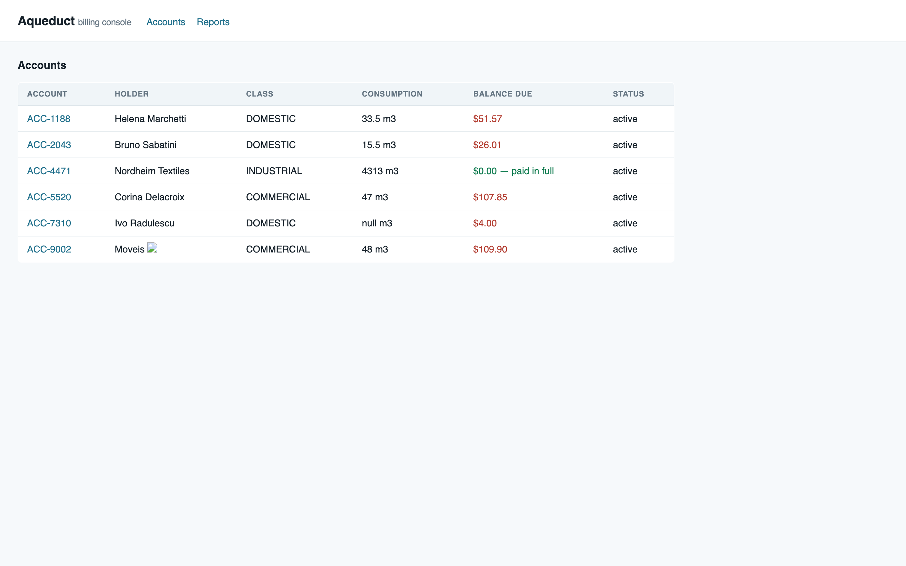

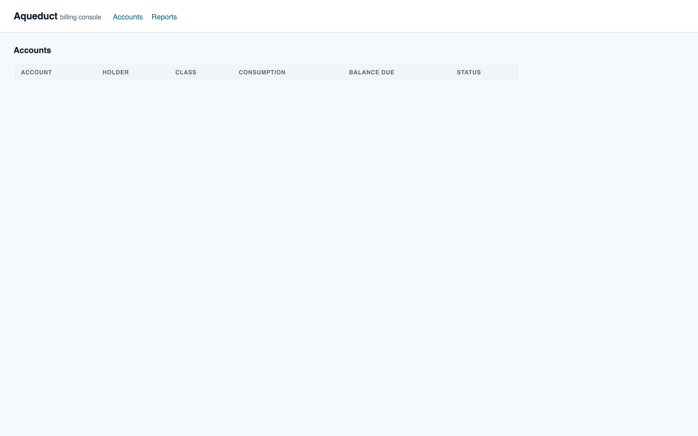

**Why it happens.** Three separate omissions line up. `float()` accepts overflow to infinity without complaint; SQLite's REAL column stores it; and Python's `json.dumps` emits non-standard `Infinity`/`NaN` tokens by default rather than raising (`allow_nan=True` is the default). On the client, `load()` has no `.catch`, so the rejected promise kills the render silently — the server returns HTTP 200 the whole time, so nothing looks wrong from the outside.

**What it costs.** The accounts list is the console's home screen and the only navigation to any account. One bad amount — reachable by a fat-fingered exponent or a retry loop — blanks it for every clerk in the office and in the field, and the detail page for the poisoned account is unreachable too, which is the page you would open to diagnose it. Recovery needs direct SQL, because the docstring is explicit that there is no console path to void a credit note. Note the `NaN` variant (`cases/TC-24`) is stopped only by chance, by a `NOT NULL` constraint at the storage layer, not by the application.

**Fails if:** a non-finite amount is accepted, or `/api/accounts` emits a token `JSON.parse` rejects. **Reproduced:** 2/2.

### <a id="c11"></a>Case 11 — the same irreversible credit note, twice

<details><summary>request / response</summary>

```sh
for i in 1 2; do
  curl -sS -w '\nHTTP %{http_code}\n' -X POST -H 'Content-Type: application/json' \
    -d '{"account_id":"ACC-1188","amount":40,"reason":"goodwill CN-77","actor":"clerk"}' \
    http://127.0.0.1:8414/api/credit-notes
done
```
```json
{ "ok": true, "billing": { "credits": 40.0, "balance_due": 11.57 } }
HTTP 201
{ "ok": true, "billing": { "credits": 80.0, "balance_due": -28.43 } }
HTTP 201
```
```
$ sqlite3 aqueduct.db "SELECT id,amount,reason,created_at FROM credit_notes;"
4|40.0|goodwill CN-77|2026-08-21T16:52:01Z
5|40.0|goodwill CN-77|2026-08-21T16:52:01Z
```
</details>

No idempotency key, no natural-key constraint, no time-window duplicate check. Two identical irreversible credits in the same second. The oracle here is the endpoint's own docstring: something the system declares un-voidable should be hard to write twice by accident, and the field-phone retry is the obvious way it happens.

### <a id="c13"></a>Case 13 — every malformed input returns 500 with a full traceback

Seven probes, one contract. Any input the handler cannot coerce escapes as an unhandled exception into the catch-all at `server.py:251-253`, which serialises `traceback.format_exc()` into the response body.

<details><summary>Missing required field → 500</summary>

```bash
curl -sS -w '\nHTTP %{http_code} in %{time_total}s\n' -X POST \
  -H 'Content-Type: application/json' \
  -d '{"account_id":"ACC-1188","reason":"no amount field","actor":"clerk"}' \
  http://127.0.0.1:8414/api/adjustments
```
```json
{
  "error": "server error",
  "trace": "Traceback (most recent call last):\n  File \"/…/mqa-v5/server.py\", line 247, in do_POST\n    code, out = fn(conn, body)\n  File \"/…/mqa-v5/server.py\", line 141, in api_adjustment\n    amount = float(body[\"amount\"])\nKeyError: 'amount'\n"
}
```
```
HTTP 500 in 0.002805s
```
</details>

<details><summary>Non-numeric amount → 500</summary>

```bash
curl -sS -w '\nHTTP %{http_code} in %{time_total}s\n' -X POST \
  -H 'Content-Type: application/json' \
  -d '{"account_id":"ACC-1188","amount":"abc","reason":"x","actor":"clerk"}' \
  http://127.0.0.1:8414/api/adjustments
```
```json
{ "error": "server error",
  "trace": "…line 141, in api_adjustment\n    amount = float(body[\"amount\"])\nValueError: could not convert string to float: 'abc'\n" }
```
```
HTTP 500 in 0.000987s
```
</details>

<details><summary>Bytes that are not JSON → 500, and the traceback names the Python install</summary>

```bash
curl -sS -w '\nHTTP %{http_code} in %{time_total}s\n' -X POST \
  -H 'Content-Type: application/json' \
  -d 'not json at all {{{' \
  http://127.0.0.1:8414/api/adjustments
```
```json
{ "error": "server error",
  "trace": "…\n  File \"/opt/homebrew/Cellar/python@3.14/3.14.4_1/Frameworks/Python.framework/Versions/3.14/lib/python3.14/json/decoder.py\", line 363, in raw_decode\n    raise JSONDecodeError(\"Expecting value\", s, err.value) from None\njson.decoder.JSONDecodeError: Expecting value: line 1 column 1 (char 0)\n" }
```
```
HTTP 500 in 0.002003s
```
</details>

<details><summary>Wrong types → 500</summary>

```bash
curl -sS -w '\nHTTP %{http_code} in %{time_total}s\n' -X POST \
  -H 'Content-Type: application/json' \
  -d '{"account_id":["ACC-1188"],"amount":{"v":10},"reason":null,"actor":[]}' \
  http://127.0.0.1:8414/api/adjustments
```
```json
{ "error": "server error",
  "trace": "…line 141, in api_adjustment\n    amount = float(body[\"amount\"])\nTypeError: float() argument must be a string or a real number, not 'dict'\n" }
```
```
HTTP 500 in 0.001130s
```
</details>

<details><summary><code>amount: "NaN"</code> → 500, caught by SQLite rather than by the app</summary>

```bash
curl -sS -w '\nHTTP %{http_code} in %{time_total}s\n' -X POST \
  -H 'Content-Type: application/json' \
  -d '{"account_id":"ACC-1188","amount":"NaN","reason":"nan probe","actor":"clerk"}' \
  http://127.0.0.1:8414/api/credit-notes
```
```json
{ "error": "server error",
  "trace": "…line 159, in api_credit_note\n    conn.execute(\n…\nsqlite3.IntegrityError: NOT NULL constraint failed: credit_notes.amount\n" }
```
```
HTTP 500 in 0.001574s
```
No row was written — but by accident, at the storage layer, not because the application rejected it.
</details>

<details><summary>Non-numeric meter reading → 500</summary>

```bash
curl -sS -w '\nHTTP %{http_code} in %{time_total}s\n' -X POST \
  -H 'Content-Type: application/json' \
  -d '{"account_id":"ACC-2043","meter_m3":"not-a-number"}' \
  http://127.0.0.1:8414/api/readings
```
```json
{ "error": "server error",
  "trace": "…line 128, in api_add_reading\n    meter_m3 = float(body[\"meter_m3\"])\nValueError: could not convert string to float: 'not-a-number'\n" }
```
```
HTTP 500 in 0.002768s
```
</details>

**Why it happens.** No handler validates anything. Each reads `body["field"]` and coerces, and `do_POST`'s bare `except Exception` converts every failure into a 500 carrying `traceback.format_exc()`.

**What it costs.** Two things. Operationally, a 500 tells the client the *server* failed, so a well-behaved caller retries — against endpoints with no idempotency (Case 11). Informationally, the body leaks absolute source paths, line numbers, source text, the interpreter version and the install layout to anyone on the office network, which the README notes is the only thing standing in for authentication.

**Fails if:** any malformed request returns 5xx rather than 4xx, or any response body contains a stack trace. **Reproduced:** 2/2 for each probe.

### <a id="c8b"></a>Case 8b — money and readings written against accounts that do not exist

<details><summary>Credit note for a phantom account</summary>

```bash
curl -sS -w '\nHTTP %{http_code} in %{time_total}s\n' -X POST \
  -H 'Content-Type: application/json' \
  -d '{"account_id":"ACC-NOPE","amount":250,"reason":"phantom","actor":"clerk"}' \
  http://127.0.0.1:8414/api/credit-notes
```
```json
{ "ok": true, "billing": null }
```
```
HTTP 201 in 0.001261s
```
</details>

<details><summary>Reading for a phantom account, and the orphan it leaves</summary>

```bash
curl -sS -w '\nHTTP %{http_code} in %{time_total}s\n' -X POST \
  -H 'Content-Type: application/json' \
  -d '{"account_id":"ACC-NOPE-2","meter_m3":500}' \
  http://127.0.0.1:8414/api/readings
```
```json
{ "ok": true, "billing": null }
```
```
HTTP 201 in 0.001307s
```
```
$ sqlite3 aqueduct.db "SELECT r.id,r.account_id FROM readings r LEFT JOIN accounts a ON a.id=r.account_id WHERE a.id IS NULL;"
17|ACC-NOPE-2
```
</details>

No table declares a foreign key and no handler checks existence, so a typo'd account id produces a silently orphaned money row that no account screen will ever display. `"billing": null` is the only hint, and the status is still 201.

### <a id="c16"></a>Case 16 — a 20,004-character reason with a bidi override

<details><summary>request / response</summary>

```python
reason = "A"*20000 + " " + chr(0x202E) + " \U0001F4A7"   # + RTL override + emoji
body = json.dumps({"account_id":"ACC-1188","amount":1,"reason":reason,"actor":"x"})
# POST /api/adjustments
```
```
HTTP 201
```
```
$ sqlite3 aqueduct.db "SELECT id,LENGTH(reason),amount FROM adjustments;"
1|20004|1.0
```
</details>

Low severity by itself; it matters because that field is rendered into the ledger table through `innerHTML` (Case 15) and there is no length cap on a free-text column that reaches every clerk's screen.

---

## Flow 4 — The console UI

The front end is 183 lines of plain JS. Working means it shows what the API returned, tells the clerk when something is wrong, and does not execute data as code.

| # | Case | Expected | Result | Evidence |
|---|------|----------|--------|----------|
| 14 | Account with no readings | an empty state | ❌ "null m3" + `undefined` row | [details](#c14) · `cases/TC-75` |
| 15 | Markup in a clerk's `reason` field | escaped text | ❌ executes as script | [details](#c15) · `cases/TC-80` |
| 17 | Modal rejects a non-numeric amount | the clerk sees the error | ❌ message painted under the modal | [details](#c17) · `cases/TC-72` |
| 12 | The shutoff button | a confirmation step | ❌ one click, irreversible | [details](#c12) · `cases/TC-70` |
| 21 | Any page load | clean console | ❌ TypeError on every load | [details](#c21) · `cases/TC-76` |
| — | Healthy account detail | renders correctly | ✅ | [04-detail-acc1188-healthy.png](04-detail-acc1188-healthy.png) |
| — | `GET` a nonexistent account | 404, no internals | ✅ | `cases/TC-50` |

### <a id="c14"></a>Case 14 — the empty state renders the word `undefined` three times

`ACC-7310` is a new connection with no readings — a state the seed data creates deliberately.

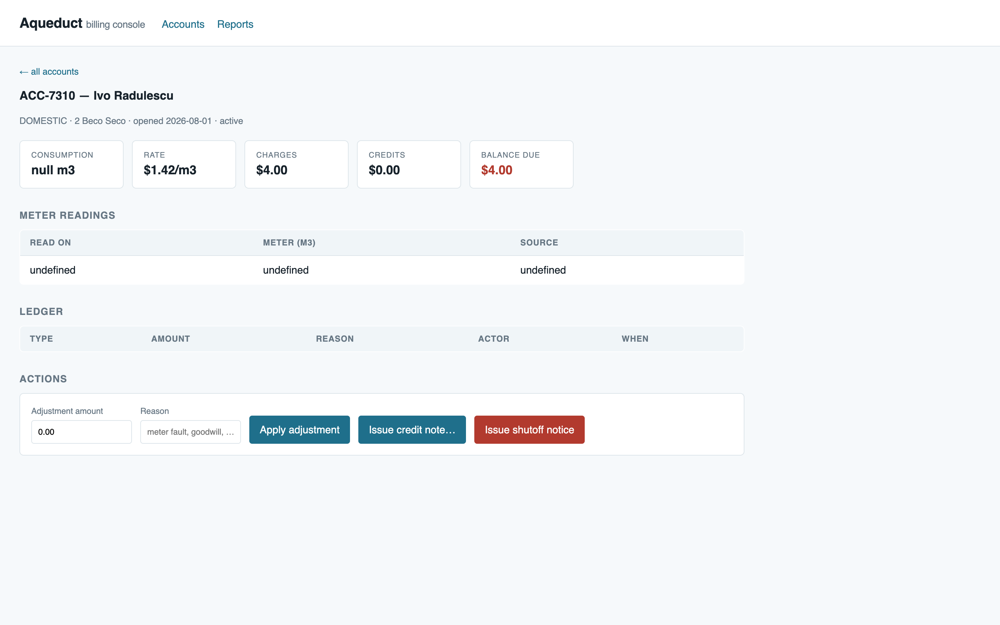

**Why it happens.** Two separate spots. `consumption()` returns Python `None` for fewer than two readings, which serialises to `null`, and `app.js:58` concatenates it straight into the tile — `b.consumption_m3 + ' m3'`. And `app.js:71` reaches for an empty-state placeholder by substituting an empty object: `var reads = d.readings.length ? d.readings : [{}];` — then renders `r.read_on`, `r.meter_m3` and `r.source` off it, each `undefined`.

**What it costs.** Cosmetic in isolation, but it is on the billing screen of a real account and it makes the genuinely-important zero states (Case 1's `$0.00`) harder to distinguish from rendering noise.

### <a id="c15"></a>Case 15 — text a clerk types runs as script in other clerks' browsers

**What should happen.** `reason`, `actor` and `holder_name` are data and should be escaped on render.

**What happened.** I posted an adjustment whose `reason` contained an `` payload through the ordinary endpoint, then opened the account.

```bash
curl -sS -X POST -H 'Content-Type: application/json' \
  -d '{"account_id":"ACC-1188","amount":10,"reason":"goodwill ","actor":"clerk-a"}' \
  http://127.0.0.1:8414/api/adjustments
```
```
HTTP 201
$ sqlite3 aqueduct.db "SELECT id,reason,actor FROM adjustments;"
1|goodwill |clerk-a
```

Measured in the page after loading `/account/ACC-1188`:

```json
{ "documentTitle": "Aqueduct — Billing Console|LEDGER-XSS",
  "scriptExecutedFromLedgerReason": true,
  "injectedElementsInLedger": 1,
  "ledgerReasonCellHTML": "goodwill " }
```

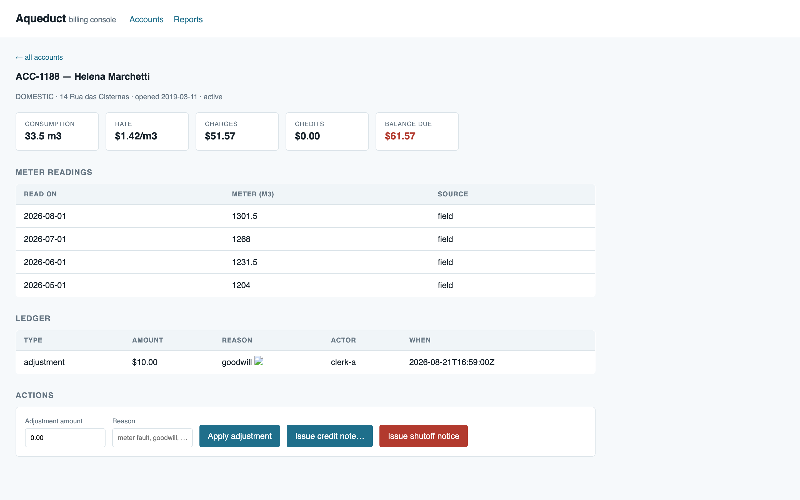

The same thing happens from account data with no clerk involved at all — `ACC-9002`'s holder name in the seed carries a payload, and simply opening the accounts list sets `document.title` to `AQ-XSS`:

```json
{ "documentTitle": "AQ-XSS", "xssFired": true,
  "imgTagsInjectedIntoTable": 1,
  "holderCellHTML": "Moveis " }
```

**Why it happens.** Four sinks, all the same pattern — string concatenation into `innerHTML` with no escaping:

- `renderList` (`app.js:30-38`) — `id`, `holder_name`, `service_class`, `status`
- `renderDetail` (`app.js:49`) — `d-title` from `holder_name`
- `renderDetail` (`app.js:74`) — readings `read_on` and `source`
- `ledgerRow` (`app.js:93`) — `reason` and `actor`

There is no Content-Security-Policy header either, so nothing mitigates it in depth.

**What it costs.** With no login (a documented gap) the practical exposure is anyone who can reach the office network, and the payload persists in the database and fires for every clerk who opens the affected screen. Given the endpoints in this same console dispatch disconnection crews and write irreversible credit notes, script running in a clerk's session can drive those actions as that clerk. The `reason` sink is the one that matters most: it is a free-text field clerks are expected to type into, so this is reachable without touching the database.

**Fails if:** any value from the API is interpolated into `innerHTML` without escaping. **Reproduced:** 2/2 for both the `reason` and the `holder_name` path.

### <a id="c17"></a>Case 17 — the modal's own error message is painted underneath the modal

**What should happen.** Typing a non-numeric amount into the credit-note modal and confirming should tell the clerk why nothing happened.

**What happened.** The message is created, is not hidden, has correct text — and is behind the modal's scrim, so the clerk sees nothing at all and the modal just sits there.

I drove the modal, entered `abc`, and clicked confirm. The toast auto-hides after 4s, faster than a tool round-trip, so I froze that one timer to photograph the state; nothing about layout or stacking was altered.

```json
{ "toastTextInDOM": "Amount must be a number",
  "toastVisibleAttrWise": true,
  "toastRect": { "x": 620, "y": 833, "w": 201, "h": 43 },
  "toastZIndex": "5",
  "modalStillOpen": true,
  "modalZIndex": "1000",
  "elementActuallyPaintedAtToastCentre": "modal",
  "userCanSeeToast": false }
```

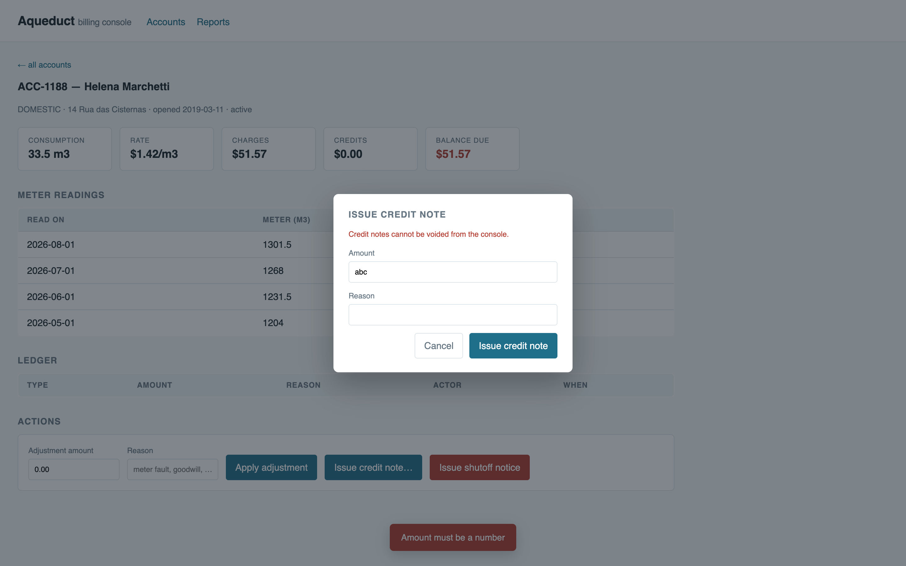

**Why it happens.** `style.css:102` gives `.toast` `z-index: 5`; `style.css:87` gives `.modal` `z-index: 1000`. The toast was authored against the page and is then shown on top of a dialog that outranks it. `confirmCreditNote` (`app.js:127-130`) deliberately leaves the modal open on the client-side rejection path — the one branch where the toast is the only feedback there is.

Note this passes any DOM assertion: the element exists, `hidden` is `false`, the text is right. `document.elementFromPoint` at the toast's own centre returns the modal, which is what proves the user cannot see it.

**What it costs.** The clerk clicks "Issue credit note", nothing visibly happens, and the natural response is to click again — against an endpoint with no duplicate protection (Case 11) on an irreversible action, as soon as they correct the amount.

### <a id="c12"></a>Case 12 — the confirmation gates are on the wrong actions

The reversible-ish credit note gets a modal and a red warning. The irreversible crew dispatch gets a single click.

Before — `ACC-1188`, `active`, no notices:

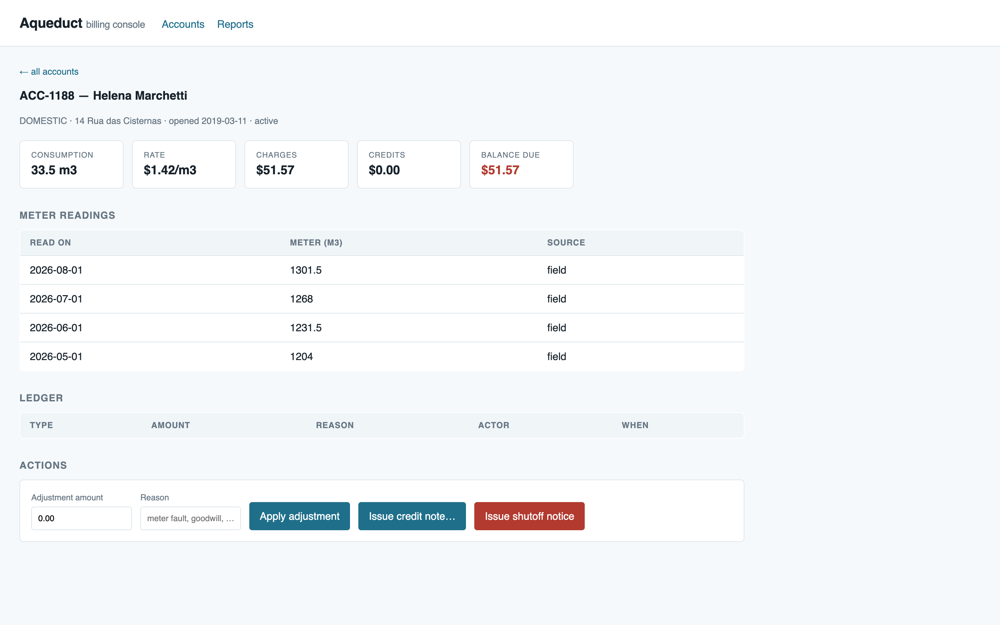

After one click on "Issue shutoff notice", with no dialog in between:

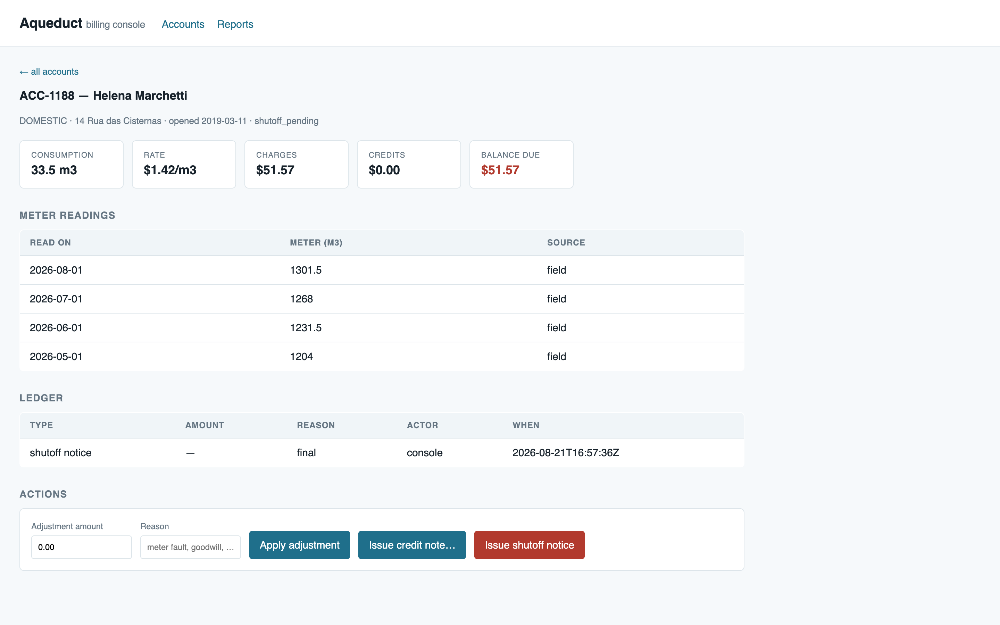

```
# before
ACC-1188|active
0
# after one click
ACC-1188|shutoff_pending
1|ACC-1188|console|final|2026-08-21T16:57:36Z
```

`issueShutoff` (`app.js:144-152`) posts `{stage: 'final'}` unconditionally — there is no stage selector in the UI, so `reminder` and `warning` cannot be issued from the console at all. The only stage a clerk can send is the one the README reserves for supervisors.

### <a id="c21"></a>Case 21 — a TypeError on every page load

```
Uncaught TypeError: Cannot read properties of undefined (reading 'render')
```

`initSparkline` (`app.js:18-21`) calls `window.Chartlet.render(...)`. Nothing defines `Chartlet` — no script tag in `index.html`, no bundle — and `evaluate_script` confirms `typeof window.Chartlet === "undefined"`. The `.sparkline` element is styled `height: 0`, so the feature is invisible either way. It fires on every navigation of this run. Low severity on its own; the cost is that a permanently dirty console is where a real error goes unnoticed, which is exactly what happened with Case 10's `SyntaxError`.

---

## Flow 5 — Field use: the console on a phone

The brief says clerks use this on phones out in the field. Both defects here are in `style.css`.

| # | Case | Expected | Result | Evidence |
|---|------|----------|--------|----------|
| 18 | Accounts list at phone width | balance visible, table scrolls in place | ❌ balance and status off-screen | [details](#c18) · `cases/TC-73` |
| 19 | Credit-note modal at phone width | usable | ❌ confirm button off-screen, no way to dismiss | [details](#c19) · `cases/TC-74` |

### <a id="c18"></a>Case 18 — the balance due is off the right edge of the phone

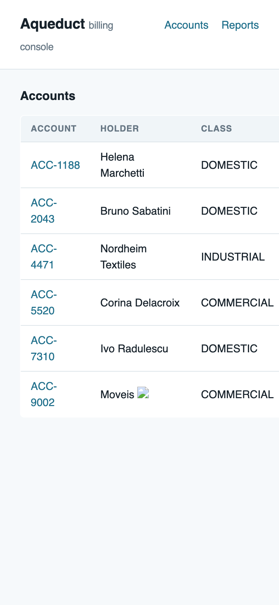

Measured two ways, because the symptom presents differently in each:

```json
// window narrowed to 500px (Chrome's minimum), desktop mode
{ "viewportWidth": 500, "documentScrollWidth": 748,
  "pageScrollsHorizontally": true, "horizontalOverflowPx": 248,
  "tableCssMinWidth": "720px", "tableParentOverflowX": "visible",
  "balanceDueCell": { "right": 669, "visible": false },
  "statusCell": { "right": 748, "visible": false } }

// 390x844 mobile emulation
{ "viewportWidth": 748, "tableRenderedWidth": 720 }   // layout viewport forced to 748
```

**Why it happens.** `style.css:43-51` puts `min-width: 720px` on `table` with no scroll container — the parent is a bare `<section>` with `overflow-x: visible`. So the table cannot shrink and cannot scroll inside its own box; the whole page has to scroll instead, or the browser expands the layout viewport to 748px and renders everything at roughly half scale.

**What it costs.** Balance due is the number the clerk is standing at the property to look up, and it is the one that is off-screen. The status column — including `shutoff_pending` — goes with it.

### <a id="c19"></a>Case 19 — the credit-note modal cannot be completed or dismissed on a phone

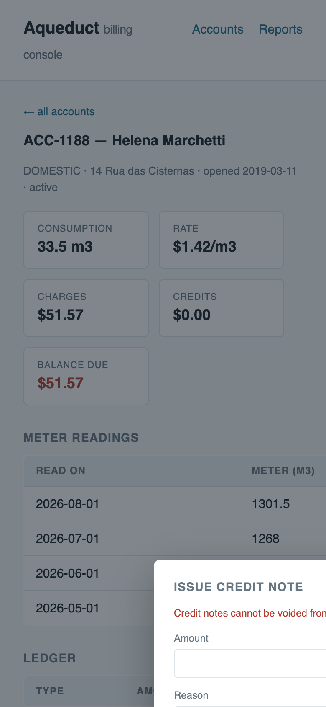

```json
{ "physicalScreenWidthCss": 390, "layoutViewportWidth": 748,
  "amountField":   { "left": 208, "right": 540, "onScreen": false },
  "reasonField":   { "left": 208, "right": 540, "onScreen": false },
  "cancelButton":  { "left": 313, "right": 390, "onScreen": true },
  "confirmButton": { "left": 400, "right": 540, "onScreen": false },
  "backdropClickCloses": false,
  "escapeKeyCloses": false }
```

**Why it happens.** `style.css:89-91` fixes the card at `width: 380px; min-width: 380px`. Because Case 18 inflates the layout viewport to 748px, the flex-centred card lands centred on 374px — off to the right of a 390px screen. `app.js` registers no backdrop-click and no `keydown` handler, so once it is open the only exit is reloading the page.

**What it costs.** A field clerk cannot issue a credit note, and having opened the dialog cannot get back to the account without reloading.

---

## Durable state

Every persistence claim above, as the query and its literal output. All reads are against `aqueduct.db` in the app directory.

<details><summary>The tariff gap behind Case 1</summary>

```
$ sqlite3 aqueduct.db "SELECT * FROM tariffs;"
DOMESTIC|1.42|4.0
COMMERCIAL|2.05|11.5
$ sqlite3 aqueduct.db "SELECT COUNT(*) FROM tariffs WHERE service_class='INDUSTRIAL';"
0
$ sqlite3 aqueduct.db "SELECT DISTINCT service_class FROM accounts;"
DOMESTIC
INDUSTRIAL
COMMERCIAL
```
One of the three service classes in use has no price.
</details>

<details><summary>Shutoff notices written during the run, including the phantom account</summary>

```
$ sqlite3 aqueduct.db "SELECT id,account_id,actor,stage FROM shutoff_notices ORDER BY id;"
1|ACC-2043|clerk-nobody|final
2|ACC-5520|clerk-nobody|final
3|ACC-5520|x|banana
4|ACC-DOES-NOT-EXIST|x|final
$ sqlite3 aqueduct.db "SELECT id,status FROM accounts ORDER BY id;"
ACC-1188|active
ACC-2043|shutoff_pending
ACC-4471|active
ACC-5520|shutoff_pending
ACC-7310|active
ACC-9002|active
$ sqlite3 aqueduct.db "SELECT COUNT(*) FROM accounts WHERE id='ACC-DOES-NOT-EXIST';"
0
```
</details>

<details><summary>Non-finite and duplicate money rows</summary>

```
$ sqlite3 aqueduct.db "SELECT id,account_id,amount,reason FROM credit_notes WHERE account_id='ACC-1188';"
1|ACC-1188|Inf|overflow probe
$ sqlite3 aqueduct.db "SELECT id,amount,reason,created_at FROM credit_notes;"
4|40.0|goodwill CN-77|2026-08-21T16:52:01Z
5|40.0|goodwill CN-77|2026-08-21T16:52:01Z
$ sqlite3 aqueduct.db "SELECT COUNT(*) FROM shutoff_notices WHERE account_id='ACC-1188' AND stage='final';"
10
```
</details>

<details><summary>Orphan rows — the negatives, as queries that returned something they should not have</summary>

```
$ sqlite3 aqueduct.db "SELECT r.id,r.account_id FROM readings r LEFT JOIN accounts a ON a.id=r.account_id WHERE a.id IS NULL;"
17|ACC-NOPE-2
```
</details>

<details><summary>audit_log — the query that came back empty, and why that is not a finding</summary>

```
$ sqlite3 aqueduct.db "SELECT COUNT(*) FROM audit_log;"
0
```
Nothing was written to `audit_log` by any of the 32 cases, including the ten crew dispatches. The README lists this as a known gap, so it is not filed as a defect — it is noted below as a question, because the gap interacts badly with Flow 2.
</details>

<details><summary>Fixture state at end of run</summary>

```
$ python3 seed.py
seeded aqueduct.db: 6 accounts, 15 readings
$ sqlite3 aqueduct.db "SELECT id,status FROM accounts;"
ACC-1188|active
ACC-2043|active
ACC-4471|active
ACC-5520|active
ACC-7310|active
ACC-9002|active
$ sqlite3 aqueduct.db "SELECT (SELECT COUNT(*) FROM adjustments),(SELECT COUNT(*) FROM credit_notes),(SELECT COUNT(*) FROM shutoff_notices),(SELECT COUNT(*) FROM readings r LEFT JOIN accounts a ON a.id=r.account_id WHERE a.id IS NULL);"
0|0|0|0
```
Everything the run wrote has been cleared.
</details>

## Screens driven

Twelve captures, in the order they happened. Screenshot writes into the run directory were refused by the automation server — its workspace root is `/Users/<you>`, not the app tree — so each was captured to a staging directory under that root and moved here immediately; the staging directory has been removed.

| # | Image | What it shows |
|---|---|---|
| 01 | [01-accounts-list-desktop.png](01-accounts-list-desktop.png) | Accounts list, healthy, 1440×900. ACC-4471 green "paid in full" beside 4313 m3; ACC-7310 "null m3"; ACC-9002's broken-image icon is the XSS payload |
| 02 | [02-detail-acc7310-no-readings.png](02-detail-acc7310-no-readings.png) | Empty-readings state: "null m3" and the `undefined` row |
| 03 | [03-detail-acc4471-industrial-zero-bill.png](03-detail-acc4471-industrial-zero-bill.png) | Case 1 on the detail screen: "RATE $0.00/m3", "$0.00 — paid in full", three valid readings below |
| 04 | [04-detail-acc1188-healthy.png](04-detail-acc1188-healthy.png) | A correctly-priced account — the working case, and the "before" for Case 12 |
| 05 | [05-credit-note-modal-desktop.png](05-credit-note-modal-desktop.png) | Credit-note modal, desktop, default state |
| 06 | [06-modal-validation-toast-buried.png](06-modal-validation-toast-buried.png) | Case 17: the error message dimmed beneath the scrim |
| 07 | [07-accounts-list-mobile-390.png](07-accounts-list-mobile-390.png) | Case 18: balance and status off-screen at 390px |
| 08 | [08-credit-note-modal-mobile-390.png](08-credit-note-modal-mobile-390.png) | Case 19: modal pushed off the right edge |
| 09 | [09-shutoff-after-one-click.png](09-shutoff-after-one-click.png) | Case 12 "after": `shutoff_pending`, final notice in the ledger |
| 10 | [10-accounts-list-dead-after-overflow.png](10-accounts-list-dead-after-overflow.png) | Case 10: the home screen with zero rows |
| 11 | [11-stored-xss-via-ledger-reason.png](11-stored-xss-via-ledger-reason.png) | Case 15: injected ledger row, tab title rewritten |
| 12 | [12-meter-swap-negative-period.png](12-meter-swap-negative-period.png) | The signed-off negative period, carried correctly — and labelled "paid in full" |

## Console and network

The console was pulled after each meaningful step rather than once at the end.

**Every page load, on every screen:**
```
[error] Uncaught TypeError: Cannot read properties of undefined (reading 'render')
```

**After the overflow credit note, on the accounts list:**
```
[error] Uncaught TypeError: Cannot read properties of undefined (reading 'render')
[error] Uncaught (in promise) SyntaxError: No number after minus sign in JSON at position 925 (line 36 column 23)
```

Network on that same load — note every request succeeded, which is why the blank screen has no server-side signal at all:
```
GET http://localhost:8414/                  [200]
GET http://localhost:8414/static/style.css  [200]
GET http://localhost:8414/static/app.js     [200]
GET http://localhost:8414/api/accounts      [200]   <- 200, and unparseable
```

A `404` also appears on the initial list load (favicon), which is noise.

Two claims in this report were measured from the DOM rather than read off a rendered capture, and are labelled as such where they appear: the stacking check in Case 17 (`document.elementFromPoint`) and the geometry in Cases 18 and 19 (`getBoundingClientRect`). Both are paired with a screenshot showing the same thing.

## Checks outside the run

There is no test suite, no linter config and no build in this project — `find` returns only `server.py`, `seed.py`, `README.md` and three static files. Nothing could be run beyond the campaign itself. The server's own stderr log is at `server.log`.

## Coverage — what this run reached

| Interesting state | Reached? | Evidence |
|---|---|---|
| Missing tariff class, both directions | yes | `cases/TC-01`, `TC-02` |
| Every POST endpoint with malformed bytes, wrong types, missing and extra fields | yes | `cases/TC-20`,`21`,`24`,`28`,`40`,`53` |
| Client-supplied values the server should not trust (`stage`, `actor`, `read_on`, `amount`, `source`) | yes | `cases/TC-11`,`12`,`41`,`43`,`26`,`25` |
| Duplicate and concurrent requests | yes | `cases/TC-60`, `TC-61` |
| Nonexistent-account identities on every write path | yes | `cases/TC-13`, `TC-27`, `TC-42` |
| UI at desktop and phone widths, incl. the overlay surface | yes | 01–12 |
| Empty / error / success states of each screen | yes | 02, 04, 06, 10 |
| **A no-credential or wrong-actor identity** | **no** | there is no authentication to bypass; documented gap |
| **Behaviour when `read_on` is a valid but out-of-order backdated correction** | **no** | only invalid-format dates were driven; a valid backdated ISO date was not tested |
| **The `reminder` → `warning` → `final` sequence issued in the correct order** | **no** | the console cannot issue `reminder` or `warning` at all, so the happy path of the disconnection policy has never been exercised anywhere |
| **Whether anything downstream consumes `shutoff_notices`** | **no** | no consumer exists in this tree; whether a crew is actually dispatched is outside the console |
| **Concurrent writes from two browsers** | **no** | concurrency was driven at the API only |
| **Behaviour at production data volume** | **no** | 6 accounts, 15 readings; no timing claim in this report should be read as a performance result |

The "no" rows matter more than the "yes" ones. In particular, nobody has ever run the disconnection policy as designed, because the console provides no way to do it.

## Questions for the team — not defects

These are things I could not settle from the code and the README, and I am not filing any of them as defects.

1. **The negative-consumption sign-off holds, but the label may not be what Billing meant.** I tested it as designed: a meter swap on `ACC-1188` (old unit at 1301.5, new unit reading 12.0) produced `consumption_m3: -1289.5` and `charges: -1827.09`, carried and not clamped, exactly as the README and the `consumption()` docstring specify. The behaviour is correct. The question is the display — the tile reads **"-$1827.09 — paid in full"** in green ([12-meter-swap-negative-period.png](12-meter-swap-negative-period.png)), because `app.js` treats any `balance_due <= 0` as settled. A $1,827 credit balance is not the same thing as a settled account, and this is also what makes Case 1's `$0.00` read as reassuring. Is "paid in full" the right label for a credit balance, or should credit balances be shown distinctly?
2. **Should `audit_log` be a blocker for the disconnection path specifically?** The README lists the unwritten `audit_log` as a known gap, which I have respected. But Flow 2 writes ten irreversible dispatch records with an `actor` the client chose freely and no audit trail, so there is currently no way to reconstruct who dispatched a crew. That may be an acceptable gap for adjustments and a serious one for disconnections — a judgement I cannot make from here.
3. **Can `reminder` and `warning` be issued at all today?** The API accepts them but the console only ever sends `final`. If the earlier stages are issued by some other system, the ordering check in Case 5 needs to read that system's data; if not, the policy has no implementation anywhere.
4. **Is a negative adjustment intended, while a negative credit note is not?** I have treated the negative credit note as a defect (Case 9) on the grounds that it inverts the meaning of the record. Negative adjustments look legitimate. Confirm the asymmetry before it is enforced in code.
5. **Should the console show that a service class is unpriced, or refuse to load the account?** This is the product half of Case 1. Refusing is safer; showing a clear "unpriced — awaiting tariff" state may be more useful to a clerk. Either beats `$0.00`.

## Residual risk

- **The disconnection policy has never been executed end to end, by anyone.** The console cannot issue `reminder` or `warning`, so the ordering rule has no working path to be tested against — fixing Case 5 by adding the check will make the console's only shutoff button fail until a stage selector exists. Those two changes have to land together.
- **No claim here covers what happens after a notice is written.** Whether `shutoff_notices` actually reaches a dispatch system, and whether that system is idempotent over the ten duplicate rows in Case 9, is outside this tree and untested.
- **Case 10's recovery path is unverified.** I proved a poisoned credit note blanks the console and that there is no console route to void one; I did not attempt or verify a repair procedure, so "delete the row in SQL" is an inference, not a tested recovery.
- **Every timing figure is from a six-account SQLite fixture on a laptop, single user, warm.** `balance()` runs three queries per account and `api_accounts` calls it in a loop, so the list endpoint is O(accounts × 3) queries with no index on `readings.account_id` — at real utility scale that is a plausible problem, and this run says nothing about it either way.
- **The XSS blast radius assumes the office-network boundary described in the README is real.** I could not verify that boundary. If the console is reachable more widely than the README believes, Case 15's severity rises sharply.
- **No authentication exists, so no authorisation case could be run.** Every "identity" probe in this report is really an input-validation probe.

## Next steps

Ordered by what stops the worst outcome soonest.

1. **Make `lookup_tariff` unable to return a silent zero** (Case 1) — return an explicit "not found" and have `balance()` refuse to produce a `balance_due` for an unpriced class. Owner: whoever owns billing. This is the one that is losing money right now, in production, invisibly.
2. **Enforce the disconnection state machine server-side** (Cases 5–8) — require two prior notices before `final`, constrain `stage` to the three legal values, stop defaulting to `final`, and reject unknown accounts. Ship it with a stage selector in the UI (Case 12) or the console's shutoff button stops working.
3. **Reject non-finite and negative amounts, and set `allow_nan=False` on the JSON encoder** (Cases 9, 10) — the encoder flag alone converts a silent console-wide outage into a loud 500, and is a one-line change worth making today even before the input validation lands.
4. **Escape all interpolated values in `app.js`** (Case 15) — four sinks, listed above; `textContent` or an escape helper. Add a CSP header while you are there.
5. **Validate input at every handler and stop serialising tracebacks** (Case 13) — return 400 with a field name, log the trace server-side only.
6. **Validate `read_on` as an ISO date** (Cases 3, 4) — and consider a `CHECK` constraint, since the ordering depends on it.
7. **Fix the two CSS defects** (Cases 18, 19) — wrap tables in an `overflow-x: auto` container, make the modal card `width: min(380px, calc(100vw - 32px))`, and raise the toast above the modal (Case 17).
8. **Add existence checks and foreign keys** (Case 8b), **an idempotency guard on credit notes** (Case 11), **a length cap on free-text fields** (Case 16), and **remove or implement `Chartlet`** (Case 21).
9. **Answer the five questions above**, particularly 1 and 3 — both change what the fixes in steps 1 and 2 should actually do.

---

# Fixes applied, and the re-run against them

Everything above describes the build as found. The fixes below were then applied to that same tree and every failing case was re-run. The full re-run transcript is `rerun-after-fix.txt`.

**Build after fixes:** `server.py` sha256 `cb6f0bfd…`, `static/app.js` sha256 `c0ca5d2a…`, `static/index.html` sha256 `c46c8eab…`, `static/style.css` sha256 `3c0b88fa…` (full list in `build-marker-fixed.txt`). `seed.py` also changed — it now creates a unique index and three lookup indexes, so **`python3 seed.py` must be re-run** for the concurrency guard to exist.

**Left alone deliberately:** the negative-consumption sign-off, the unwritten `audit_log`, the absent login, and the unbuilt Reports screen. The first is signed-off behaviour and is regression-checked below; the other three are documented gaps, and closing them is a product decision, not a bug fix.

## What changed

**`server.py`**

- `lookup_tariff` returns `None` for a missing service class instead of `(0.0, 0.0)`. `balance()` handles that by returning `priced: false`, an `unpriced_reason`, and `balance_due: null` — it no longer states a balance it cannot compute.
- A validation layer: `req_str` / `opt_str` (type, emptiness, 500-char cap), `req_amount` (finite via `math.isfinite`, optional non-negative, ±1,000,000 bound), `req_date` (`date.fromisoformat`), and `load_account`, which every write handler now calls first so no row can be written against an account that does not exist.
- `api_shutoff` requires `stage`, constrains it to `reminder`/`warning`/`final`, and refuses a stage whose predecessors are not already on record. A repeat of an existing stage is a 409. Only `final` moves the account to `shutoff_pending`.
- Credit notes reject negative amounts and 409 on an identical note within 60 seconds. Adjustments still accept negatives, which is how an overcharge is corrected.
- `BadRequest` maps to 400 with a message naming the field. Unhandled exceptions log the traceback to stderr and return a bare `{"error": "server error"}` — no trace in the body.
- `json.dumps(..., allow_nan=False)`, so a non-finite value can never again be serialised as a token that breaks every client.

**`seed.py`** — `UNIQUE INDEX ux_shutoff_account_stage (account_id, stage)`, because the handler's check and its insert are not one transaction; plus indexes on `readings(account_id, read_on DESC)`, `adjustments(account_id)` and `credit_notes(account_id)`.

**`static/app.js`** — an `esc()` helper applied to every value interpolated into `innerHTML`, and `d-title` moved to `textContent`; `money()` returns `—` for non-numbers; unpriced accounts render "unpriced — awaiting tariff" and a banner rather than a currency figure; the `[{}]` empty-readings placeholder replaced with a real empty row; errors raised while the modal is open render *inside* the modal; the shutoff button offers only the next legal stage and asks for confirmation before `final`; `Escape` and backdrop click close the modal; both `fetch` chains have a `.catch`; the `Chartlet` call is gone.

**`static/style.css`** — tables wrapped in an `overflow-x: auto` container so they scroll in place instead of moving the page; modal card `width: 380px; max-width: 100%` with a `max-height` and its own padding; toast `z-index` raised to 2000, above the modal's 1000; an `unpriced` colour token and a narrow-width block.

## Re-run results

| # | Case | Before | After | Evidence |
|---|------|--------|-------|----------|
| 1 | INDUSTRIAL account, no tariff | ❌ `balance_due: 0.0`, "paid in full" | ✅ `priced:false`, `balance_due:null`, banner | [details](#r1) |
| 3 | `read_on: tomorrow-ish` | ❌ 201, reprices to $118.31 | ✅ 400 | [details](#r3) |
| 4 | `read_on: 01-09-2026` | ❌ 201, silently unbilled | ✅ 400 | [details](#r3) |
| 5 | `final` with no prior notices | ❌ 201, crew dispatched | ✅ 400, names the missing stages | [details](#r2) |
| 6 | `stage` omitted | ❌ defaults to `final` | ✅ 400, required | [details](#r2) |
| 7 | `stage: "banana"` | ❌ 201, stored | ✅ 400 | [details](#r2) |
| 8 | Write against a phantom account | ❌ 201, orphan row | ✅ 400 on all four endpoints | [details](#r2) · [details](#r4) |
| 9 | Concurrent duplicate notices | ❌ 10 rows | ✅ 1 row, 5/5 trials | [details](#r5) |
| 9b | Credit note `-5000` | ❌ 201, balance +$5,000 | ✅ 400 | [details](#r4) |
| 10 | Credit note `1e400` | ❌ 201, console-wide outage | ✅ 400 | [details](#r4) |
| 11 | Duplicate credit note | ❌ 2 rows | ✅ 409, 1 row | [details](#r6) |
| 13 | Seven malformed-input probes | ❌ 500 + traceback | ✅ 400 + field message, no trace | [details](#r4) |
| 14 | Empty readings state | ❌ "null m3", `undefined` row | ✅ "no reading yet", "No meter readings yet." | [details](#r7) |
| 15 | XSS via `reason` and `holder_name` | ❌ script executes | ✅ rendered as text | [details](#r8) |
| 16 | 20,004-char reason | ❌ 201, stored | ✅ 400 | [details](#r4) |
| 17 | Modal rejection message | ❌ painted under the scrim | ✅ inside the modal | [details](#r9) |
| 12 | Shutoff button | ❌ one click, irreversible | ✅ next-legal-stage only, confirm before `final` | [details](#r10) |
| 18 | Accounts list at 390px | ❌ page scrolls, balance off-screen | ⚠️ partial — table scrolls in place, balance still needs a swipe | [details](#r11) |
| 19 | Modal at 390px | ❌ buttons off-screen, no exit | ✅ fully on screen, Escape and backdrop close it | [details](#r12) |
| 21 | Console on page load | ❌ TypeError every load | ✅ clean | [details](#r13) |
| 6b | **Negative consumption (signed off)** | ✅ carried | ✅ still carried, −1289.5 m³ | [details](#r14) |

### <a id="r1"></a>Case 1 — the unpriced account now says so

<details><summary>request / response</summary>

```bash
curl -sS -w '\nHTTP %{http_code} in %{time_total}s\n' \
  http://127.0.0.1:8414/api/accounts/ACC-4471
```
```json
{
  "billing": {
    "account_id": "ACC-4471",
    "priced": false,
    "unpriced_reason": "no tariff for service class INDUSTRIAL",
    "rate_per_m3": null,
    "standing_fee": null,
    "consumption_m3": 4313.0,
    "charges": null,
    "adjustments": 0,
    "credits": 0,
    "balance_due": null
  }
}
```
```
HTTP 200 in 0.001483s
```
</details>

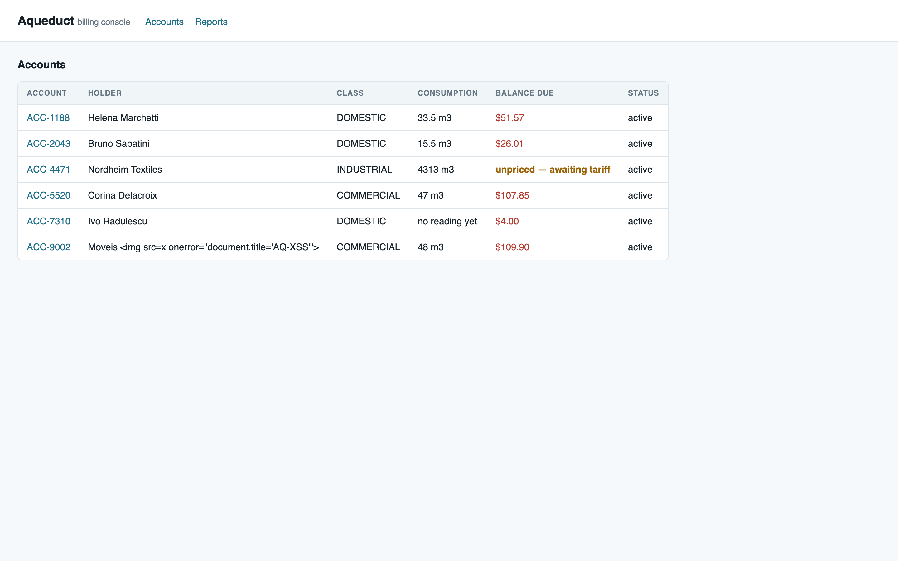

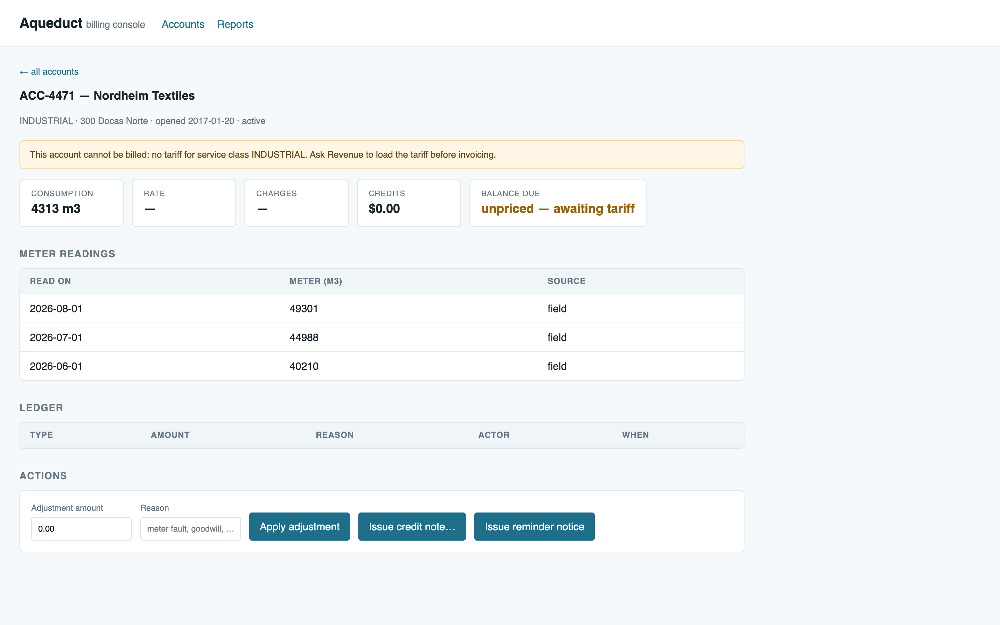

### <a id="r2"></a>Cases 5–8 — the disconnection policy is enforced

<details><summary>the four rejections</summary>

```
--- final with no prior notices ---
{ "error": "cannot issue 'final' for ACC-2043: missing prior notice(s): reminder, warning" }
HTTP 400 in 0.000813s

--- stage omitted ---
{ "error": "stage is required, one of: reminder, warning, final" }
HTTP 400 in 0.000781s

--- stage=banana ---
{ "error": "stage must be one of: reminder, warning, final" }
HTTP 400 in 0.000694s

--- final on a phantom account ---
{ "error": "no such account: ACC-DOES-NOT-EXIST" }
HTTP 400 in 0.000757s
```
</details>

<details><summary>and the policy running in order — which had never been executable</summary>

```
--- issue reminder ---
{ "ok": true, "account_id": "ACC-2043", "actor": "sup-1", "stage": "reminder" }   HTTP 201
--- issue warning ---
{ "ok": true, "account_id": "ACC-2043", "actor": "sup-1", "stage": "warning" }    HTTP 201
--- issue final ---
{ "ok": true, "account_id": "ACC-2043", "actor": "sup-1", "stage": "final" }      HTTP 201
--- replay the final ---
{ "error": "already issued", "detail": "a 'final' notice already exists for ACC-2043" }
HTTP 409
```
```
$ sqlite3 aqueduct.db "SELECT id,account_id,actor,stage FROM shutoff_notices ORDER BY id;"
1|ACC-2043|sup-1|reminder
2|ACC-2043|sup-1|warning
3|ACC-2043|sup-1|final
$ sqlite3 aqueduct.db "SELECT id,status FROM accounts WHERE id='ACC-2043';"
ACC-2043|shutoff_pending
```
</details>

### <a id="r3"></a>Cases 3, 4 — dates are parsed

<details><summary>request / response</summary>

```
--- read_on=tomorrow-ish ---
{ "error": "read_on must be a YYYY-MM-DD date, got 'tomorrow-ish'" }   HTTP 400
--- read_on=01-09-2026 ---
{ "error": "read_on must be a YYYY-MM-DD date, got '01-09-2026'" }     HTTP 400
--- read_on=2026-09-01 (valid) ---
{ "ok": true, "billing": { "consumption_m3": 11.5, "charges": 20.33, "balance_due": 20.33 } }
HTTP 201
```
The 11.5 m³ that Case 4 silently discarded is now billed.
</details>

### <a id="r4"></a>Case 13 and the money probes — 400 with a message, no traceback

<details><summary>all ten, verbatim</summary>

```
--- credit note 1e400 ---        { "error": "amount must be a finite number" }        HTTP 400
--- credit note NaN ---          { "error": "amount must be a finite number" }        HTTP 400
--- credit note -5000 ---        { "error": "amount must not be negative" }           HTTP 400
--- credit note phantom acct --- { "error": "no such account: ACC-NOPE" }             HTTP 400
--- adjustment missing amount ---{ "error": "amount is required" }                    HTTP 400
--- adjustment amount=abc ---    { "error": "amount must be a number" }               HTTP 400
--- malformed bytes ---          { "error": "request body must be valid JSON" }       HTTP 400
--- wrong types ---              { "error": "account_id must be a string" }           HTTP 400
--- 20000-char reason ---        { "error": "reason must be at most 500 characters" } HTTP 400
--- meter_m3=not-a-number ---    { "error": "meter_m3 must be a number" }             HTTP 400
```
No response body contains a stack trace, a file path, or an interpreter version.

A negative *adjustment* is still accepted, because that is a legitimate overcharge correction:
```
--- adjustment -12.50 ---
{ "ok": true, "billing": { "adjustments": -12.5, "balance_due": 39.07 } }   HTTP 201
```

Orphan check across every table:
```
$ sqlite3 aqueduct.db "SELECT 'readings',COUNT(*) FROM readings r LEFT JOIN accounts a ON a.id=r.account_id WHERE a.id IS NULL UNION ALL ..."
readings|0
adjustments|0
credit_notes|0
shutoff_notices|0
```
</details>

### <a id="r5"></a>Case 9 — concurrency, five trials

<details><summary>12 parallel identical requests, repeated five times</summary>

```
201 409 409 409 409 409 409 409 409 409 409 409  -> rows written: 1 (expect 1)
201 409 409 409 409 409 409 409 409 409 409 409  -> rows written: 1 (expect 1)
201 409 409 409 409 409 409 409 409 409 409 409  -> rows written: 1 (expect 1)
201 409 409 409 409 409 409 409 409 409 409 409  -> rows written: 1 (expect 1)
201 409 409 409 409 409 409 409 409 409 409 409  -> rows written: 1 (expect 1)
```
Exactly one write per trial. The handler's pre-check would race on its own; the `UNIQUE` index is what makes this hold, and `sqlite3.IntegrityError` is translated to the same 409 rather than escaping as a 500.
</details>

### <a id="r6"></a>Case 11 — the retried credit note

<details><summary>request / response</summary>

```json
{ "ok": true, "billing": { "credits": 40.0, "balance_due": 11.57 } }
HTTP 201
{ "error": "duplicate credit note",
  "detail": "an identical credit note was issued in the last 60 seconds; not issuing a second one",
  "existing_credit_note_id": 1,
  "billing": { "credits": 40.0, "balance_due": 11.57 } }
HTTP 409
```
```
$ sqlite3 aqueduct.db "SELECT COUNT(*) FROM credit_notes WHERE account_id='ACC-1188';"
1
```
</details>

### <a id="r7"></a>Case 14 — the empty state

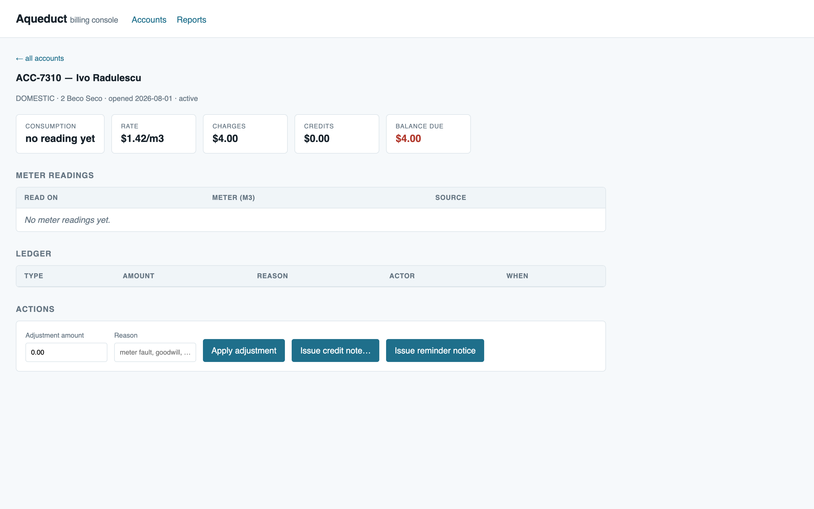

```json
{ "consumptionTile": "no reading yet",
  "readingsTableText": "No meter readings yet.",
  "anyUndefinedOnPage": false,
  "anyNullOnPage": false }
```

### <a id="r8"></a>Case 15 — the payloads render as text

Measured on the accounts list, which previously rewrote `document.title` on load:

```json
{ "documentTitle": "Aqueduct — Billing Console",
  "xssStillFires": false,
  "injectedImgTags": 0,
  "holderCellRendersAsText": "Moveis &lt;img src=x onerror=\"document.title='AQ-XSS'\"&gt;" }
```

Visible in [13-accounts-list-desktop-fixed.png](13-accounts-list-desktop-fixed.png) — ACC-9002's holder name now reads as the literal string `Moveis ` instead of a broken-image icon.

### <a id="r9"></a>Case 17 — the rejection message is where the clerk is looking

```json
{ "errorText": "Amount must be a finite number",
  "errorVisible": true,
  "errorRect": { "x": 554, "y": 370, "w": 332, "h": 34 },
  "elementPaintedAtErrorCentre": "cn-error",
  "userCanSeeError": true,
  "modalStillOpen": true }
```

`document.elementFromPoint` at the message's own centre now returns the message, not the modal.

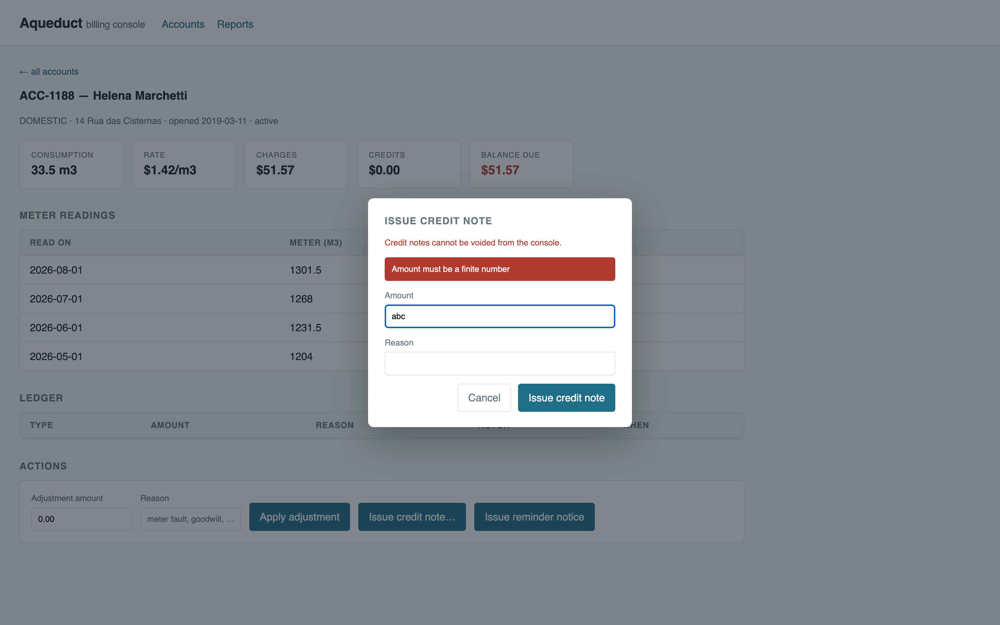

### <a id="r10"></a>Case 12 — the irreversible action is gated

The button now offers only the next legal stage. On an account with no notices it reads "Issue reminder notice" and is not styled as dangerous ([14-detail-acc4471-unpriced-fixed.png](14-detail-acc4471-unpriced-fixed.png)). With `reminder` and `warning` on record it reads "Issue final notice" and clicking it raises:

```
confirm: Issue a FINAL disconnection notice for ACC-1188?

This dispatches a crew and cannot be reversed from the console.
```

Dismissing it writes nothing — the important half of the assertion:

```
### after CANCELLING the confirm dialog
$ sqlite3 aqueduct.db "SELECT stage FROM shutoff_notices WHERE account_id='ACC-1188';"
reminder
warning
$ sqlite3 aqueduct.db "SELECT id,status FROM accounts WHERE id='ACC-1188';"
ACC-1188|active
```

Accepting it completes the sequence and disables the control:

```json
{ "buttonLabelAfter": "All notices issued", "buttonDisabled": true, "toastText": "final notice issued" }
```
```
$ sqlite3 aqueduct.db "SELECT id,stage,actor FROM shutoff_notices WHERE account_id='ACC-1188' ORDER BY id;"
1|reminder|sup-1
2|warning|sup-1
3|final|console
$ sqlite3 aqueduct.db "SELECT COUNT(*) FROM shutoff_notices WHERE account_id='ACC-1188' AND stage='final';"
1
```

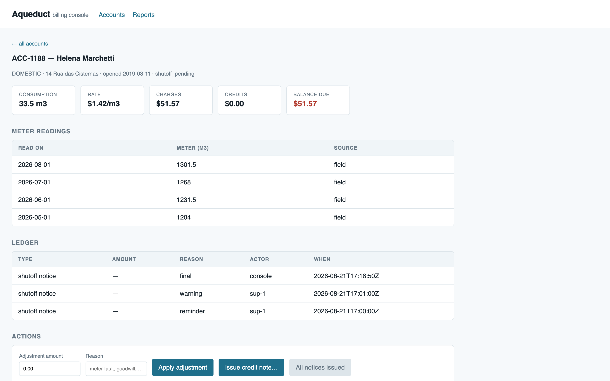

During this check the confirm dialog was raised a second time by a stray click; the unique index absorbed it and the `final` row count stayed at 1. That was not a planned case, and it is the most convincing evidence in this section that the constraint is doing real work.

### <a id="r11"></a>Case 18 — partially fixed, and worth reading carefully

```json
{ "layoutViewportWidth": 390,
  "documentScrollWidth": 390,
  "pageScrollsHorizontally": false,
  "tableParentClass": "table-wrap",
  "tableParentOverflowX": "auto",
  "wrapperScrollsInsteadOfPage": true,
  "wrapperClientWidth": 356,
  "wrapperScrollWidth": 738 }
```

Two things improved and one did not. The layout viewport is a true 390px rather than being inflated to 748px, so text renders at full size instead of at roughly half scale; and the table scrolls inside its own box rather than dragging the page sideways.

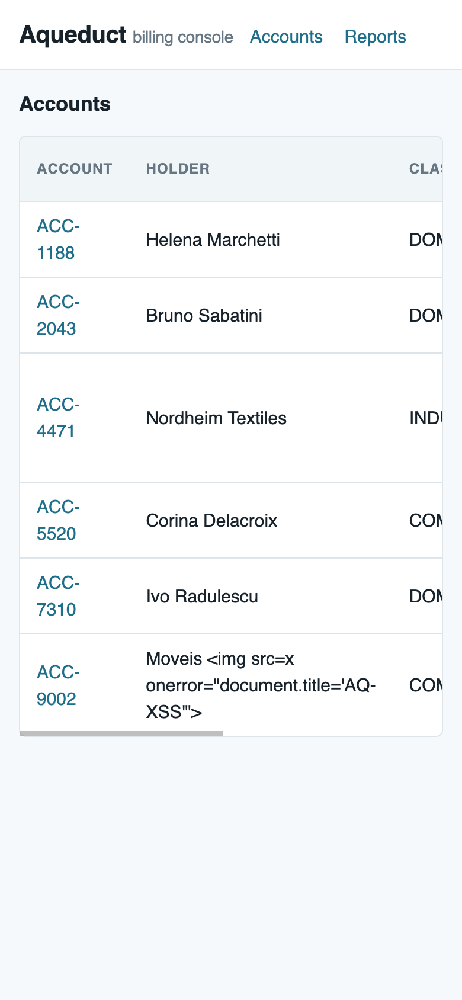

**Balance due is still not visible without a swipe.** Six columns do not fit on a phone, and the standard scroll container does not change that:

```json
{ "scrolledWithinWrapper": 382, "pageStillNotScrolled": 0,
  "balanceCellText": "unpriced — awaiting tariff", "balanceNowOnScreen": true }
```

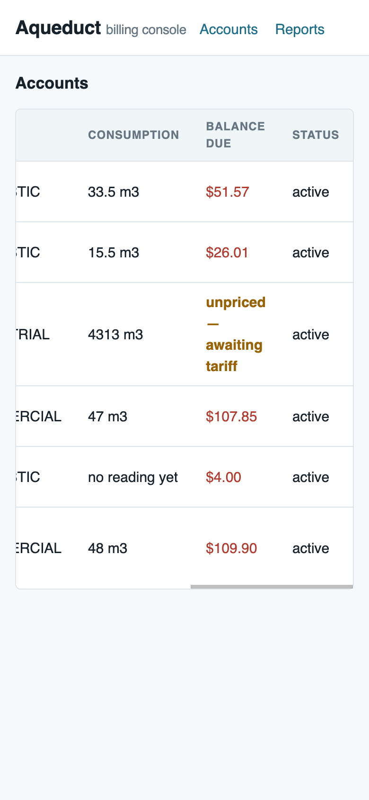

The data is reachable and the page no longer misbehaves, but the number a field clerk opens the app to read is one gesture away. Making it the first thing they see means a card layout at narrow widths — a redesign of the list, not a bug fix, so I have not done it. Flagged in residual risk.

### <a id="r12"></a>Case 19 — the modal fits and can be dismissed

```json
{ "layoutViewportWidth": 390, "cardWidth": 358, "cardOnScreen": true,
  "amountField":   { "left": 40,  "right": 350, "onScreen": true },
  "reasonField":   { "left": 40,  "right": 350, "onScreen": true },
  "cancelButton":  { "left": 123, "right": 200, "onScreen": true },
  "confirmButton": { "left": 210, "right": 350, "onScreen": true } }
```
```json
{ "escapeClosesModal": true, "backdropClickClosesModal": true }
```

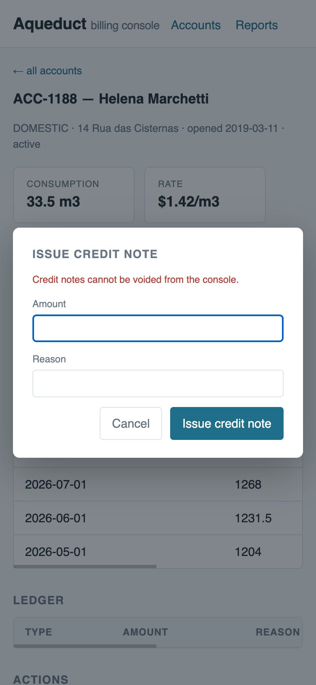

### <a id="r13"></a>Case 21 — clean console

`list_console_messages` returns no messages on the accounts list and on account detail, before and after driving the actions. Previously every load produced a `TypeError`.

### <a id="r14"></a>The signed-off behaviour, regression-checked

The point of this check is that none of the above quietly "fixed" something Billing asked to be left alone. Same meter swap as before — old unit at 1301.5, new unit reading 12.0:

```
consumption_m3: -1289.5   charges: -1827.09
```

Carried, not clamped, unchanged. The `-$1827.09 — paid in full` label is also unchanged, because that is question 1 for Billing rather than a defect, and answering it is their call.

## Verdict after fixes

**CONDITIONAL.** The six worst findings are closed with evidence, and the disconnection policy can now be executed as written for the first time. Three things gate an actual ship:

1. **`python3 seed.py` must be re-run** or the unique index does not exist and Case 9's concurrency guard is absent. On a real database this is a migration, not a re-seed, and nobody has written one.
2. **Question 3 is unanswered** — whether `reminder` and `warning` are issued elsewhere. The ordering check now requires them to exist in *this* database. If another system issues them, the check will block legitimate finals, which is a wrongful-denial harm in the opposite direction from the one that was fixed. This is the single most important thing to confirm before deploying the shutoff change.
3. **Nothing here has been reviewed by anyone but me**, and the fixes were written by the same process that tested them — which is the weakest form of verification in this document.

## Residual risk after fixes

- **Balance due still requires a horizontal swipe on a phone** ([r11](#r11)). Partially addressed; the full answer is a narrow-width card layout.
- **The credit-note duplicate guard is a 60-second window, not a constraint.** Unlike the shutoff guard it has no unique index behind it — two genuinely simultaneous identical requests could still both land, and a legitimate second identical credit note within a minute is refused. A client-supplied idempotency key would be the correct mechanism; the window is a mitigation.
- **`MAX_AMOUNT` of 1,000,000 and `MAX_TEXT` of 500 are my numbers, not the business's.** They are bounds where there were none, but nobody has confirmed a credit note can never legitimately exceed a million.
- **The ordering check reads only `shutoff_notices`.** If notices are ever archived or purged, previously-valid accounts will start failing the check.
- **No test suite exists, so none of this is protected against regression.** Every case in this report is reproducible from `cases/<id>/request.sh`, but nothing runs them automatically. The highest-value follow-up is turning Cases 1, 5, 10 and 15 into an actual test file.
- **Everything unfixed remains unfixed:** no authentication, no audit trail, no Reports screen — all documented gaps, all still open, and the audit-trail one now covers a disconnection path that is enforced but still not attributable ([question 2](#questions-for-the-team--not-defects)).
- **Performance is still unmeasured.** Indexes were added on the columns `balance()` filters by, but `api_accounts` still runs three queries per account in a loop and no measurement at realistic volume was taken.
