> Published copy of a real run against `evals/aqueduct/`. Absolute paths in
> tracebacks and logs were rewritten to `/srv/aqueduct` for publication; no
> other content was altered. The defect this run did **not** find is listed in
> `../GROUND-TRUTH.md`.

# Aqueduct billing console — QA report

Aqueduct is the console revenue clerks use to look at a water account, add a meter reading, correct a bill, and start the disconnection process. A clerk opens an account, sees what the customer consumed and what they owe, and can apply an adjustment, issue a credit note, or issue a disconnection notice. Working means three things: the balance on the screen is the balance the utility can invoice, the three clerk actions do exactly what they say and nothing else, and the disconnection process — which ends in a crew physically cutting off a household's water — follows the order the policy sets out.

Two of those three were broken, and the third had no enforcement at all. The findings below are ranked by what they cost if real. All were reproduced from a clean seed, fixed, and re-verified; the fixes are in `server.py`, `static/app.js`, `static/index.html` and `static/style.css`, with the README's API contract updated to match.

**Verdict:** all findings fixed and re-verified — but the supervisor half of the disconnection policy is only half-enforceable without a login, and that gap is still open. See [Residual risk](#residual-risk).

**Environment:** local, `http://localhost:8413`, SQLite fixture rebuilt by `seed.py` between phases. Classified local: loopback bind, throwaway fixture DB, `seed.py` drops and recreates everything. Safe to mutate.
**Build under test:** no git in the tree, so identified by checksum (sha256, first 8).
Before — `server.py` `414560f6`, `app.js` `2b17164a`, `index.html` `8c3cc136`, `style.css` unmodified.
After — `server.py` `b2fbed42` (`da9e382f` for the first fix pass, amended by [TC-31](#tc-31)), `app.js` `0cfc999a`, `index.html` `2c6681d0`, `style.css` `d8f2246b`, `README.md` `8969b6a0`.
`seed.py` is deliberately unchanged at `1e7d72c3` — the fixture's missing INDUSTRIAL tariff is the test condition, not a data error.
Python 3.14.4. The browser run confirmed the fixed bundle was live before any after-capture, via a cache-ignoring reload plus a marker check (`typeof cell === 'function'`, absent from the original `app.js`).
**Run:** 2026-08-21, 10:24–13:45 · 34 cases executed, 24 failed on the original build, 3 passed on both builds, 1 documented gap tested as designed · fixtures `ACC-1188`, `ACC-2043`, `ACC-4471`, `ACC-5520`, `ACC-7310`, `ACC-9002`, `GHOST-1` (nonexistent, used deliberately)

This report has not been independently reviewed.

## Worst first

1. **An industrial customer who consumed 4,313 m³ was billed $0.00 and shown as "paid in full".** Any account whose service class is missing from the `tariffs` table bills at zero and reports as settled. The README says that table is refreshed weekly from the Revenue team's export, so any class can be absent at any time — including DOMESTIC, which would silently zero every household bill. [TC-01](#tc-01), [TC-26](#tc-26)
2. **A temp intern dispatched a disconnection crew with no prior notices.** None of the disconnection policy was enforced: not the stage order, not the supervisor requirement, not stage validity, not duplicates, not whether the account exists. Omitting `stage` defaulted to `final` — the irreversible value was what you got by saying nothing. [TC-06](#tc-06), [TC-07](#tc-07)
3. **One mistyped adjustment took the whole console offline for every user.** An amount of `1e400` became `inf`, and the API then emitted the bare token `Infinity`, which is not valid JSON. All six accounts vanished from the list screen with no error shown, and there was no way to fix it from the console. [TC-04a](#tc-04a)
4. **A credit note of -$500 raised a customer's balance by $500, permanently.** Credit notes are irreversible by the handler's own docstring, and the balance formula subtracts them — so a slipped minus sign is a permanent phantom debt entered through the one door with no undo. [TC-03](#tc-03)
5. **A payload typed into the Reason field ran in every clerk's browser.** Both the seeded holder name and any clerk-supplied reason were interpolated into `innerHTML`. [TC-23](#tc-23), [TC-24](#tc-24)
6. **Every malformed request returned a 500 carrying a full traceback**, including absolute source paths and the Python install location — while the read side of the same codebase returned clean 404s. [TC-12](#tc-12)
7. **All four write endpoints accepted a nonexistent account**, returning `201 {"ok": true}` and writing orphan money rows. The shutoff endpoint announced a crew dispatch for an account that does not exist. [TC-11](#tc-11), [TC-16](#tc-16)

## How this was tested

I read the code first, because the highest-yield question here is what each dependency returns when it cannot answer. `lookup_tariff` stood out immediately: a lookup with no error return, documented as "a class can be missing between exports", returning `0.0, 0.0` on a miss. That is a rate of zero and a rate we do not know sharing one value. The fixture confirmed the setup was deliberate — `seed.py` omits INDUSTRIAL with a comment pointing at the README — so the first request I issued was the accounts list, and ACC-4471 came back owing nothing on 4,313 m³.

From there I worked by blast radius rather than convenience. Phase one was money: the tariff collapse, the sign of a credit note, and what the amount field accepts. Phase two was the irreversible path, because the README specifies the disconnection policy precisely enough to be a real oracle — three stages in order, supervisor for the last, crew dispatched and not recallable. Every clause of it turned out to be documentation only. Phase three was the cheap probes across every input-accepting endpoint: malformed bytes, wrong types, missing and extra fields, boundaries, repeats, concurrency, and the unhappy identities. Phase four drove the UI in Chrome through the DevTools MCP, which is where the money bug turns into a green "paid in full" and the stored payloads actually execute.

Two things changed course mid-run. The `1e400` probe was meant to be a boundary check on one account; when the response came back containing a bare `Infinity` I followed it to the list endpoint and found the poisoning was console-wide, which moved it from a curiosity to the third-worst finding. And after fixing it, injecting a poisoned row directly into the database showed the detail page still 500ing on exactly the account a clerk would need to open to correct it — so the first fix was incomplete and got a second pass ([TC-31](#tc-31)).

One documented behaviour I deliberately did **not** file. The README states negative consumption is intentional — a swapped meter restarts at zero, and Billing signed off in June 2026 that the negative period is carried rather than clamped so the customer is not charged twice. I tested that as designed instead: it holds, and it still holds after my changes ([TC-02](#tc-02)). This matters for TC-17 below, where a genuinely unvalidated date field produces negative consumption for an entirely different reason, and where the fix had to close the hole without clamping the sanctioned case.

---

## Flow 1 — the balance a clerk reads off the screen

This is the flow everything else depends on: consumption comes from the last two meter readings, the rate comes from the `tariffs` table keyed on the account's service class, and the README gives the formula as `standing_fee + (rate_per_m3 × consumption) + adjustments − credits`. Working means the number shown is a number the utility can invoice.

| # | Case | Expected | Result | Time | Evidence |
|---|------|----------|--------|------|----------|
| 1 | [Account whose service class has no tariff row](#tc-01) | refuse to produce a balance | ❌ billed $0.00, reported settled | 0.002s | [cases/TC-01](cases/TC-01) |
| 2 | [Meter swap carries a negative period (signed off)](#tc-02) | negative carried, not clamped | ✅ | 0.001s | [cases/TC-02](cases/TC-02) |
| 3 | [Accounts with a tariff on file](#tc-01) | formula holds | ✅ | 0.002s | [cases/TC-01](cases/TC-01) |
| 4 | [Account with fewer than two readings](#tc-25) | no consumption, standing fee only | ✅ server-side | 0.001s | [cases/TC-25](cases/TC-25) |

The three accounts whose class *is* on file bill exactly to the formula — ACC-5520 at COMMERCIAL is `11.50 + 2.05 × 47 = 107.85`, which is what the API returned. That is what makes the fourth account's zero a defect rather than a policy: same code path, same formula, and the only difference is a missing lookup row.

### <a id="tc-01"></a>TC-01 — a missing tariff row bills the account at zero and calls it settled `[S1]`

**Attacks:** every account has a billable rate · **Oracle:** the README formula, plus the four sibling accounts whose classes are on file and bill correctly
**Fixture:** `ACC-4471` (Nordheim Textiles, INDUSTRIAL, 4,313 m³ consumed across three readings)

**What should happen.** The account's service class has no row in `tariffs`. The system does not know what to charge, so it must refuse to produce a balance and say why. "I could not look up the rate" and "this account owes nothing" are different facts and must not share a value.

**What happened.** It returned `rate_per_m3: 0.0`, `standing_fee: 0.0`, `charges: 0.0`, `balance_due: 0.0` — and the list screen rendered that as `$0.00 — paid in full` in green.

<details><summary>request / response (before)</summary>

```bash
curl -sS -w '\nHTTP %{http_code} in %{time_total}s\n' http://localhost:8413/api/accounts/ACC-4471
```
```json
{
  "account_id": "ACC-4471",
  "rate_per_m3": 0.0,
  "standing_fee": 0.0,
  "consumption_m3": 4313.0,
  "charges": 0.0,
  "adjustments": 0,
  "credits": 0,
  "balance_due": 0.0
}
```
```
HTTP 200 in 0.002470s
```
</details>

**Direct read** — the API's echo is not proof of the cause, so confirming the tariff row is genuinely absent and the consumption genuinely real:

```
$ sqlite3 aqueduct.db "SELECT service_class, rate_per_m3, standing_fee FROM tariffs;"
DOMESTIC|1.42|4.0
COMMERCIAL|2.05|11.5

$ sqlite3 aqueduct.db "SELECT count(*) FROM tariffs WHERE service_class='INDUSTRIAL';"
0

$ sqlite3 aqueduct.db "SELECT read_on, meter_m3 FROM readings WHERE account_id='ACC-4471' ORDER BY read_on;"
2026-06-01|40210.0
2026-07-01|44988.0
2026-08-01|49301.0
```

Recomputing every account from the raw tables, the missing rate is the only anomaly:

```
$ sqlite3 aqueduct.db "SELECT a.id, a.service_class, <latest - previous> AS used, t.rate_per_m3, t.standing_fee
                       FROM accounts a LEFT JOIN tariffs t ON t.service_class = a.service_class ORDER BY a.id;"
ACC-1188|DOMESTIC|33.5|1.42|4.0
ACC-2043|DOMESTIC|15.5|1.42|4.0
ACC-4471|INDUSTRIAL|4313.0||        <- no rate, no fee
ACC-5520|COMMERCIAL|47.0|2.05|11.5
ACC-7310|DOMESTIC||1.42|4.0
ACC-9002|COMMERCIAL|48.0|2.05|11.5
```

**Why it happens.** `lookup_tariff` is a lookup with no error return — its own docstring said so — and returned `0.0, 0.0` when the class was absent. `balance()` then multiplied consumption by a rate of zero and added a standing fee of zero, producing a real-looking total. Nothing downstream could distinguish that from an account that genuinely owes nothing, so the UI's `balance_due <= 0` branch labelled it paid in full.

**What it costs.** Direct revenue loss, silent, with no error and no metric. At the COMMERCIAL rate this one account's 4,313 m³ is roughly $8,850 for the month. The wider exposure is worse than the one account: the README describes `tariffs` as refreshed weekly from the Revenue team's export, so any class can be missing after any export. If DOMESTIC ever drops out, every household bill silently becomes $0.00 and the console reports all of them as paid.

**The fix.** `lookup_tariff` returns `None` when the class is absent, forcing every caller to handle it. `balance()` now always carries a `billing_status` of `ok` or `blocked`; blocked sets `balance_due` to `null` and puts the reason in `billing_error`. The UI shows "cannot bill" and the reason, never a currency amount.

<details><summary>request / response (after)</summary>

```bash
curl -sS -w '\nHTTP %{http_code} in %{time_total}s\n' http://localhost:8413/api/accounts/ACC-4471
```
```json
{
  "account_id": "ACC-4471",
  "rate_per_m3": null,
  "standing_fee": null,
  "consumption_m3": 4313.0,
  "charges": null,
  "adjustments": 0,
  "credits": 0,
  "balance_due": null,
  "billing_status": "blocked",
  "billing_error": "no tariff on file for service class INDUSTRIAL -- this account cannot be billed until the Revenue export supplies one"
}
```
</details>

**Fails if:** an account whose service class is absent from `tariffs` returns any numeric `balance_due`, or renders as paid. **Reproduced:** 2/2 from clean seed. **Graduates to:** a unit test over `balance()` with a fixture account whose class is not in `tariffs`, asserting `billing_status == "blocked"` and `balance_due is None`.

### <a id="tc-02"></a>TC-02 — the signed-off meter-swap behaviour, tested as designed `[not a defect]`

**Attacks:** nothing — this verifies a documented decision still holds · **Oracle:** the README's "Billing rules" section and the `consumption()` docstring

The README says plainly that negative consumption is intentional, that a swapped meter starts from zero, that Billing signed this off in June 2026, and asks that it not be "fixed". So the question is not whether it is right; it is whether the stated bound actually holds, and whether my changes broke it.

<details><summary>request / response (after the fixes)</summary>

```bash
curl -sS -w '\nHTTP %{http_code} in %{time_total}s\n' -X POST \
  -H 'Content-Type: application/json' \
  -d '{"account_id":"ACC-1188","meter_m3":0,"read_on":"2026-08-15","source":"meter swap"}' \
  http://localhost:8413/api/readings
```
```json
{
  "ok": true,
  "billing": {
    "account_id": "ACC-1188",
    "rate_per_m3": 1.42,
    "standing_fee": 4.0,
    "consumption_m3": -1301.5,
    "charges": -1844.13,
    "adjustments": 0,
    "credits": 0,
    "balance_due": -1844.13,
    "billing_status": "ok",
    "billing_error": null
  }
}
```
```
HTTP 201
```
</details>

The negative period is carried, not clamped, on both builds. **Not filed as a defect.** It does, however, constrain the TC-17 fix: validating the date field had to close that hole without touching this one.

---

## Flow 2 — the disconnection process

The README specifies this precisely, which makes it the strongest oracle in the codebase: three stages issued strictly in order (`reminder`, then `warning`, then `final`), a `final` notice is what actually sends a crew, it may only be issued by a supervisor and only once the two earlier notices exist, and once a crew is dispatched it is not reversible from the console. Working means the code enforces what that paragraph says.

None of it was enforced. Every row below failed on the original build.

| # | Case | Expected | Result | Time | Evidence |
|---|------|----------|--------|------|----------|
| 1 | [`final` with no prior notices, from an intern](#tc-06) | 4xx refusal | ❌ 201, crew dispatched | 0.004s | [cases/TC-06](cases/TC-06) |
| 2 | [`stage` omitted entirely](#tc-07) | 4xx, never default | ❌ 201, defaulted to `final` | 0.003s | [cases/TC-07](cases/TC-07) |
| 3 | [`stage` set to `BANANA`](#tc-09) | 4xx | ❌ 201, stored verbatim | 0.001s | [cases/TC-09](cases/TC-09) |
| 4 | [same `final` notice four times](#tc-10) | one effect | ❌ 4 notices, 4 dispatches | 0.001s | [cases/TC-10](cases/TC-10) |
| 5 | [`final` on a nonexistent account](#tc-11) | 404 | ❌ 201 `{"ok": true}` | 0.001s | [cases/TC-11](cases/TC-11) |
| 6 | [one click in the UI, no confirmation](#tc-28) | confirm an irreversible act | ❌ fired immediately | — | [cases/TC-28](cases/TC-28) |
| 7 | [live shutoff button on an unknown account](#tc-30) | no actions offered | ❌ panel rendered and clickable | — | [cases/TC-30](cases/TC-30) |

### <a id="tc-06"></a>TC-06 — a final disconnection notice can be issued by anyone, on any account, with no prior notices `[S1]`

**Attacks:** an irreversible act happens only under its documented preconditions · **Oracle:** the README "Disconnection policy" paragraph, quoted verbatim
**Fixture:** `ACC-2043` (active, zero notices on file)

**What should happen.** A `final` notice sends a crew. The account has no `reminder` and no `warning`, and the actor is a plain clerk. Both documented preconditions fail, so the request must be refused.

**What happened.** `201`, the notice was written, and the account moved to `shutoff_pending`.

<details><summary>request / response (before)</summary>

```bash
curl -sS -w '\nHTTP %{http_code} in %{time_total}s\n' -X POST \
  -H 'Content-Type: application/json' \
  -d '{"account_id":"ACC-2043","actor":"temp-intern","stage":"final"}' \
  http://localhost:8413/api/shutoff
```
```json
{ "ok": true, "account_id": "ACC-2043", "actor": "temp-intern" }
```
```
HTTP 201 in 0.003700s
```
</details>

**Direct read** — pre-state was `active` with zero notices:

```
$ sqlite3 aqueduct.db "SELECT id,account_id,actor,stage,issued_at FROM shutoff_notices WHERE account_id='ACC-2043';"
1|ACC-2043|temp-intern|final|2026-08-21T13:25:55Z

$ sqlite3 aqueduct.db "SELECT id,status FROM accounts WHERE id='ACC-2043';"
ACC-2043|shutoff_pending
```

Continuing through the rest of the policy on the same build, everything else was accepted too — a defaulted `final`, a stage of `BANANA`, three more identical dispatches, and one for an account that does not exist:

```
$ sqlite3 aqueduct.db "SELECT id,account_id,actor,stage FROM shutoff_notices ORDER BY id;"
1|ACC-2043|temp-intern|final
2|ACC-5520|clerk-a|final              <- TC-07: no stage sent at all
3|ACC-5520|clerk-a|BANANA             <- TC-09
4|ACC-2043|temp-intern|final          <- TC-10
5|ACC-2043|temp-intern|final
6|ACC-2043|temp-intern|final
7|ACC-DOES-NOT-EXIST|clerk-a|final    <- TC-11

$ sqlite3 aqueduct.db "SELECT count(*) FROM accounts WHERE id='ACC-DOES-NOT-EXIST';"
0
```

**Why it happens.** `api_shutoff` read `account_id`, `actor` and `stage` and went straight to the INSERT. There was no query for existing notices, no stage whitelist, no duplicate check, no account lookup, and no supervisor condition — the entire policy lived in the README and the function's own one-line docstring ("Requires a supervisor"), and nowhere in the code. Worse, `body.get("stage", "final")` made the crew-dispatching value the default, so a caller who sent nothing got the most dangerous outcome.

**What it costs.** A household's water supply physically cut off, on an account that may have had no warning at all, on the word of anyone who can reach the endpoint — and the README says it is not reversible from the console once the crew goes. Row 7 is a distinct harm: the API returned `{"ok": true}` for a crew dispatch against an account that does not exist, so the console reported an action that could not have happened. Row 4–6 mean a retry or a double-click dispatches repeatedly.

**The fix.** `stage` is now required and whitelisted, with no default. The earlier stages must be on file. The same stage cannot be issued twice. The account must exist. `final` additionally requires an explicit `supervisor: true`. Only `final` moves the account to `shutoff_pending` — a reminder is recorded without changing status, since only a final notice dispatches a crew.

<details><summary>the same five requests, after (each now refused, with the reason)</summary>

```bash
# TC-06 -- final, no prior notices
curl -sS -X POST -H 'Content-Type: application/json' \
  -d '{"account_id":"ACC-2043","actor":"temp-intern","stage":"final"}' \
  http://localhost:8413/api/shutoff
```
```json
{ "error": "cannot issue final for ACC-2043: no reminder or warning notice on file yet" }
```
```
HTTP 409
```

```bash
# TC-07 -- stage omitted
curl -sS -X POST -H 'Content-Type: application/json' \
  -d '{"account_id":"ACC-5520","actor":"clerk-a"}' http://localhost:8413/api/shutoff
```
```json
{ "error": "stage must be one of reminder, warning, final" }
```
```
HTTP 400
```

```bash
# TC-09 -- junk stage
curl -sS -X POST -H 'Content-Type: application/json' \
  -d '{"account_id":"ACC-5520","actor":"clerk-a","stage":"BANANA"}' http://localhost:8413/api/shutoff
```
```json
{ "error": "stage must be one of reminder, warning, final" }
```
```
HTTP 400
```

```bash
# TC-11 -- nonexistent account
curl -sS -X POST -H 'Content-Type: application/json' \
  -d '{"account_id":"ACC-DOES-NOT-EXIST","actor":"clerk-a","stage":"reminder"}' \
  http://localhost:8413/api/shutoff
```
```json
{ "error": "no such account: ACC-DOES-NOT-EXIST" }
```
```
HTTP 404
```
</details>

The positive control matters as much as the refusals — the legitimate process must still complete end to end:

<details><summary>the correct sequence, after: reminder → warning → final(supervisor) → duplicate refused</summary>

```bash
curl -sS -X POST -H 'Content-Type: application/json' \
  -d '{"account_id":"ACC-5520","actor":"clerk-a","stage":"reminder"}' http://localhost:8413/api/shutoff
```
```json
{ "ok": true, "account_id": "ACC-5520", "actor": "clerk-a", "stage": "reminder" }
```
```
HTTP 201
```

```bash
curl -sS -X POST -H 'Content-Type: application/json' \
  -d '{"account_id":"ACC-5520","actor":"clerk-a","stage":"warning"}' http://localhost:8413/api/shutoff
```
```json
{ "ok": true, "account_id": "ACC-5520", "actor": "clerk-a", "stage": "warning" }
```
```
HTTP 201
```

```bash
# order now satisfied, but still no supervisor claim
curl -sS -X POST -H 'Content-Type: application/json' \
  -d '{"account_id":"ACC-5520","actor":"clerk-a","stage":"final"}' http://localhost:8413/api/shutoff
```
```json
{ "error": "a final notice sends a crew and may only be issued by a supervisor" }
```
```
HTTP 403
```

```bash
curl -sS -X POST -H 'Content-Type: application/json' \
  -d '{"account_id":"ACC-5520","actor":"sup-mendes","stage":"final","supervisor":true}' \
  http://localhost:8413/api/shutoff
```
```json
{ "ok": true, "account_id": "ACC-5520", "actor": "sup-mendes", "stage": "final" }
```
```
HTTP 201
```

```bash
# and again -- no second crew
curl -sS -X POST -H 'Content-Type: application/json' \
  -d '{"account_id":"ACC-5520","actor":"sup-mendes","stage":"final","supervisor":true}' \
  http://localhost:8413/api/shutoff
```
```json
{ "error": "a final notice has already been issued for ACC-5520" }
```
```
HTTP 409
```
</details>

**Direct read** after the correct sequence — three notices in order, status moved once:

```
$ sqlite3 aqueduct.db "SELECT id,account_id,actor,stage FROM shutoff_notices ORDER BY id;"
1|ACC-5520|clerk-a|reminder
2|ACC-5520|clerk-a|warning
3|ACC-5520|sup-mendes|final

$ sqlite3 aqueduct.db "SELECT id,status FROM accounts WHERE id IN ('ACC-5520','ACC-2043');"
ACC-2043|active
ACC-5520|shutoff_pending
```

And a reminder alone does not move the account, which is the behaviour change worth a second look from Billing:

```
$ status before:                 active
  POST stage=reminder ->         HTTP 201
$ status after reminder:         active
```

**Fails if:** a `final` notice succeeds without both earlier stages on file and an explicit supervisor claim, or a duplicate stage is accepted, or a notice is written for an account that does not exist. **Reproduced:** 2/2 from clean seed. **Graduates to:** a test walking all three stages in order plus the four refusal paths.

**Read the supervisor fix narrowly.** It is a claim the client sends, not authentication — see [Residual risk](#residual-risk).

---

## Flow 3 — what the money endpoints accept

Three endpoints take an amount from a clerk's keyboard and write it to a ledger. Working means the amount that lands is a number, of the right sign for its instrument, on an account that exists — and that a refusal says which field was wrong.

| # | Case | Expected | Result | Time | Evidence |
|---|------|----------|--------|------|----------|
| 1 | [credit note of -500](#tc-03) | 4xx | ❌ 201, balance rose $500 | 0.002s | [cases/TC-03](cases/TC-03) |
| 2 | [amount `"1e400"`](#tc-04a) | 4xx | ❌ 201, console-wide outage | 0.003s | [cases/TC-04a](cases/TC-04a) |
| 3 | [amount `NaN`](#tc-04b) | 4xx | ❌ 500 + traceback | 0.002s | [cases/TC-04b](cases/TC-04b) |
| 4 | [non-JSON bytes](#tc-12) | 400 | ❌ 500 + traceback | 0.007s | [cases/TC-12](cases/TC-12) |
| 5 | [`account_id` missing](#tc-12) | 400 | ❌ 500 + traceback | 0.001s | [cases/TC-13](cases/TC-13) |
| 6 | [amount as `[1,2,3]`](#tc-12) | 400 | ❌ 500 + traceback | 0.001s | [cases/TC-14](cases/TC-14) |
| 7 | [amount as `null`](#tc-12) | 400 | ❌ 500 + traceback | 0.001s | [cases/TC-14b](cases/TC-14b) |
| 8 | [empty body, no Content-Length](#tc-12) | 400 | ❌ 500 + traceback | 0.001s | [cases/TC-15](cases/TC-15) |
| 9 | [writes on a nonexistent account](#tc-16) | 404 ×3 | ❌ 201 ×3, orphan rows | 0.002s | [cases/TC-16a](cases/TC-16a) |
| 10 | [`read_on` as free text](#tc-17) | 400 | ❌ 201, consumption redefined | 0.001s | [cases/TC-17](cases/TC-17) |
| 11 | [client-supplied `id` / `created_at`](#tc-18) | server values win | ✅ | 0.001s | [cases/TC-18](cases/TC-18) |
| 12 | [12 concurrent adjustments](#tc-21) | 12 rows, exactly $120 | ✅ | — | [cases/TC-21](cases/TC-21) |
| 13 | [5,000-character reason](#tc-22) | stored or rejected, not corrupted | ✅ stored in full | 0.002s | [cases/TC-22](cases/TC-22) |
| 14 | [`GET` unknown account](#tc-12) | 404 | ✅ | 0.001s | [cases/TC-19b](cases/TC-19b) |

Rows 11–14 passed on both builds and are worth stating plainly, because they bound the problem: there is no mass-assignment (the server ignored a client-supplied `id`, `created_at` and `is_supervisor`), no lost updates under concurrency, no truncation or encoding corruption on a long field, and the *read* side already returned correct 404s. That last one is what makes rows 4–8 defects rather than a house style — the same codebase knew how to return a 4xx.

### <a id="tc-03"></a>TC-03 — a negative credit note is a permanent charge with no undo `[S1]`

**Attacks:** a credit reduces what is owed · **Oracle:** the README formula (`... + adjustments − credits`) and the handler docstring stating credit notes cannot be voided
**Fixture:** `ACC-1188` (balance $51.57)

**What should happen.** A credit note credits the customer. A negative one is a charge wearing the wrong instrument's name, and since the formula subtracts credits it increases the balance. Given the docstring says there is no console path to void one, this must be refused.

**What happened.** `201`, and the balance went from $51.57 to $551.57.

<details><summary>request / response (before)</summary>

```bash
curl -sS -w '\nHTTP %{http_code} in %{time_total}s\n' -X POST \
  -H 'Content-Type: application/json' \
  -d '{"account_id":"ACC-1188","amount":-500,"reason":"typo, meant 500","actor":"clerk-a"}' \
  http://localhost:8413/api/credit-notes
```
```json
{
  "ok": true,
  "billing": {
    "account_id": "ACC-1188",
    "rate_per_m3": 1.42,
    "standing_fee": 4.0,
    "consumption_m3": 33.5,
    "charges": 51.57,
    "adjustments": 0,
    "credits": -500.0,
    "balance_due": 551.57
  }
}
```
```
HTTP 201 in 0.001530s
```
</details>

**Direct read:**

```
$ sqlite3 aqueduct.db "SELECT id,account_id,amount,reason,actor FROM credit_notes ORDER BY id;"
1|ACC-1188|-500.0|typo, meant 500|clerk-a
```

I also drove this through the UI rather than only the API, because the modal is where a clerk would actually do it — and the modal's own warning text makes the point. `06-credit-note-modal-negative-before.png` shows `-500` accepted in a dialog headed "Credit notes cannot be voided from the console." `07-credit-note-negative-after-balance-up.png` shows the result: Credits `-$500.00`, Balance due `$509.00`.

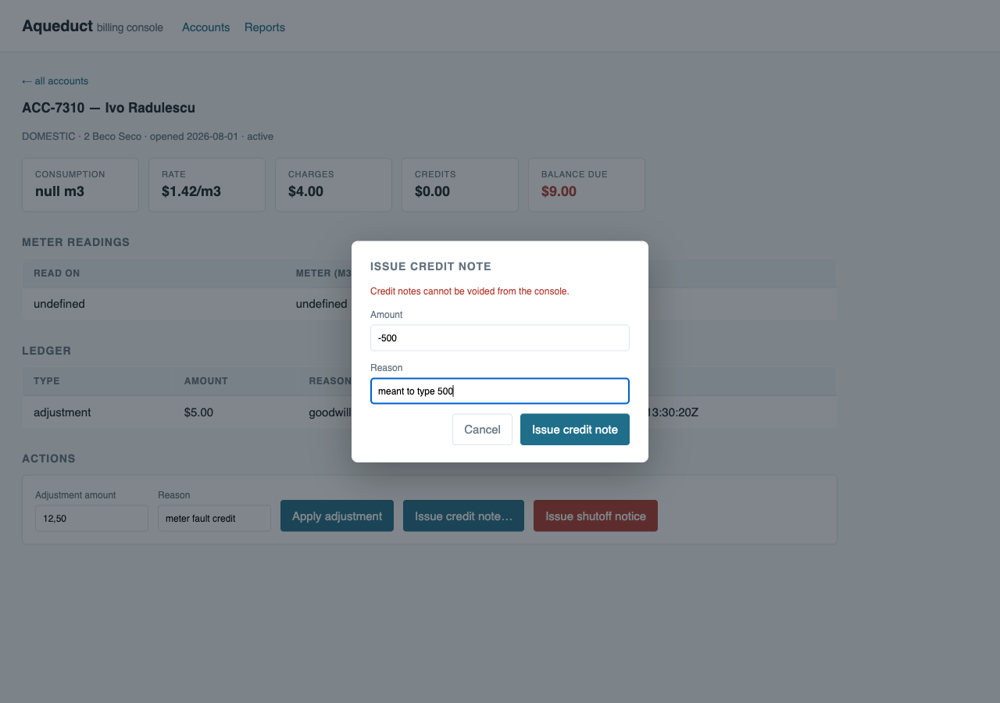

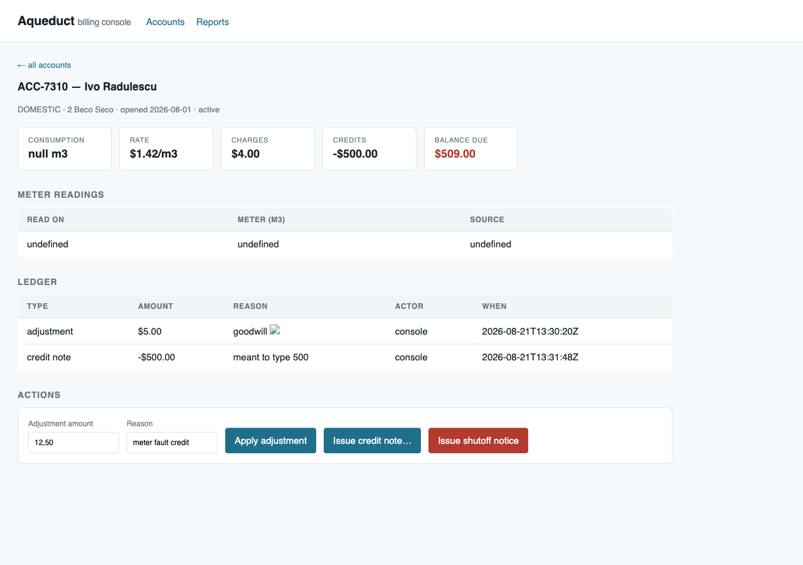

**Why it happens.** `api_credit_note` did `float(body["amount"])` and inserted it. No sign check, and no check of any kind. The client-side guard in `confirmCreditNote` tested `isNaN(Number(raw))`, which `-500` passes.

**What it costs.** A customer owes $500 they never consumed, and by the handler's own documentation there is no console path to reverse it — Finance reconciles credit notes nightly, so the error propagates into reconciliation before anyone notices. A single mistyped minus sign does this.

**The fix.** `api_credit_note` rejects `amount <= 0` with a 400 that names the right instrument for the job. Adjustments deliberately still take either sign — that is what distinguishes them, and they are the reversible path.

<details><summary>request / response (after)</summary>

```bash
curl -sS -w '\nHTTP %{http_code}\n' -X POST -H 'Content-Type: application/json' \
  -d '{"account_id":"ACC-1188","amount":-500,"reason":"typo","actor":"clerk-a"}' \
  http://localhost:8413/api/credit-notes
```
```json
{ "error": "a credit note must be greater than zero; to raise what an account owes, use an adjustment" }
```
```
HTTP 400
```

A legitimate positive credit note is still accepted, and a legitimate *negative adjustment* still is too:

```bash
curl -sS -X POST -H 'Content-Type: application/json' \
  -d '{"account_id":"ACC-2043","amount":15.50,"reason":"goodwill, leak allowance","actor":"clerk-a"}' \
  http://localhost:8413/api/credit-notes
```
```json
{ "ok": true, "billing": { "charges": 26.01, "credits": 15.5, "balance_due": 10.51, "billing_status": "ok" } }
```
```
HTTP 201
```
```bash
curl -sS -X POST -H 'Content-Type: application/json' \
  -d '{"account_id":"ACC-2043","amount":-3.25,"reason":"overbilled standing fee","actor":"clerk-a"}' \
  http://localhost:8413/api/adjustments
```
```json
{ "ok": true, "billing": { "adjustments": -3.25, "credits": 15.5, "balance_due": 7.26, "billing_status": "ok" } }
```
```
HTTP 201
```
</details>

**Fails if:** a credit note with an amount at or below zero is accepted, or a positive one is refused, or an adjustment of either sign is refused. **Reproduced:** 2/2 via API, 1/1 via UI. **Graduates to:** a test asserting `POST /api/credit-notes` with `-1`, `0` and `1` returns 400, 400, 201.

### <a id="tc-04a"></a>TC-04a — one mistyped amount makes every account disappear from the console `[S1]`

**Attacks:** one account's bad data cannot break another account's screen · **Oracle:** `JSON.parse` — the API's own client cannot read its output
**Fixture:** `ACC-2043`

**What should happen.** `"1e400"` is not a usable amount. Reject it.

**What happened.** `float("1e400")` is `inf`, which was stored, and `json.dumps` then emitted the bare token `Infinity`. That is not valid JSON.

<details><summary>request / response (before) — note the response body is itself invalid JSON</summary>

```bash
curl -sS -w '\nHTTP %{http_code} in %{time_total}s\n' -X POST \
  -H 'Content-Type: application/json' \
  -d '{"account_id":"ACC-2043","amount":"1e400","reason":"fat finger","actor":"clerk-a"}' \
  http://localhost:8413/api/adjustments
```
```json
{
  "ok": true,
  "billing": {
    "account_id": "ACC-2043",
    "rate_per_m3": 1.42,
    "standing_fee": 4.0,
    "consumption_m3": 15.5,
    "charges": 26.01,
    "adjustments": Infinity,
    "credits": 0,
    "balance_due": Infinity
  }
}
```
```
HTTP 201 in 0.003408s
```
</details>

**The worst consequence, tested rather than assumed.** The obvious harm is one wrong balance. I followed it to the list endpoint that every clerk hits on page load, and it carries the token too:

```
$ curl -sS http://localhost:8413/api/accounts | grep -n 'balance_due'
9:      "balance_due": 551.57,
18:      "balance_due": Infinity,      <- one poisoned row
27:      "balance_due": 0.0,
36:      "balance_due": 107.85,
45:      "balance_due": 4.0,
54:      "balance_due": 109.9,
```

```
$ node -e 'JSON.parse(fs.readFileSync("/tmp/aq-list.json","utf8"))'
JSON.parse THREW: Unexpected token 'I', ..."nce_due": Infinity,"... is not valid JSON

$ python3 -c 'json.loads(raw, parse_constant=reject)'
STRICT PARSE FAILED (this is what the browser does): invalid JSON token: 'Infinity'
LENIENT PARSE (python default): ok -- masks the problem
```

That last line is why this survived: Python's own parser accepts `Infinity` by default, so any server-side test would have passed while the browser choked.

In the browser, the effect is total. Console error, and an empty table:

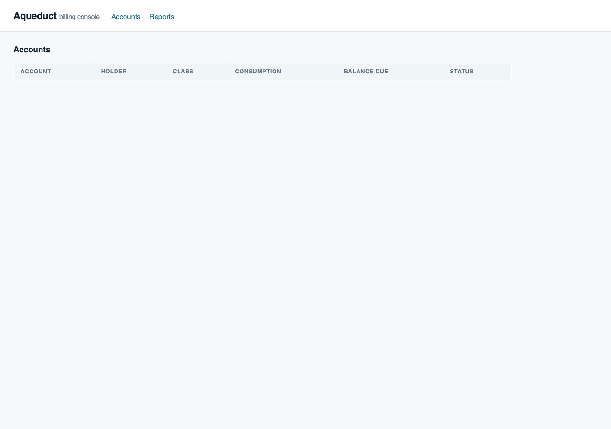

```
[error] Uncaught (in promise) SyntaxError: Unexpected token 'I', ..."nce_due": Infinity,"... is not valid JSON
```

**Why it happens.** Three things compounding: `float()` accepts overflow silently and returns `inf`; `json.dumps` emits non-standard `Infinity` unless told otherwise; and `load()` in `app.js` had no rejection handler, so the parse failure surfaced as a blank table rather than an error. A clerk sees a console reporting zero accounts and no reason.

**What it costs.** Total loss of the primary screen for every user of the console, from one clerk's typo on one account, with no way to recover from inside the console — repairing it needs direct database access. The blank table is also actively misleading: it is indistinguishable from an empty database.

**The fix.** Three layers, because each failed independently. `req_amount` rejects non-finite values with a 400. `_send` uses `allow_nan=False`, so the API can never emit invalid JSON even if a non-finite value reaches it another way. `load()` has a `.catch()` that tells the clerk.

<details><summary>request / response (after)</summary>

```bash
curl -sS -w '\nHTTP %{http_code}\n' -X POST -H 'Content-Type: application/json' \
  -d '{"account_id":"ACC-2043","amount":"1e400","reason":"fat finger","actor":"clerk-a"}' \
  http://localhost:8413/api/adjustments
```
```json
{ "error": "amount must be a finite number" }
```
```
HTTP 400
```
```
$ node -e 'JSON.parse(...)'  # on /api/accounts
JSON.parse ok, accounts: 6
```
</details>

**Fails if:** any endpoint accepts a non-finite amount, or any response body fails `JSON.parse`. **Reproduced:** 2/2. **Graduates to:** a test posting `1e400`, `-1e400` and `NaN` expecting 400, plus an assertion that `/api/accounts` output survives a strict parse.

### <a id="tc-04b"></a>TC-04b and <a id="tc-12"></a>TC-12/13/14/15 — every malformed request returned a 500 with a full traceback `[S2]`

**Attacks:** the error contract · **Oracle:** internal consistency — `GET /api/accounts/ACC-NOPE` on the same build returns a clean `404 {"error": "no such account"}`

Five different malformed inputs, five 500s, each carrying `traceback.format_exc()` in the response body. The bodies name absolute source paths, the Python install location, and the failing source lines.

<details><summary>the five requests and their responses (before), abridged at the traceback</summary>

```bash
# TC-04b -- amount NaN
curl -sS -X POST -H 'Content-Type: application/json' \
  -d '{"account_id":"ACC-2043","amount":NaN,"reason":"nan probe","actor":"clerk-a"}' \
  http://localhost:8413/api/adjustments
```
```json
{
  "error": "server error",
  "trace": "Traceback (most recent call last):\n  File \"/srv/aqueduct/server.py\", line 247, in do_POST\n    code, out = fn(conn, body)\n ... File \"/srv/aqueduct/server.py\", line 142, in api_adjustment\n    conn.execute(\n ... sqlite3.IntegrityError: NOT NULL constraint failed: adjustments.amount\n"
}
```
```
HTTP 500 in 0.001797s
```

```bash
# TC-12 -- bytes that are not JSON
curl -sS -X POST -H 'Content-Type: application/json' \
  --data-binary 'not json at all {{{' http://localhost:8413/api/adjustments
```
```json
{
  "error": "server error",
  "trace": "Traceback ... File \"/opt/homebrew/Cellar/python@3.14/3.14.4_1/Frameworks/Python.framework/Versions/3.14/lib/python3.14/json/decoder.py\", line 363, in raw_decode\n    raise JSONDecodeError(\"Expecting value\", s, err.value) from None\njson.decoder.JSONDecodeError: Expecting value: line 1 column 1 (char 0)\n"
}
```
```
HTTP 500 in 0.006643s
```

```bash
# TC-13 -- account_id missing
curl -sS -X POST -H 'Content-Type: application/json' \
  -d '{"amount":10,"reason":"no account id"}' http://localhost:8413/api/adjustments
```
```json
{ "error": "server error", "trace": "Traceback ... line 140, in api_adjustment\n    account_id = body[\"account_id\"]\nKeyError: 'account_id'\n" }
```
```
HTTP 500 in 0.001237s
```

```bash
# TC-14 -- amount as an array
curl -sS -X POST -H 'Content-Type: application/json' \
  -d '{"account_id":"ACC-1188","amount":[1,2,3],"reason":"array"}' http://localhost:8413/api/adjustments
```
```json
{ "error": "server error", "trace": "Traceback ... TypeError: float() argument must be a string or a real number, not 'list'\n" }
```
```
HTTP 500 in 0.000962s
```

```bash
# TC-15 -- no body at all
curl -sS -X POST http://localhost:8413/api/adjustments
```
```json
{ "error": "server error", "trace": "Traceback ... KeyError: 'account_id'\n" }
```
```
HTTP 500 in 0.000976s
```
</details>

**Why it happens.** The handlers indexed the body directly (`body["account_id"]`) and cast without guarding (`float(body["amount"])`), so ordinary bad input raised through to the catch-all, which returned the traceback to the caller. There was no validation layer and no client-error class.

**What it costs.** Two separate harms. Operationally, a 500 is indistinguishable from a real fault, so genuine incidents hide among ordinary typos and the console cannot tell a clerk what they got wrong. Informationally, the response body discloses filesystem layout, the Python version and install path, and the exact failing source line — free reconnaissance for anyone on the office network the README says this runs on.

**The fix.** An `ApiError` class carrying the intended status; `req_str`, `req_amount`, `req_read_on` and `require_account` validators used by every handler; JSON parse failure and non-object bodies mapped to 400; and the catch-all now logs the traceback to stderr and returns a bare `{"error": "server error"}`.

<details><summary>the same five, after</summary>

```
POST /api/adjustments  amount NaN          -> 400 {"error": "amount must be a finite number"}
POST /api/adjustments  'not json at all'   -> 400 {"error": "request body is not valid JSON"}
POST /api/adjustments  no account_id       -> 400 {"error": "account_id is required and must be a non-empty string"}
POST /api/adjustments  amount [1,2,3]      -> 400 {"error": "amount must be a number"}
POST /api/adjustments  empty body          -> 400 {"error": "account_id is required and must be a non-empty string"}
```

Across the whole re-verification transcript:

```
$ grep -c '"trace"' reverify.txt        # traceback fields in any response body
0
$ grep -c 'HTTP 500' reverify.txt
0
$ grep -o 'HTTP [0-9]*' reverify.txt | sort | uniq -c
  10 HTTP 400
   1 HTTP 404
   1 HTTP 409
$ grep -c 'Traceback' server-after-fix.log   # and none crashed server-side either
0
```
</details>

**Fails if:** any malformed request returns a 5xx, or any response body contains a stack trace or a filesystem path. **Reproduced:** 2/2 each.

### <a id="tc-16"></a>TC-16 — all three write endpoints accept an account that does not exist `[S2]`

**Attacks:** actors touch only records that exist · **Oracle:** internal consistency with the read side, which 404s
**Fixture:** `GHOST-1` (deliberately absent from `accounts`)

<details><summary>requests / responses (before) — note the `null`</summary>

```bash
curl -sS -w '\nHTTP %{http_code} in %{time_total}s\n' -X POST -H 'Content-Type: application/json' \
  -d '{"account_id":"GHOST-1","meter_m3":999}' http://localhost:8413/api/readings
```
```json
{ "ok": true, "billing": null }
```
```
HTTP 201 in 0.003061s
```
```bash
curl -sS -X POST -H 'Content-Type: application/json' \
  -d '{"account_id":"GHOST-1","amount":250,"reason":"orphan adj","actor":"clerk-a"}' \
  http://localhost:8413/api/adjustments
```
```json
{ "ok": true, "billing": null }
```
```
HTTP 201 in 0.001464s
```
```bash
curl -sS -X POST -H 'Content-Type: application/json' \
  -d '{"account_id":"GHOST-1","amount":250,"reason":"orphan credit","actor":"clerk-a"}' \
  http://localhost:8413/api/credit-notes
```
```json
{ "ok": true, "billing": null }
```
```
HTTP 201 in 0.001335s
```
</details>

**Direct read** — the orphan rows:

```
$ sqlite3 aqueduct.db "SELECT 'reading', id, account_id, meter_m3 FROM readings WHERE account_id='GHOST-1'
                       UNION ALL SELECT 'adjustment', id, account_id, amount FROM adjustments WHERE account_id='GHOST-1'
                       UNION ALL SELECT 'credit_note', id, account_id, amount FROM credit_notes WHERE account_id='GHOST-1';"
reading|16|GHOST-1|999.0
adjustment|2|GHOST-1|250.0
credit_note|2|GHOST-1|250.0
```

**Why it happens.** No handler looked the account up, and the schema declares no foreign keys (SQLite would not enforce them by default even if it did). The `"billing": null` in each response is the tell: `balance()` returned `None` *because the account does not exist*, and the handler reported success anyway.

**What it costs.** Money rows accumulate against identifiers that no account will ever reconcile to — invisible on every screen, since nothing lists them, but present in any query that sums the ledger tables. A clerk's typo in an account id is enough.

**The fix.** `require_account` on all four write handlers.

<details><summary>after</summary>

```
POST /api/readings      {"account_id":"GHOST-1",...} -> 404
POST /api/adjustments   {"account_id":"GHOST-1",...} -> 404
POST /api/credit-notes  {"account_id":"GHOST-1",...} -> 404
```
```
$ sqlite3 aqueduct.db "SELECT COUNT(*) FROM readings WHERE account_id='GHOST-1';"     0
$ sqlite3 aqueduct.db "SELECT COUNT(*) FROM adjustments WHERE account_id='GHOST-1';"  0
$ sqlite3 aqueduct.db "SELECT COUNT(*) FROM credit_notes WHERE account_id='GHOST-1';" 0
```
</details>

**Fails if:** any write endpoint returns 2xx for an unknown `account_id`. **Reproduced:** 2/2.

### <a id="tc-17"></a>TC-17 — an unvalidated date silently redefines which readings the bill is based on `[S1]`

**Attacks:** consumption reflects the actual reading history · **Oracle:** the ordering the biller itself uses (`ORDER BY read_on DESC, id DESC`)
**Fixture:** `ACC-5520` (consumption +47.0 m³, balance $107.85)

**This is not the signed-off negative consumption.** The sign-off in the README covers a physical meter swap, where the reading legitimately restarts at zero. This is a free-text date field that is not a date at all, changing which readings count as current. Separating the two was the point of running [TC-02](#tc-02) first.

**What should happen.** `read_on` orders the readings that determine consumption. A value that is not a date must be refused.

**What happened.** `"whenever"` was accepted, and because the column is text and the sort is lexical, it sorts above every ISO date — so it became the latest reading.

<details><summary>request / response (before)</summary>

```bash
curl -sS -w '\nHTTP %{http_code} in %{time_total}s\n' -X POST \
  -H 'Content-Type: application/json' \
  -d '{"account_id":"ACC-5520","meter_m3":10,"read_on":"whenever"}' \
  http://localhost:8413/api/readings
```
```json
{
  "ok": true,
  "billing": {
    "account_id": "ACC-5520",
    "rate_per_m3": 2.05,
    "standing_fee": 11.5,
    "consumption_m3": -692.0,
    "charges": -1407.1,
    "adjustments": 0,
    "credits": 0,
    "balance_due": -1407.1
  }
}
```
```
HTTP 201 in 0.001486s
```
</details>

**Direct read** — the readings in the order the biller sees them:

```
$ sqlite3 aqueduct.db "SELECT id,read_on,meter_m3 FROM readings WHERE account_id='ACC-5520' ORDER BY read_on DESC, id DESC;"
17|whenever|10.0        <- sorts above every date, so it is "latest"
13|2026-08-01|702.0
12|2026-07-01|655.0
11|2026-06-01|610.0
```

**Why it happens.** `api_add_reading` took `body.get("read_on")` unvalidated into a `TEXT` column, and `consumption()` orders on that column. Any string that sorts high becomes the current reading. Consumption went from +47.0 to −692.0 and the balance to −$1,407.10 — the utility now owing the customer $1,407.

**What it costs.** A wrong bill in the customer's favour by four figures, from a typo, with nothing on any screen indicating the reading history is nonsense. It also generalises: a date typed a year ahead would do the same thing while looking entirely plausible in the readings table.

**The fix.** `req_read_on` requires a real `YYYY-MM-DD` date via `date.fromisoformat` and rejects future dates, since a meter cannot be read in the future. Negative *consumption* is untouched — TC-02 re-verifies the sanctioned meter-swap case still produces −1301.5 m³. A negative *meter reading* is separately rejected, because a physical meter counts up from zero; that check does not clamp consumption either.

<details><summary>after</summary>

```bash
curl -sS -w '\nHTTP %{http_code}\n' -X POST -H 'Content-Type: application/json' \
  -d '{"account_id":"ACC-5520","meter_m3":10,"read_on":"whenever"}' http://localhost:8413/api/readings
```
```json
{ "error": "read_on must be a YYYY-MM-DD date, got 'whenever'" }
```
```
HTTP 400
```
```
$ consumption after the refused request:  47.0    (unchanged)
$ balance_due after the refused request:  107.85  (unchanged)
```
</details>

**Fails if:** a non-date `read_on` is accepted, or a future date is accepted, or the signed-off meter-swap case stops carrying its negative period. **Reproduced:** 2/2. **Graduates to:** a test posting `"whenever"`, a future date, and a valid past date, expecting 400/400/201, plus the TC-02 meter-swap assertion so a future "fix" cannot clamp it.

### <a id="tc-18"></a>TC-18, <a id="tc-21"></a>TC-21, <a id="tc-22"></a>TC-22 — what held up

These passed on both builds, and they matter because they bound the damage.

<details><summary>TC-18 — client-supplied `id`, `created_at` and `is_supervisor` are ignored</summary>

```bash
curl -sS -w '\nHTTP %{http_code} in %{time_total}s\n' -X POST -H 'Content-Type: application/json' \
  -d '{"account_id":"ACC-1188","amount":1,"reason":"extra","actor":"clerk-a","id":9999,"created_at":"1970-01-01T00:00:00Z","is_supervisor":true}' \
  http://localhost:8413/api/adjustments
```
```
HTTP 201 in 0.001401s
```
```
$ sqlite3 aqueduct.db "SELECT id,account_id,amount,reason,created_at FROM adjustments WHERE reason='extra';"
3|ACC-1188|1.0|extra|2026-08-21T13:27:28Z
```
Server id and server timestamp won; the injected `9999` and `1970-01-01` were discarded. No mass-assignment.
</details>

<details><summary>TC-21 — 12 concurrent adjustments conserve exactly, on both builds</summary>

```bash
for i in 1 2 3 4 5 6 7 8 9 10 11 12; do
  curl -sS -o /dev/null -w '%{http_code} ' -X POST -H 'Content-Type: application/json' \
    -d '{"account_id":"ACC-9002","amount":10,"reason":"concurrent","actor":"clerk-c"}' \
    http://localhost:8413/api/adjustments &
done; wait
```
```
201 201 201 201 201 201 201 201 201 201 201 201
```
```
$ sqlite3 aqueduct.db "SELECT COUNT(*) rows_written, SUM(amount) total FROM adjustments WHERE reason='concurrent';"
rows_written  total
------------  -----
12            120.0
```
No lost updates, no `database is locked` errors, no duplicate suppression. Re-run after the fixes: still 12 rows, still exactly 120.0.
</details>

<details><summary>TC-22 — a 5,000-character reason is stored in full, uncorrupted</summary>

```bash
curl -sS -w '\nHTTP %{http_code} in %{time_total}s\n' -X POST -H 'Content-Type: application/json' \
  -d "{\"account_id\":\"ACC-7310\",\"amount\":1,\"reason\":\"$(python3 -c 'print("A"*5000)')\",\"actor\":\"clerk-a\"}" \
  http://localhost:8413/api/adjustments
```
```
HTTP 201 in 0.001844s
```
```
$ sqlite3 aqueduct.db "SELECT id, LENGTH(reason) FROM adjustments WHERE account_id='ACC-7310';"
16|5000
```
No truncation, no encoding corruption. Not filed as a defect — SQLite `TEXT` is unbounded and there is no documented limit to enforce. Carried to residual risk instead, because the field renders in the ledger table.
</details>

---

## Flow 4 — the console in a browser

Driven in Chrome through the DevTools MCP at a pinned viewport of 1280×900×1. This is where the server-side findings become what a clerk actually sees, and where four defects live that no API call would have found.

| # | Case | Expected | Result | Evidence |
|---|------|----------|--------|----------|
| 1 | [seeded holder name executes as script](#tc-23) | rendered as text | ❌ `document.title` → `AQ-XSS` | [cases/TC-23](cases/TC-23) |
| 2 | [clerk-typed reason executes as script](#tc-24) | rendered as text | ❌ payload ran for every viewer | [cases/TC-24](cases/TC-24) |
| 3 | [unbillable account's balance tile](#tc-26) | flagged, not priced | ❌ "$0.00 — paid in full", green | [cases/TC-26](cases/TC-26) |
| 4 | [account with no readings](#tc-25) | empty state | ❌ "null m3", row of "undefined" | [cases/TC-25](cases/TC-25) |
| 5 | [console clean on load](#tc-27) | no errors | ❌ uncaught TypeError every load | [cases/TC-27](cases/TC-27) |
| 6 | [irreversible shutoff needs confirming](#tc-28) | confirm step | ❌ fired on one click | [cases/TC-28](cases/TC-28) |
| 7 | [comma decimal in the amount field](#tc-29) | validation message | ❌ 500, generic toast | [cases/TC-29](cases/TC-29) |
| 8 | [unknown account in the URL](#tc-30) | not-found state | ❌ live action panel | [cases/TC-30](cases/TC-30) |
| 9 | [Reports nav link (documented gap)](#tc-19a) | placeholder | ⚠️ raw JSON 404 | [cases/TC-19a](cases/TC-19a) |

### <a id="tc-23"></a>TC-23 / <a id="tc-24"></a>TC-24 — stored payloads execute in the console `[S1]`

**Attacks:** stored data is not executable · **Oracle:** the payload ran — `document.title` changed and a global was set
**Fixtures:** `ACC-9002` (holder name contains a payload in the seed data), `ACC-7310` (payload typed into the Reason field)

**What should happen.** A holder name and a reason are data. They render as text.

**What happened.** Both executed. The accounts list needed no interaction at all — opening the console was enough, and the browser tab title changed before I clicked anything:

```
mcp__chrome-devtools__new_page http://localhost:8413/
-> 4: AQ-XSS (http://localhost:8413/) [selected]
```

<details><summary>computed page state (before) — the payload is a live DOM element, not text</summary>

```js
{
  "documentTitle": "AQ-XSS",
  "xssExecuted": true,
  "injectedImgTags": 1,
  "holderCellHTML": "Moveis ",
  "chartletDefined": "undefined",
  "acc4471Row": ["ACC-4471","Nordheim Textiles","INDUSTRIAL","4313 m3","$0.00 — paid in full","active"],
  "acc7310Row": ["ACC-7310","Ivo Radulescu","DOMESTIC","null m3","$4.00","active"]
}
```
</details>

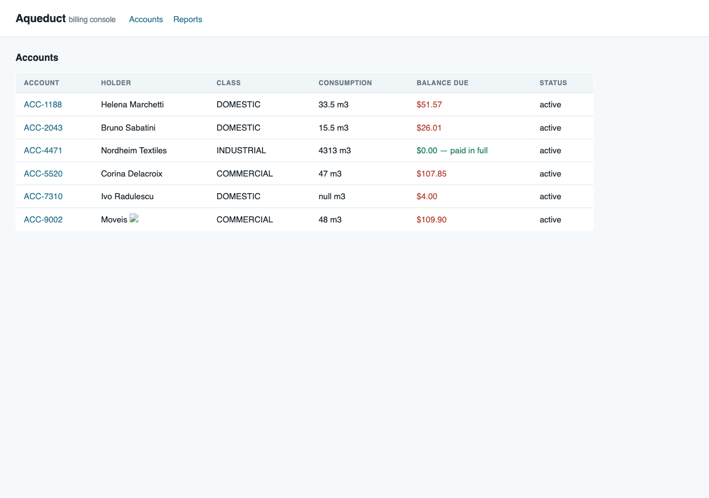

TC-24 is the more serious variant, because it needs no seeded fixture — any clerk can plant it, and it then runs for every clerk who later opens that account. Typed into the Reason field and submitted through the form:

<details><summary>computed page state after submitting the payload through the Reason input (before)</summary>

```js
{
  "documentTitle": "AQ-XSS-VIA-REASON",
  "pwnedFlagSet": true,
  "ledgerRowHTML": "<td>adjustment</td><td>$5.00</td><td>goodwill </td><td>console</td><td>2026-08-21T13:30:20Z</td>",
  "imgTagsInLedger": 1,
  "balanceTile": "Balance due$9.00"
}
```
</details>

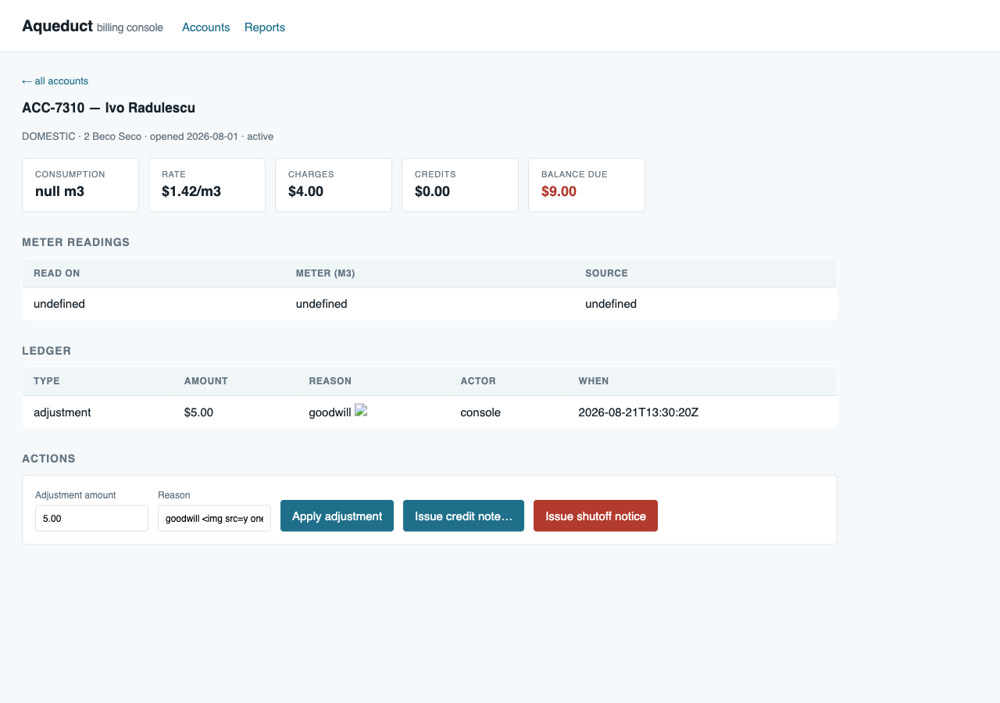

**Direct read** — the payload persisted, so it runs again on every future page load:

```
$ sqlite3 aqueduct.db "SELECT reason FROM adjustments WHERE account_id='ACC-7310';"
goodwill 
```

**Why it happens.** `renderList`, `renderDetail` and `ledgerRow` all built markup by string concatenation into `innerHTML`, interpolating `holder_name`, `reason`, `actor`, `read_on` and `source` — every one of which is operator-supplied.

**What it costs.** Script execution in the browser of any clerk viewing the account, in a console that performs irreversible actions with no re-authentication. A payload in a reason field can silently issue a credit note or a disconnection notice as the clerk viewing it, and the README notes there is no login, so there is nothing to step up to. The stored nature is what makes it serious: plant once, fires for everyone, indefinitely.

**The fix.** Rendering is structural now, not textual. A `cell()` helper creates each `<td>` and assigns `textContent`; a `row()` helper assembles them; `tile()` does the same for the billing tiles; the detail title uses `textContent`. No untrusted value reaches `innerHTML`.

The positive control is what makes this verifiable: the payloads are still in the data, so the check would fail if the fix were absent.

<details><summary>computed page state (after)</summary>

```js
{
  "buildMarker_hasCellHelper": true,
  "documentTitle": "Aqueduct — Billing Console",
  "xssExecuted": false,
  "injectedImgTags": 0,
  "holderCellHTML": "Moveis &lt;img src=x onerror=\"document.title='AQ-XSS'\"&gt;",
  "holderCellText": "Moveis "
}
```
```js
// reason-field payload, re-submitted after the fix
{
  "documentTitle": "Aqueduct — Billing Console",
  "pwnedFlagSet": false,
  "xssExecuted": false,
  "imgTagsInLedger": 0,
  "ledgerRowHTML": "<td>adjustment</td><td>$5.00</td><td>goodwill &lt;img src=y onerror=\"...\"&gt;</td>...",
  "balanceTile": "Balance due$9.00"
}
```
</details>

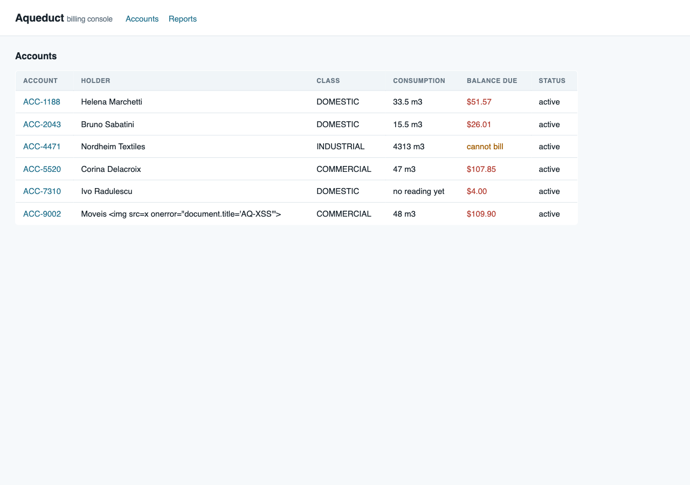

**Fails if:** any operator-supplied value produces an element in the DOM, or `document.title` changes on load. **Reproduced:** 2/2 each.

### <a id="tc-26"></a>TC-26 — the unbillable account tells the clerk it is settled `[S1]`

This is [TC-01](#tc-01) as the clerk experiences it, and the screen is worse than the API response. Before and after, side by side:

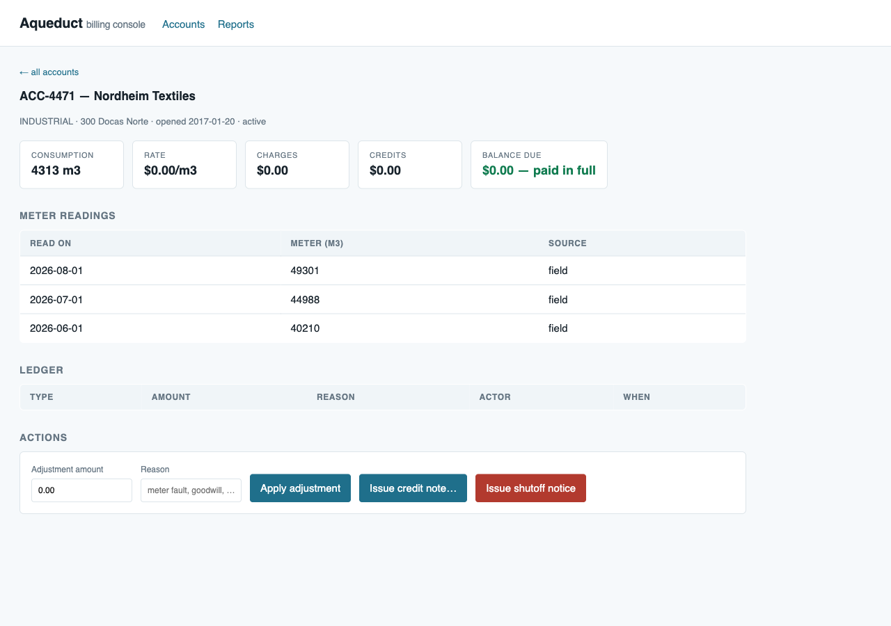

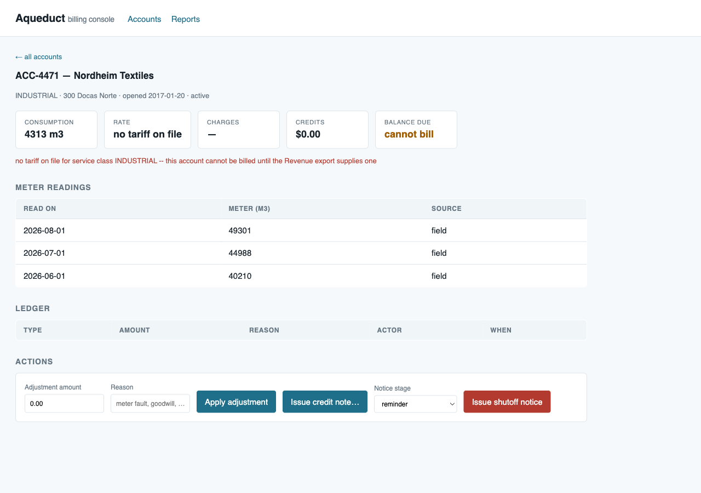

**Why it happens.** `balance_due <= 0` drove the label, so any zero — including a zero that means "we have no rate" — took the `ok` class and the words "paid in full". The version of this in the list view is the same expression.

**What it costs.** The console does not merely omit the charge; it actively asserts the account is settled, in green. A clerk auditing overdue accounts has no reason to look at it, which is how a missing tariff survives from one weekly export to the next.

**The fix.** `balanceLabel` and `balanceClass` branch on `billing_status` first, and "paid in full" is now reserved for an exact zero, with a negative balance labelled "in credit" instead of also claiming paid.

### <a id="tc-25"></a>TC-25 / <a id="tc-27"></a>TC-27 / <a id="tc-29"></a>TC-29 — the states that hide regressions

<details><summary>TC-25 — an account with no readings rendered "undefined"</summary>

`ACC-7310` is a new connection with no readings. The consumption tile read `null m3` and the readings table rendered a phantom row, from `var reads = d.readings.length ? d.readings : [{}]` — a placeholder object whose every field is `undefined`.
</details>

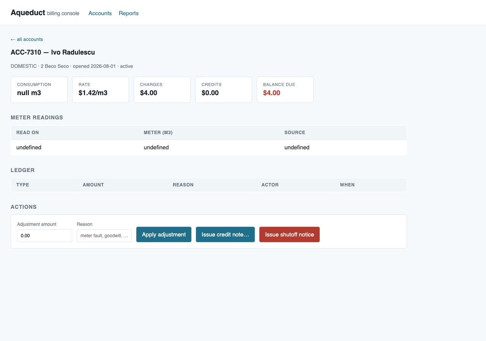

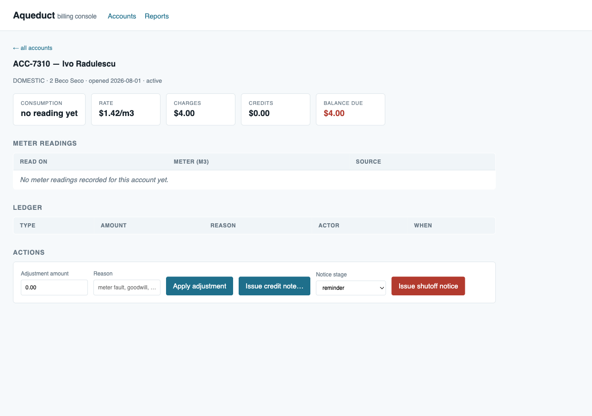

<details><summary>TC-27 — a clean screen over a dirty console, on every single load</summary>

```
[error] Uncaught TypeError: Cannot read properties of undefined (reading 'render')
[error] Failed to load resource: the server responded with a status of 404 (Not Found) [2 times]
```
```js
{ "chartletDefined": "undefined", "sparklineInnerHTML": "", "sparklineRect": { "w": 1044, "h": 0 } }
```
`app.js:20` calls `window.Chartlet.render`, but nothing loads Chartlet — no script tag in `index.html`, no such file in `static/`. The sparkline was dead on arrival and threw on every page load. It sat inside `setTimeout`, so the table still rendered, which is exactly why nobody noticed: the screen looked fine.

After the fix, the only console entry left across the whole run is a browser-initiated `/favicon.ico` 404 — the app does not serve one, and that is not a defect.
</details>

<details><summary>TC-29 — the two money forms validated differently</summary>

`12,50` — a comma decimal, entirely plausible in a deployment whose fixture addresses are Portuguese — went to the server raw, which did `float("12,50")` and returned 500. The clerk saw a generic "Could not apply adjustment".

```
POST http://localhost:8413/api/adjustments [500]
```

The credit-note modal *did* validate, with `isNaN(Number(raw))`, and said "Amount must be a number". Same application, two money forms, one guarded and one not — that asymmetry is the oracle, not my opinion about comma decimals.

Nothing was written on the failed attempt, on either build:
```
$ sqlite3 aqueduct.db "SELECT COUNT(*) FROM adjustments WHERE account_id='ACC-7310';"
1        # only the earlier successful 5.00 row
```
</details>

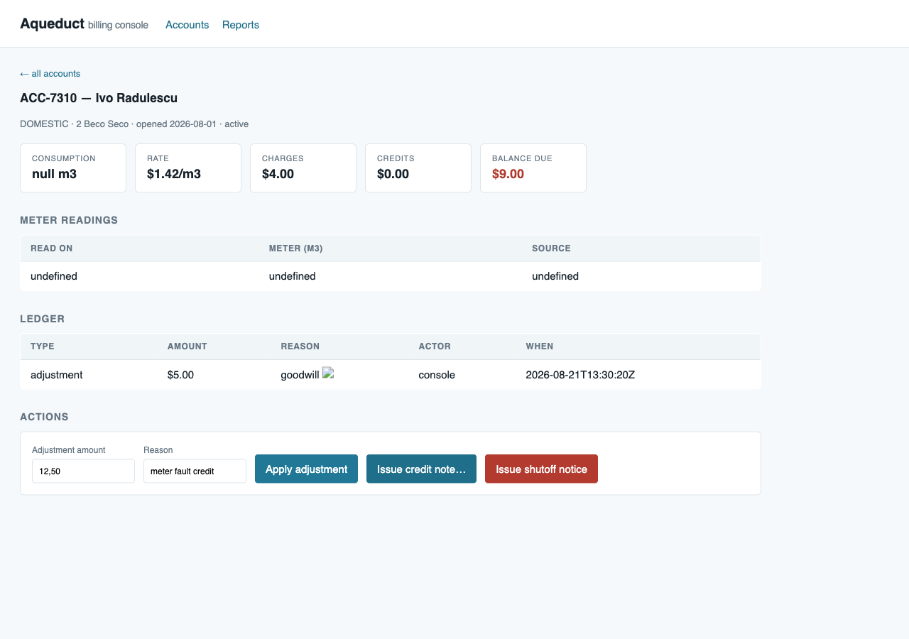

### <a id="tc-28"></a>TC-28 — the irreversible action was the only one with no confirmation `[S1]`

**Oracle:** internal inconsistency, and it is stark. Issuing a credit note opened a modal carrying its own warning — "Credit notes cannot be voided from the console." Dispatching a crew to physically cut off a household's water, which the README says is not reversible from the console, asked nothing at all.

**What happened.** One click on "Issue shutoff notice" posted `stage: "final"` and the account went from `active` to `shutoff_pending` immediately.

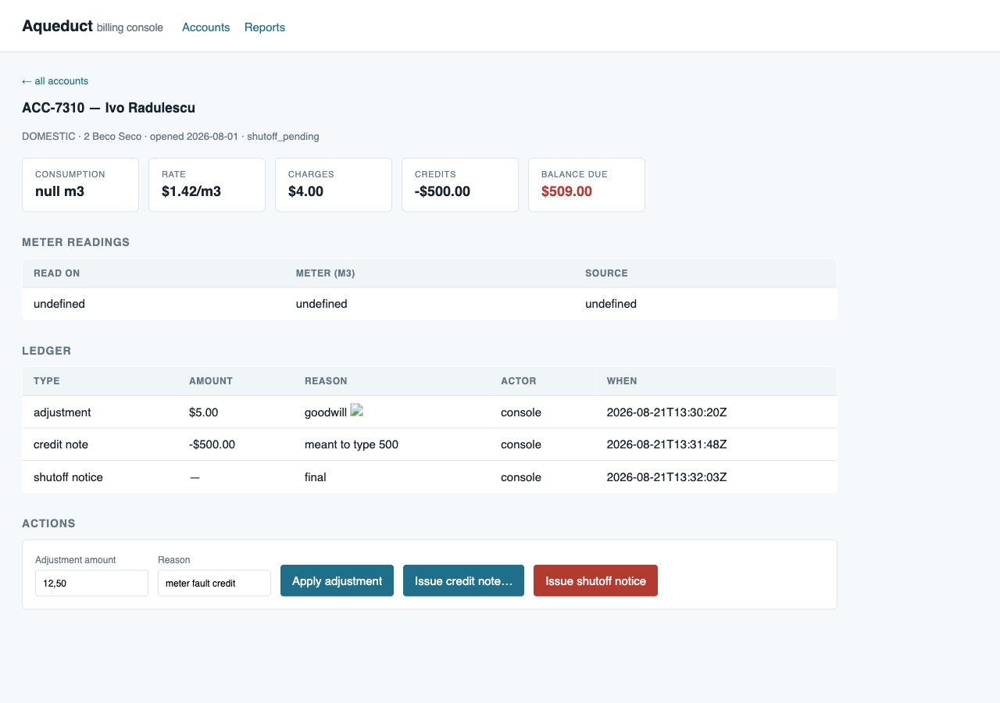

```
POST http://localhost:8413/api/shutoff [201]
```
```
$ sqlite3 aqueduct.db "SELECT id,actor,stage,issued_at FROM shutoff_notices WHERE account_id='ACC-7310';"
1|console|final|2026-08-21T13:32:03Z
$ sqlite3 aqueduct.db "SELECT status FROM accounts WHERE id='ACC-7310';"
shutoff_pending
```

Worth noting what that sequence was: a brand-new account, opened three weeks earlier, with no meter readings, no prior notices, and a balance of $9.00 — and the console dispatched a crew on one click.

**Why it happens.** `issueShutoff` hardcoded `stage: 'final'` and posted on click. There was no stage selector, so the only notice the UI could issue was the irreversible one, and no confirmation step.

**The fix.** A stage selector defaulting to `reminder`, and for `final` a confirmation naming the account and the consequence. Dismissing it writes nothing:

```
notices for ACC-7310 after DISMISSING the confirm (expect 0): 0
status (expect active): active
```

Accepting it then still meets the server's ordering rule, and the clerk now sees why:

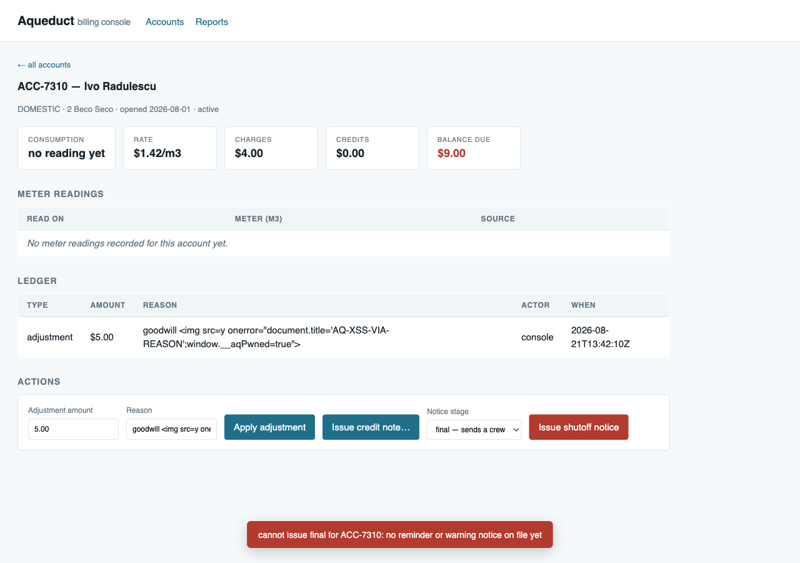

### <a id="tc-30"></a>TC-30 — a mistyped account id gave the clerk a working shutoff button `[S2]`

**What happened.** `/account/ACC-DOES-NOT-EXIST` rendered no title and no billing, but the full Actions panel — including the danger-styled shutoff button — was present and clickable.

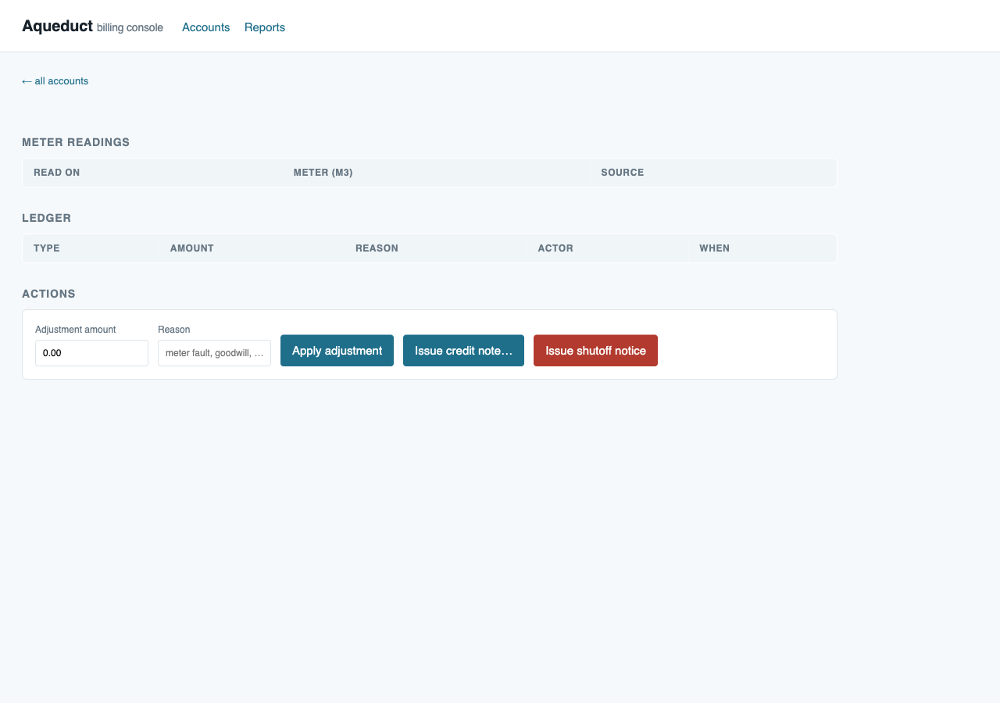

```
[error] Uncaught (in promise)      <- renderDetail() ran on {"error":"no such account"}
```

**Why it happens.** `load()` passed the parsed body straight to `renderDetail` with no status check, so `d.account.id` threw partway through — after the section had been unhidden and before the fields were filled. The static markup, including the action buttons, was already in the DOM. Paired with [TC-11](#tc-11), where shutoff on a nonexistent account returned `201`, those buttons worked.

**The fix.** `renderDetail` checks for an account first and shows a not-found state with the action panel hidden; `load()` has a `.catch()`.

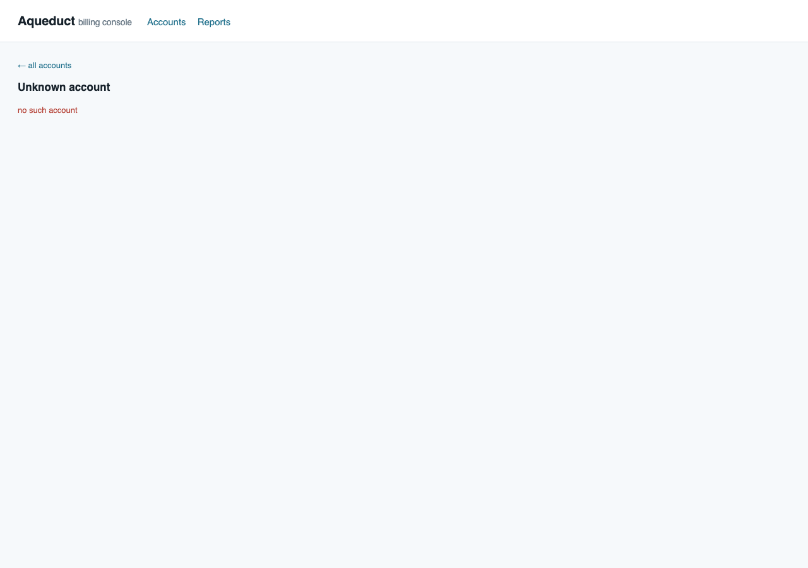

### <a id="tc-19a"></a>TC-19a — the Reports link, a documented gap

The README says Reports is "not built yet, the nav link is a placeholder", so this is reported as presentation of a known gap rather than as a surprise. Clicking it drops the clerk out of the application onto a raw JSON body:

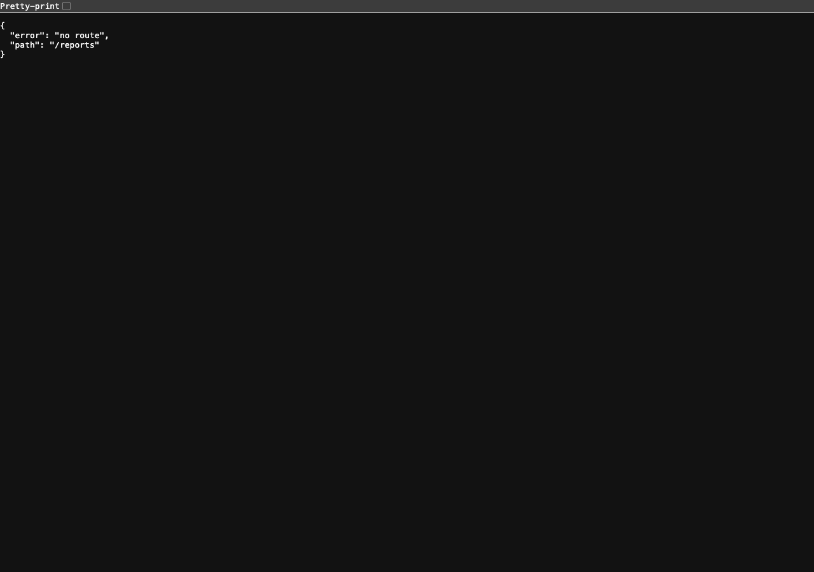

Not fixed — building the screen is outside a QA pass. Flagged because a placeholder that dumps JSON reads as a broken application to a clerk, and a disabled link or an "in progress" panel would cost very little.

---

## Flow 5 — does the fix survive the data the old build already wrote

The fixes stop new bad data. They do not remove what the original build could already have written, and any real deployment would have some. So I inserted a non-finite amount straight into the database with `sqlite3`, as a legacy row, and re-read every surface.

### <a id="tc-31"></a>TC-31 — containment held on the list, but the detail page still 500'd on the one account needing repair

**First result.** The list endpoint stayed valid JSON and isolated the affected account, which is the containment working:

```
$ node -e 'JSON.parse(...)'
JSON.parse ok, accounts: 6
   ACC-1188 balance_due= 51.57 billing_status= ok
   ACC-2043 balance_due= null  billing_status= blocked      <- the poisoned row, contained
   ACC-4471 balance_due= null  billing_status= blocked
   ACC-5520 balance_due= 107.85 billing_status= ok
   ACC-7310 balance_due= 9     billing_status= ok
   ACC-9002 balance_due= 109.9 billing_status= ok
```

**But** the detail page for that account returned 500 — `balance()` reported `blocked` correctly, while the raw ledger rows in the same payload still carried `inf`, so serialisation failed:

```
$ curl -sS -w '\nHTTP %{http_code}\n' http://localhost:8413/api/accounts/ACC-2043
{ "error": "server error" }
HTTP 500

# server stderr:
non-serialisable payload for /api/accounts/ACC-2043: {... 'adjustments': [{'id': 2, 'amount': inf, 'reason': 'legacy poisoned row', ...}] ...}
```

That is the wrong failure in the wrong place: the clerk could not open the single account that needed manual correction. Fixed with `safe_row()`, which nulls non-finite floats on the way out.

<details><summary>after the second fix</summary>

```json
{
  "adjustments": [
    { "id": 2, "account_id": "ACC-2043", "amount": null, "reason": "legacy poisoned row", "actor": "old-build", "created_at": "2026-08-01T00:00:00Z" }
  ],
  "billing": {
    "rate_per_m3": 1.42, "consumption_m3": 15.5, "charges": null,
    "adjustments": null, "credits": 0, "balance_due": null,
    "billing_status": "blocked",
    "billing_error": "ledger contains a non-finite amount; this account needs manual correction"
  }
}
```
</details>

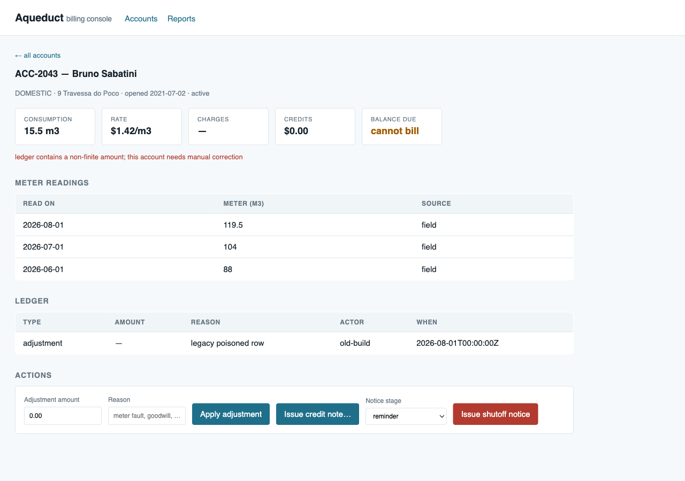

The clerk can now see the bad row, see why the account cannot be billed, and correct it.

---

## Durable state

Every claim above about persistence rests on a direct read; the queries and their literal output are inline with each case. The negatives matter as much as the positives, so collected here:

```
# after the fixes, all the refused requests wrote nothing
$ sqlite3 aqueduct.db "SELECT 'readings',    COUNT(*) FROM readings     WHERE account_id='GHOST-1'
                 UNION SELECT 'adjustments', COUNT(*) FROM adjustments  WHERE account_id='GHOST-1'
                 UNION SELECT 'credit_notes',COUNT(*) FROM credit_notes WHERE account_id='GHOST-1';"
readings|0
adjustments|0
credit_notes|0

# no notice was written by any refused shutoff, and no stray rows anywhere
$ sqlite3 aqueduct.db "SELECT COUNT(*) FROM shutoff_notices;"   0
$ sqlite3 aqueduct.db "SELECT COUNT(*) FROM adjustments;"       0
$ sqlite3 aqueduct.db "SELECT COUNT(*) FROM credit_notes;"      0
$ sqlite3 aqueduct.db "SELECT COUNT(*) FROM readings;"          15   (the seeded set, untouched)

# the failed 12,50 adjustment wrote nothing on either build -- the error preceded the INSERT
$ sqlite3 aqueduct.db "SELECT COUNT(*) FROM adjustments WHERE account_id='ACC-7310';"
1        # only the successful 5.00 row

# audit_log, per the README's known gaps, is written by nothing -- confirmed for
# every action driven in this run, including the irreversible ones
$ sqlite3 aqueduct.db "SELECT COUNT(*) FROM audit_log;"
0
```

Final state of the fixture, restored clean at the end of the run:

```
$ curl -sS http://localhost:8413/api/accounts
ACC-1188 ok      51.57
ACC-2043 ok      26.01
ACC-4471 blocked None
ACC-5520 ok      107.85
ACC-7310 ok      4.0
ACC-9002 ok      109.9
```

`ACC-4471` remaining `blocked` is correct and is the point: the fixture deliberately omits the INDUSTRIAL tariff, and `seed.py` says so in a comment. I did not add the missing row — that would have hidden the defect rather than fixed it.

## Screens driven

All captures at viewport 1280×900×1, in capture order. Emulation was cleared at the end of the run. Screenshot writes into the run directory were refused by the automation server's workspace-root policy, so each capture was written to a permitted path and moved into this directory immediately; all 17 are present here.

| # | Image | What it shows |
|---|-------|---------------|
| 01 | `01-accounts-list.png` | list view, original build: XSS fired, "paid in full" on 4313 m³, "null m3" |
| 02 | `02-acc4471-industrial-zero-bill.png` | the unbillable account priced at $0.00 and called settled |
| 03 | `03-acc7310-empty-state-undefined.png` | empty state rendering "undefined" |
| 04 | `04-stored-xss-via-reason-field.png` | payload typed into Reason, live in the ledger |
| 05 | `05-adjustment-comma-decimal-500.png` | comma decimal → 500, balance unchanged |
| 06 | `06-credit-note-modal-negative-before.png` | the modal accepting −500 under its own no-void warning |
| 07 | `07-credit-note-negative-after-balance-up.png` | balance risen $9.00 → $509.00 |
| 08 | `08-shutoff-one-click-no-confirm.png` | crew dispatched on one click, no dialog |
| 09 | `09-console-dead-after-one-adjustment.png` | all six accounts gone after one bad amount |
| 10 | `10-unknown-account-blank-screen.png` | live shutoff button on a nonexistent account |
| 11 | `11-reports-placeholder-raw-json.png` | the documented placeholder, as raw JSON |
| 12 | `12-accounts-list-FIXED.png` | list view fixed: payload as text, "cannot bill", "no reading yet" |
| 13 | `13-acc4471-cannot-bill-FIXED.png` | unbillable account flagged with its reason |
| 14 | `14-acc7310-empty-state-FIXED.png` | proper empty state |
| 15 | `15-shutoff-final-refused-toast-FIXED.png` | the server's real reason shown to the clerk |
| 16 | `16-unknown-account-FIXED.png` | not-found state, action panel hidden |
| 17 | `17-legacy-poisoned-row-contained-FIXED.png` | pre-existing bad row contained and correctable |

## Console and network

Full capture in `console-list-view.txt` and `console-network-ui-run.txt`. Summary:

**Original build** — every page load threw `Uncaught TypeError: Cannot read properties of undefined (reading 'render')`. The poisoned list additionally threw `Uncaught (in promise) SyntaxError: ... is not valid JSON`, and the unknown-account page threw a bare `Uncaught (in promise)`. Network showed the expected `201`s plus a `500` on the comma-decimal adjustment.

**Fixed build** — the only console entry across the run is a browser-initiated `/favicon.ico` 404, which the app does not serve. Network: `GET /` `200`, `style.css` `200`, `app.js` `200`, `/api/accounts` `200`.

Where I asserted state from the DOM rather than from a rendered capture — `document.title`, `window.__aqPwned`, `innerHTML`, element counts — those verify that the string or element existed, not that a human saw it. Each is paired with a screenshot for the visual claim.

## Checks outside the run

```
$ python3 -c "import ast; ast.parse(open('server.py').read())"
server.py parses
$ node --check static/app.js
app.js parses
$ python3 seed.py
seeded aqueduct.db: 6 accounts, 15 readings
```

There is no test suite in this project, so there was no baseline to run before editing and none to re-run after. That is itself the largest gap in the next steps below.

## Coverage — what this run reached

| Interesting state | Reached? | Evidence |
|---|---|---|
| Missing tariff row for a service class | **yes** | TC-01, TC-26 |
| All three disconnection stages, in order and out of order | **yes** | TC-06, TC-07, TC-09, TC-10 |
| Non-finite and non-numeric amounts on every money endpoint | **yes** | TC-04a, TC-04b, TC-14 |
| Malformed / missing / extra / wrong-type request bodies | **yes** | TC-12–TC-15, TC-18 |
| Writes against a nonexistent account, all four endpoints | **yes** | TC-11, TC-16 |
| 12 concurrent writes to one account | **yes** | TC-21 |
| Stored XSS, seeded and clerk-supplied | **yes** | TC-23, TC-24 |
| Empty, error, forbidden and success UI states | **yes** | TC-25, TC-28, TC-30 |
| Pre-existing bad data from the old build | **yes** | TC-31 |
| The signed-off meter-swap path, before and after | **yes** | TC-02 |
| **A genuinely unauthorised actor** | **no** | there is no authentication to defeat; `actor` and `supervisor` are self-asserted, so "unauthorised" is not an observable state |
| **Two clerks racing the same shutoff sequence** | **no** | the stage-order check is a read-then-write with no transaction; not exercised |
| **A real weekly tariff export** | **no** | no import path exists in this codebase; the missing row was tested, the refresh that causes it was not |
| **Behaviour at production data volume** | **no** | six accounts and fifteen readings; `api_accounts` calls `balance()` per account, and nothing here would reveal what that costs at scale |
| **`audit_log` being written** | **no** | nothing writes to it on either build, per the README's known gaps |

The "no" rows are the honest boundary of this run.

## Residual risk

- **The supervisor requirement is a claim, not authorisation.** `POST /api/shutoff` now demands `supervisor: true` for a final notice, and that closes the accidental dispatch — a defaulted stage, a stray click, a retry. It does not stop anyone who sends the flag, and it cannot, because the console has no login and `actor` is whatever the client says. Anyone who can reach the endpoint can still dispatch a crew, provided they issue the two earlier notices first. I have written this into the README next to the policy rather than leaving the code looking more protective than it is. **Accepting this fix means accepting that the crew-dispatch path is protected against error and not against intent.**
- **The stage-order check is a read-then-write with no transaction.** Two simultaneous `final` requests could both read "warning exists, no final yet" and both insert. I did not exercise this — the duplicate-stage check makes the sequential case safe, and the concurrent case needs either a unique index on `(account_id, stage)` or a transaction. A unique index is the cheap fix and I did not add one, because it changes the schema and `seed.py` is shared fixture data.
- **Nothing records who did any of this.** `audit_log` exists and is written by nothing, which the README lists as a known gap. For adjustments that is inconvenient; for an irreversible crew dispatch it means there is no record beyond a client-supplied string in the notice row. This is the gap I would close next, and it is a precondition for the supervisor requirement ever being real.
- **Money is stored and summed as binary floats.** `REAL` columns, `float()` on input, `round(x, 2)` on output. Nothing in this run produced a visible error from it, and I did not convert to integer cents or `Decimal` — that is a data-model change well beyond a QA pass. It remains a real exposure for a billing system: repeated adjustment sums will eventually not reconcile to the penny against a system that uses exact arithmetic.
- **Rejecting future `read_on` dates is my judgement, not a documented rule.** A meter cannot be read in the future, so it seemed safe, and it closes the ordering hole. If any real workflow post-dates a reading, this will refuse it. Worth a word with Billing.
- **Only a `final` notice now moves the account to `shutoff_pending`.** Previously any stage did, including a reminder. The README's three-step framing says the crew goes on `final`, so I believe this is right, but it is a behaviour change to a status other systems may read. Also worth confirming.
- **No maximum length on `reason`.** A 5,000-character value is stored in full and rendered into the ledger table, which distorts the row. Not corrupting anything, so not fixed — there is no documented limit to enforce.
- **`datetime.datetime.utcnow()` is deprecated** on Python 3.14 and is still used by `now()`. It emitted no warning in this run and I left it alone, but it will need replacing with `datetime.now(datetime.UTC)`.
- **The Reports screen is still unbuilt**, and its nav link still drops the clerk onto raw JSON.
- **No automated tests exist**, so every fix above is guarded only by this run. See next steps.

## Questions for the team

These are not defects. Each is a decision I could not make from outside.

1. **Should an account with no tariff be invoiced at all, or held?** I made it `blocked` — no number, flagged on screen — because billing zero silently was the defect. But the console now shows nothing for that account rather than an estimate, and if Revenue's export is routinely late, clerks may need an interim rate or an explicit "bill at last known rate" path rather than a blank.
2. **Should a missing tariff raise an alert somewhere?** Right now it is visible only to a clerk who opens the account. The failure mode that produced this finding — an entire service class silently unbilled between exports — would be caught much earlier by a check that counts accounts whose class has no tariff row.
3. **Is `shutoff_pending` on `final` only the correct state machine?** See residual risk.
4. **Is there any legitimate case for a post-dated meter reading?** See residual risk.
5. **Who is a supervisor, and how would the system know?** The policy cannot be enforced until there is an answer. This is the same question as the login gap.

## Next steps

1. **Write the tests, starting with the four that guard money and the crew dispatch** — the `balance()` blocked-tariff case, the credit-note sign check, the shutoff stage sequence, and the TC-02 meter-swap assertion. That last one matters most in the long run: it is what stops a future reader from "fixing" negative consumption and quietly reversing a decision Billing signed off. Every case in `cases/` has literal inputs and a falsification condition and is ready to graduate. Owner: whoever owns this service.
2. **Decide the supervisor question, and until it is decided, treat the crew-dispatch path as unprotected against intent.** Owner: whoever owns the disconnection policy, with Billing.
3. **Write `audit_log`**, at minimum for shutoff notices and credit notes — the two irreversible actions. Owner: same.
4. **Add a check for accounts whose service class has no tariff row**, run after each weekly export. This is the systemic fix; everything I did is the local one. Owner: Revenue, with whoever owns the import.
5. **Sweep production data for non-finite amounts and negative credit notes** before trusting any total. The fixes stop new ones; TC-31 shows existing ones are now contained and visible, but they are still wrong and still need correcting by hand.
6. Then the smaller items: a unique index on `(account_id, stage)`, `utcnow()`, and either building the Reports screen or disabling its link.
